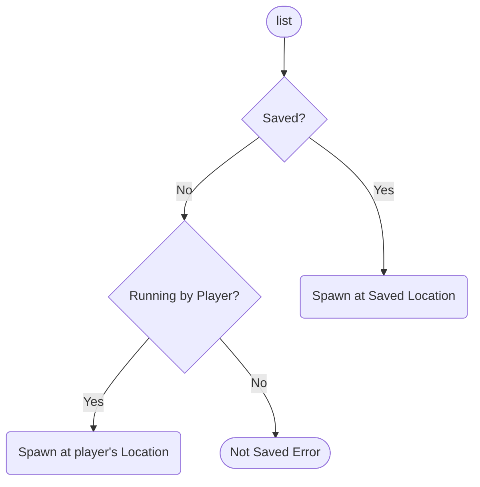
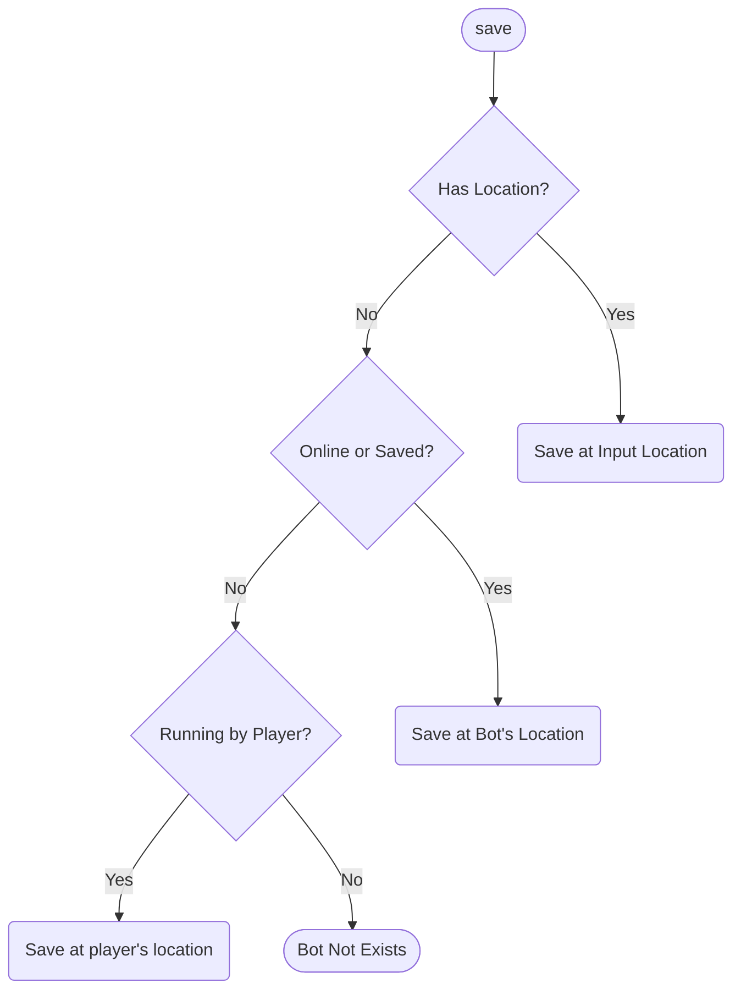
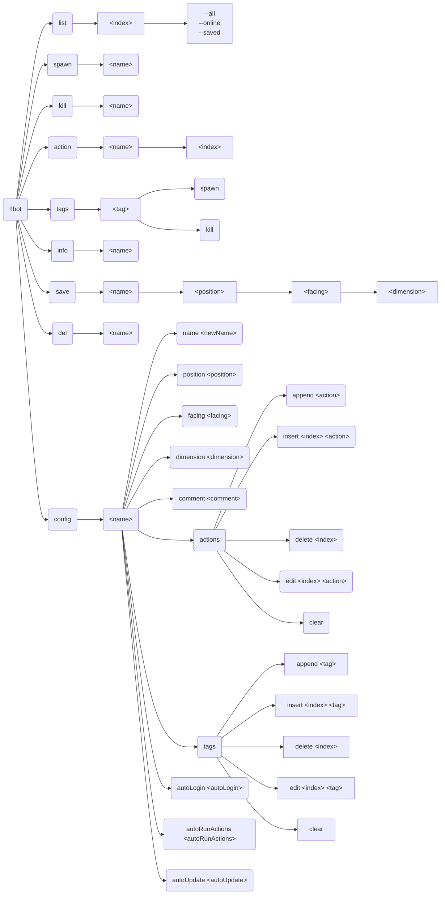
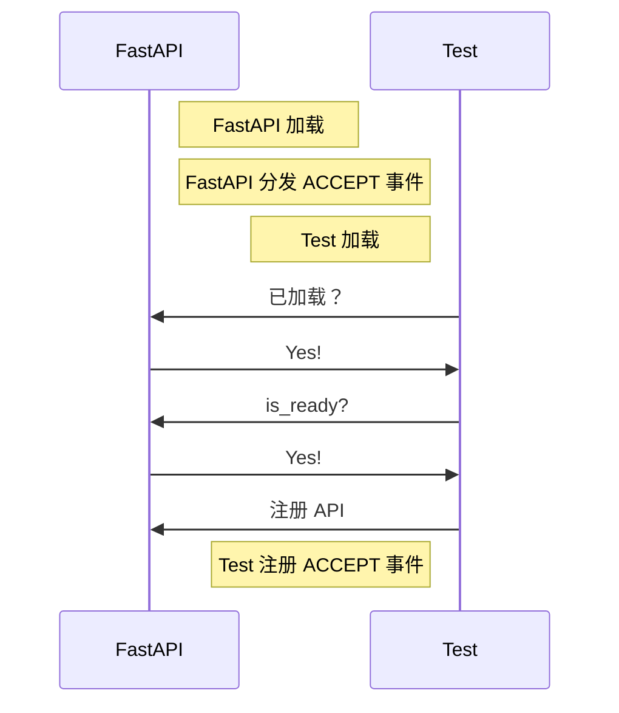
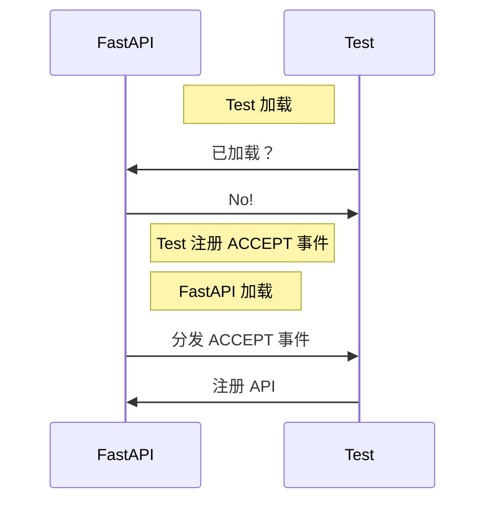
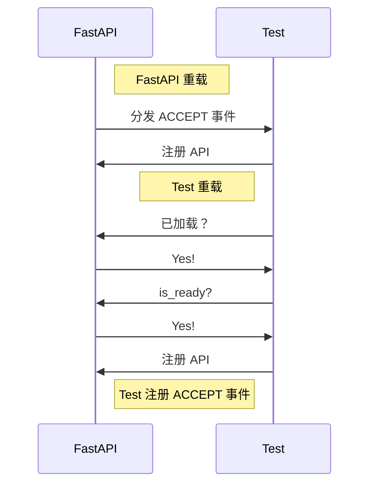
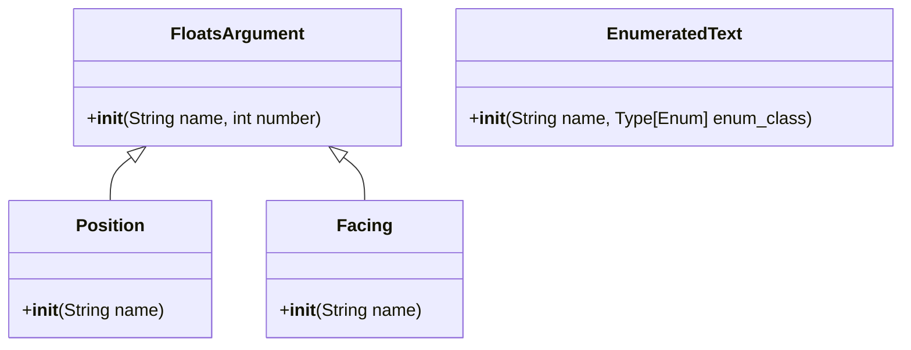

[English](full.md) | **中文**

\>\>\> [回到索引](/readme-zh_cn.md)

# 全插件信息集合

使用 `ctrl-f` 来进行页面中全文搜索，从而找到你感兴趣的东西

## advanced_calculator

### 基本信息

- 插件 ID: `advanced_calculator`
- 插件名: AdvancedCalculator
- 版本: 0.3.1
  - 元数据版本: 0.3.1
  - 发布版本: 0.3.1
- 总下载量: 1832
- 作者: [Andy Zhang](https://github.com/AnzhiZhang)
- 仓库: https://github.com/AnzhiZhang/MCDReforgedPlugins
- 仓库插件页: https://github.com/AnzhiZhang/MCDReforgedPlugins/tree/master/src/advanced_calculator
- 标签: [`工具`](/labels/tool/readme-zh_cn.md)
- 描述: 提供游戏内多种便捷计算

### 插件依赖

| 插件 ID | 依赖需求 |
| --- | --- |

### 包依赖

| Python 包 | 依赖需求 |
| --- | --- |

### 介绍

# AdvancedCalculator

> 提供游戏内多种便捷计算

## 使用

您可以使用 `=<expression>` 直接计算表达式，或使用 `==<count/expression>` 将物品数转换堆叠数。

| 指令 | 用途 | 示例 | 结果 |
| - | - | - | - |
| !!calc \<expression> | 计算表达式 | !!calc 1+1 | 1+1=2 |
| !!calc item \<count/expression> | 物品数转换堆叠数 | !!calc item 1794 | 1794个物品为1盒2组3个 |
| !!calc item \<box> \<stack> \<single> | 堆叠数转换物品数 | !!calc item 1 10 32 | 1盒10组32个为2400个物品 |
| !!calc color \<red> \<green> \<blue> | 10进制RGB转16进制 | !!calc color 255 0 255 | (255, 0, 255) -> #FF00FF |
| !!calc color \<#HEX> | 16十进制RGB转10进制 | !!calc color #00FF00 | #00FF00 -> (0, 255, 0) |

### 下载

> [!IMPORTANT]
> 使用插件之前，先阅读仓库中的 README。

| 文件 | 版本 | 上传时间 (UTC) | 大小 | 下载数 | 操作 |
| --- | --- | --- | --- | --- | --- |
| [AdvancedCalculator-v0.3.1.mcdr](https://github.com/AnzhiZhang/MCDReforgedPlugins/releases/tag/advanced_calculator-v0.3.1) | 0.3.1 | 2023/01/19 17:01:07 | 2.46KB | 1220 | [下载](https://github.com/AnzhiZhang/MCDReforgedPlugins/releases/download/advanced_calculator-v0.3.1/AdvancedCalculator-v0.3.1.mcdr) |
| [AdvancedCalculator-v0.3.0.mcdr](https://github.com/AnzhiZhang/MCDReforgedPlugins/releases/tag/advanced_calculator-v0.3.0) | 0.3.0 | 2022/10/21 20:03:33 | 2.42KB | 291 | [下载](https://github.com/AnzhiZhang/MCDReforgedPlugins/releases/download/advanced_calculator-v0.3.0/AdvancedCalculator-v0.3.0.mcdr) |
| [AdvancedCalculator-v0.2.1.mcdr](https://github.com/AnzhiZhang/MCDReforgedPlugins/releases/tag/advanced_calculator-v0.2.1) | 0.2.1 | 2022/07/21 13:20:06 | 2.38KB | 224 | [下载](https://github.com/AnzhiZhang/MCDReforgedPlugins/releases/download/advanced_calculator-v0.2.1/AdvancedCalculator-v0.2.1.mcdr) |

## advanced_whitelist_r

### 基本信息

- 插件 ID: `advanced_whitelist_r`
- 插件名: AdvancedWhitelistR
- 版本: 1.0.3
  - 元数据版本: 1.0.3
  - 发布版本: 1.0.3
- 总下载量: 694
- 作者: [noionion](https://github.com/2X-ercha), [GamerNoTitle](https://github.com/GamerNoTitle)
- 仓库: https://github.com/EMUnion/AdvancedWhitelistR
- 仓库插件页: https://github.com/EMUnion/AdvancedWhitelistR/tree/master
- 标签: [`管理`](/labels/management/readme-zh_cn.md)
- 描述: For outline-model Whitelist

### 插件依赖

| 插件 ID | 依赖需求 |
| --- | --- |
| [mcdreforged](https://github.com/Fallen-Breath/MCDReforged) | \>=2.1.0 |

### 包依赖

| Python 包 | 依赖需求 |
| --- | --- |

### 介绍

离线服务器白名单管理

### 下载

> [!IMPORTANT]
> 使用插件之前，先阅读仓库中的 README。

| 文件 | 版本 | 上传时间 (UTC) | 大小 | 下载数 | 操作 |
| --- | --- | --- | --- | --- | --- |
| [AdvancedWhitelistR-v1.0.3.mcdr](https://github.com/EMUnion/AdvancedWhitelistR/releases/tag/1.0.3) | 1.0.3 | 2023/01/04 02:59:30 | 3.73KB | 314 | [下载](https://github.com/EMUnion/AdvancedWhitelistR/releases/download/1.0.3/AdvancedWhitelistR-v1.0.3.mcdr) |
| [AdvancedWhitelistR-v1.0.2.mcdr](https://github.com/EMUnion/AdvancedWhitelistR/releases/tag/1.0.2) | 1.0.2 | 2022/01/24 15:38:16 | 3.5KB | 298 | [下载](https://github.com/EMUnion/AdvancedWhitelistR/releases/download/1.0.2/AdvancedWhitelistR-v1.0.2.mcdr) |
| [AdvancedWhitelistR-v1.0.1.mcdr](https://github.com/EMUnion/AdvancedWhitelistR/releases/tag/1.0.1) | 1.0.1 | 2022/01/24 11:46:47 | 3.5KB | 82 | [下载](https://github.com/EMUnion/AdvancedWhitelistR/releases/download/1.0.1/AdvancedWhitelistR-v1.0.1.mcdr) |

## allow_suicide

### 基本信息

- 插件 ID: `allow_suicide`
- 插件名: allow_suicide
- 版本: 1.0.0
  - 元数据版本: 1.0.0
  - 发布版本: 1.0.0
- 总下载量: 1132
- 作者: [JAs0n](https://github.com/JAs0n319)
- 仓库: https://github.com/JAs0n319/allow_suicide
- 仓库插件页: https://github.com/JAs0n319/allow_suicide/tree/master
- 标签: [`工具`](/labels/tool/readme-zh_cn.md)
- 描述: 允许玩家在没有op权限时自杀

### 插件依赖

| 插件 ID | 依赖需求 |
| --- | --- |
| [mcdreforged](https://github.com/Fallen-Breath/MCDReforged) | \>=2.1.0 |

### 包依赖

| Python 包 | 依赖需求 |
| --- | --- |

### 介绍

允许没有op权限的玩家自杀

### 下载

> [!IMPORTANT]
> 使用插件之前，先阅读仓库中的 README。

| 文件 | 版本 | 上传时间 (UTC) | 大小 | 下载数 | 操作 |
| --- | --- | --- | --- | --- | --- |
| [allow_suicide-v1.0.0.mcdr](https://github.com/JAs0n319/allow_suicide/releases/tag/allow_suicide-v1.0.0) | 1.0.0 | 2023/02/03 18:58:31 | 880B | 1132 | [下载](https://github.com/JAs0n319/allow_suicide/releases/download/allow_suicide-v1.0.0/allow_suicide-v1.0.0.mcdr) |

## auto_backup

### 基本信息

- 插件 ID: `auto_backup`
- 插件名: AutoBackup
- 版本: 0.2.0
  - 元数据版本: 0.2.0
  - 发布版本: 0.2.0
- 总下载量: 32
- 作者: [Kongtu5i](https://github.com/Kongtu5i)
- 仓库: https://github.com/Kongtu5i/AutoBackup
- 仓库插件页: https://github.com/Kongtu5i/AutoBackup/tree/main
- 标签: [`管理`](/labels/management/readme-zh_cn.md)
- 描述: 当自动备份名单中的玩家加入服务器时自动备份

### 插件依赖

| 插件 ID | 依赖需求 |
| --- | --- |
| [mcdreforged](https://github.com/Fallen-Breath/MCDReforged) | \>=2.6.0 |

### 包依赖

| Python 包 | 依赖需求 |
| --- | --- |

### 介绍

当名单中的玩家加入我的世界服务器时进行自动备份

### 下载

> [!IMPORTANT]
> 使用插件之前，先阅读仓库中的 README。

| 文件 | 版本 | 上传时间 (UTC) | 大小 | 下载数 | 操作 |
| --- | --- | --- | --- | --- | --- |
| [AutoBackup-v0.2.0.mcdr](https://github.com/Kongtu5i/AutoBackup/releases/tag/v0.2.0) | 0.2.0 | 2024/04/30 10:42:09 | 2.44KB | 32 | [下载](https://github.com/Kongtu5i/AutoBackup/releases/download/v0.2.0/AutoBackup-v0.2.0.mcdr) |

## auto_command

### 基本信息

- 插件 ID: `auto_command`
- 插件名: Auto Command
- 版本: 1.3.0
  - 元数据版本: 1.3.0
  - 发布版本: 1.3.0
- 总下载量: 191
- 作者: [bzyyyyyyyy](https://github.com/bzyyyyyyyy)
- 仓库: https://github.com/bzyyyyyyyy/MCDR-AutoCommand
- 仓库插件页: https://github.com/bzyyyyyyyy/MCDR-AutoCommand/tree/master
- 标签: [`工具`](/labels/tool/readme-zh_cn.md)
- 描述: 自动发送指令的插件

### 插件依赖

| 插件 ID | 依赖需求 |
| --- | --- |
| [mcdreforged](https://github.com/Fallen-Breath/MCDReforged) | \>=2.1.0 |
| [minecraft_data_api](/plugins/minecraft_data_api/readme-zh_cn.md) | * |

### 包依赖

| Python 包 | 依赖需求 |
| --- | --- |
| [mcdreforged](https://pypi.org/project/mcdreforged) | \>=2.1.0 |

```
pip install "mcdreforged>=2.1.0"
```

### 介绍

编辑/发送指令堆&自动发送指令
### 下载

> [!IMPORTANT]
> 使用插件之前，先阅读仓库中的 README。

| 文件 | 版本 | 上传时间 (UTC) | 大小 | 下载数 | 操作 |
| --- | --- | --- | --- | --- | --- |
| [AutoCommand-v1.3.0.mcdr](https://github.com/bzyyyyyyyy/MCDR-AutoCommand/releases/tag/v1.3.0) | 1.3.0 | 2023/06/15 17:14:11 | 22.25KB | 183 | [下载](https://github.com/bzyyyyyyyy/MCDR-AutoCommand/releases/download/v1.3.0/AutoCommand-v1.3.0.mcdr) |
| [AutoCommand-v1.0.0.mcdr](https://github.com/bzyyyyyyyy/MCDR-AutoCommand/releases/tag/v1.0.0) | 1.0.0 | 2023/06/08 06:30:33 | 21.45KB | 8 | [下载](https://github.com/bzyyyyyyyy/MCDR-AutoCommand/releases/download/v1.0.0/AutoCommand-v1.0.0.mcdr) |

## auto_execute

### 基本信息

- 插件 ID: `auto_execute`
- 插件名: Auto-Execute
- 版本: 1.1.0
  - 元数据版本: 1.1.0
  - 发布版本: 1.1.0
- 总下载量: 44
- 作者: [FRUITS-CANDY](https://github.com/FRUITS-CANDY)
- 仓库: https://github.com/Passion-Never-Dissipate/Auto-Execute
- 仓库插件页: https://github.com/Passion-Never-Dissipate/Auto-Execute/tree/master
- 标签: [`工具`](/labels/tool/readme-zh_cn.md)
- 描述: 一个以脚本为单位存储各类指令多模式执行的MCDR插件

### 插件依赖

| 插件 ID | 依赖需求 |
| --- | --- |
| [mcdreforged](https://github.com/Fallen-Breath/MCDReforged) | \>=2.6.0 |

### 包依赖

| Python 包 | 依赖需求 |
| --- | --- |
| [mcdreforged](https://pypi.org/project/mcdreforged) | \>=2.6.0 |

```
pip install "mcdreforged>=2.6.0"
```

### 介绍

一个以脚本为单位存储各类指令多模式执行的MCDR插件

### 下载

> [!IMPORTANT]
> 使用插件之前，先阅读仓库中的 README。

| 文件 | 版本 | 上传时间 (UTC) | 大小 | 下载数 | 操作 |
| --- | --- | --- | --- | --- | --- |
| [Auto-Execute-v1.1.0.mcdr](https://github.com/Passion-Never-Dissipate/Auto-Execute/releases/tag/v1.1) | 1.1.0 | 2024/03/26 14:34:38 | 20.42KB | 43 | [下载](https://github.com/Passion-Never-Dissipate/Auto-Execute/releases/download/v1.1/Auto-Execute-v1.1.0.mcdr) |
| [Auto-Execute-v1.0.0.mcdr](https://github.com/Passion-Never-Dissipate/Auto-Execute/releases/tag/v1.0) | 1.0.0 | 2024/03/26 14:34:10 | 20.4KB | 1 | [下载](https://github.com/Passion-Never-Dissipate/Auto-Execute/releases/download/v1.0/Auto-Execute-v1.0.0.mcdr) |

## auto_msg_title

### 基本信息

- 插件 ID: `auto_msg_title`
- 插件名: AutoMsgTitle
- 版本: 0.1.2
  - 元数据版本: 0.1.2
  - 发布版本: 0.1.2
- 总下载量: 76
- 作者: [zhongbai233](https://github.com/zhongbai2333)
- 仓库: https://github.com/zhongbai2333/AutoMsgTitle
- 仓库插件页: https://github.com/zhongbai2333/AutoMsgTitle/tree/master
- 标签: [`信息`](/labels/information/readme-zh_cn.md)
- 描述: 在游戏某些区域自动弹出消息。

### 插件依赖

| 插件 ID | 依赖需求 |
| --- | --- |

### 包依赖

| Python 包 | 依赖需求 |
| --- | --- |
| [mcdreforged](https://pypi.org/project/mcdreforged) | \>=2.12.0 |

```
pip install "mcdreforged>=2.12.0"
```

### 介绍

此插件可以为玩家自动弹出标题或消息，如同插件服进入主城后的标题

同时此插件可为一块区域提供自动的说明，如服务器被参观时，参观者进入某区域、机器之后自动弹出此区域、机器的制造者、名字、功能之类的；在玩家进入某一机器时自动为玩家弹出机器说明书……

### 下载

> [!IMPORTANT]
> 使用插件之前，先阅读仓库中的 README。

| 文件 | 版本 | 上传时间 (UTC) | 大小 | 下载数 | 操作 |
| --- | --- | --- | --- | --- | --- |
| [AutoMsgTitle-v0.1.2.mcdr](https://github.com/zhongbai2333/AutoMsgTitle/releases/tag/v0.1.2) | 0.1.2 | 2024/06/27 20:21:52 | 8.19KB | 33 | [下载](https://github.com/zhongbai2333/AutoMsgTitle/releases/download/v0.1.2/AutoMsgTitle-v0.1.2.mcdr) |
| [AutoMsgTitle-v0.1.1.mcdr](https://github.com/zhongbai2333/AutoMsgTitle/releases/tag/v0.1.1) | 0.1.1 | 2024/05/09 14:54:29 | 8.2KB | 41 | [下载](https://github.com/zhongbai2333/AutoMsgTitle/releases/download/v0.1.1/AutoMsgTitle-v0.1.1.mcdr) |
| [AutoMsgTitle-v0.1.0.mcdr](https://github.com/zhongbai2333/AutoMsgTitle/releases/tag/v0.1.0) | 0.1.0 | 2024/05/08 15:11:57 | 2.83KB | 1 | [下载](https://github.com/zhongbai2333/AutoMsgTitle/releases/download/v0.1.0/AutoMsgTitle-v0.1.0.mcdr) |

## auto_plugin_reloader

### 基本信息

- 插件 ID: `auto_plugin_reloader`
- 插件名: Auto Plugin Reloader
- 版本: 2.0.0
  - 元数据版本: 2.0.0
  - 发布版本: 2.0.0
- 总下载量: 6254
- 作者: [Fallen_Breath](https://github.com/Fallen-Breath)
- 仓库: https://github.com/TISUnion/AutoPluginReloader
- 仓库插件页: https://github.com/TISUnion/AutoPluginReloader/tree/master
- 标签: [`管理`](/labels/management/readme-zh_cn.md)
- 描述: 在文件变更时自动重载插件

### 插件依赖

| 插件 ID | 依赖需求 |
| --- | --- |
| [mcdreforged](https://github.com/Fallen-Breath/MCDReforged) | \>=2.13.0 |

### 包依赖

| Python 包 | 依赖需求 |
| --- | --- |
| [mcdreforged](https://pypi.org/project/mcdreforged) |  |

```
pip install mcdreforged
```

### 介绍

它是一个可以自动检测 MCDR 插件文件夹中发生的变更并触发插件重载的插件

它是厌倦了插件文件更新后需要手动执行插件重载的懒人的救星！

### 下载

> [!IMPORTANT]
> 使用插件之前，先阅读仓库中的 README。

| 文件 | 版本 | 上传时间 (UTC) | 大小 | 下载数 | 操作 |
| --- | --- | --- | --- | --- | --- |
| [AutoPluginReloader-v2.0.0.mcdr](https://github.com/TISUnion/AutoPluginReloader/releases/tag/v2.0.0) | 2.0.0 | 2024/06/30 05:12:37 | 18.57KB | 198 | [下载](https://github.com/TISUnion/AutoPluginReloader/releases/download/v2.0.0/AutoPluginReloader-v2.0.0.mcdr) |
| [AutoPluginReloader-v1.1.3.mcdr](https://github.com/TISUnion/AutoPluginReloader/releases/tag/v1.1.3) | 1.1.3 | 2021/10/01 18:23:47 | 17.58KB | 2234 | [下载](https://github.com/TISUnion/AutoPluginReloader/releases/download/v1.1.3/AutoPluginReloader-v1.1.3.mcdr) |
| [AutoPluginReloader-v1.1.2.mcdr](https://github.com/TISUnion/AutoPluginReloader/releases/tag/v1.1.2) | 1.1.2 | 2021/09/30 10:02:54 | 17.59KB | 167 | [下载](https://github.com/TISUnion/AutoPluginReloader/releases/download/v1.1.2/AutoPluginReloader-v1.1.2.mcdr) |

## battery_saver

### 基本信息

- 插件 ID: `battery_saver`
- 插件名: BatterySaver
- 版本: 0.0.1
  - 元数据版本: 0.0.2
  - 发布版本: 0.0.1
- 总下载量: 11
- 作者: [Mooling0602](https://github.com/Mooling0602)
- 仓库: https://github.com/Mooling0602/BatterySaver-MCDR
- 仓库插件页: https://github.com/Mooling0602/BatterySaver-MCDR/tree/main
- 标签: [`工具`](/labels/tool/readme-zh_cn.md), [`信息`](/labels/information/readme-zh_cn.md)
- 描述: 检查主机的电量并在其低位时自动关闭服务器。

### 插件依赖

| 插件 ID | 依赖需求 |
| --- | --- |
| [mcdreforged](https://github.com/Fallen-Breath/MCDReforged) | \>=2.1.0 |

### 包依赖

| Python 包 | 依赖需求 |
| --- | --- |
| [psutil](https://pypi.org/project/psutil) |  |

```
pip install psutil
```

### 介绍

检查主机的电量并在其低位时自动关闭服务器。

### 下载

> [!IMPORTANT]
> 使用插件之前，先阅读仓库中的 README。

| 文件 | 版本 | 上传时间 (UTC) | 大小 | 下载数 | 操作 |
| --- | --- | --- | --- | --- | --- |
| [BatterySaver.mcdr](https://github.com/Mooling0602/BatterySaver-MCDR/releases/tag/0.0.1) | 0.0.1 | 2024/05/30 17:01:11 | 2.13KB | 11 | [下载](https://github.com/Mooling0602/BatterySaver-MCDR/releases/download/0.0.1/BatterySaver.mcdr) |

## beep

### 基本信息

- 插件 ID: `beep`
- 插件名: Beep
- 版本: 1.1.0
  - 元数据版本: 1.1.0
  - 发布版本: 1.1.0
- 总下载量: 6093
- 作者: [Fallen_Breath](https://github.com/Fallen-Breath), [LucunJi](https://github.com/LucunJi)
- 仓库: https://github.com/TISUnion/Beep
- 仓库插件页: https://github.com/TISUnion/Beep/tree/master
- 标签: [`工具`](/labels/tool/readme-zh_cn.md)
- 描述: @某人，@ all可作用于所有玩家。使用两个@@小心被打

### 插件依赖

| 插件 ID | 依赖需求 |
| --- | --- |
| [mcdreforged](https://github.com/Fallen-Breath/MCDReforged) | \>=2.1.0 |

### 包依赖

| Python 包 | 依赖需求 |
| --- | --- |

### 介绍

*无*

### 下载

> [!IMPORTANT]
> 使用插件之前，先阅读仓库中的 README。

| 文件 | 版本 | 上传时间 (UTC) | 大小 | 下载数 | 操作 |
| --- | --- | --- | --- | --- | --- |
| [Beep-v1.1.0.mcdr](https://github.com/TISUnion/Beep/releases/tag/v1.1.0) | 1.1.0 | 2021/08/26 14:01:49 | 1.74KB | 4682 | [下载](https://github.com/TISUnion/Beep/releases/download/v1.1.0/Beep-v1.1.0.mcdr) |
| [Beep-v1.0.0.mcdr](https://github.com/TISUnion/Beep/releases/tag/v1.0.0) | 1.0.0 | 2021/08/21 15:35:36 | 1.67KB | 1411 | [下载](https://github.com/TISUnion/Beep/releases/download/v1.0.0/Beep-v1.0.0.mcdr) |

## better_backup

### 基本信息

- 插件 ID: `better_backup`
- 插件名: Better Backup
- 版本: 2.1.6
  - 元数据版本: 2.1.7
  - 发布版本: 2.1.6
- 总下载量: 382
- 作者: [z0z0r4](https://github.com/z0z0r4)
- 仓库: https://github.com/z0z0r4/better_backup
- 仓库插件页: https://github.com/z0z0r4/better_backup/tree/master
- 标签: [`管理`](/labels/management/readme-zh_cn.md)
- 描述: 支持文件去重的高效备份/回档插件

### 插件依赖

| 插件 ID | 依赖需求 |
| --- | --- |

### 包依赖

| Python 包 | 依赖需求 |
| --- | --- |
| [mcdreforged](https://pypi.org/project/mcdreforged) | \>=2.1.2 |
| [pydal](https://pypi.org/project/pydal) | ~=20230521.1 |
| [pyzstd](https://pypi.org/project/pyzstd) | ~=0.15.9 |
| [xxhash](https://pypi.org/project/xxhash) | ~=3.4.1 |

```
pip install "mcdreforged>=2.1.2" pydal~=20230521.1 pyzstd~=0.15.9 xxhash~=3.4.1
```

### 介绍

支持文件去重的高效备份/回档插件

一些特性：

- 带注释的备份
- 所有文件只留一份不重复，节省硬盘空间
- 备份大小显示，信息清晰
- 理论上无限制的备份点，只取决于存档改动
### 下载

> [!IMPORTANT]
> 使用插件之前，先阅读仓库中的 README。

| 文件 | 版本 | 上传时间 (UTC) | 大小 | 下载数 | 操作 |
| --- | --- | --- | --- | --- | --- |
| [Better_Backup-v2.1.6.mcdr](https://github.com/z0z0r4/better_backup/releases/tag/v2.1.6) | 2.1.6 | 2023/08/30 12:35:29 | 17.57KB | 382 | [下载](https://github.com/z0z0r4/better_backup/releases/download/v2.1.6/Better_Backup-v2.1.6.mcdr) |

## bingo

### 基本信息

- 插件 ID: `bingo`
- 插件名: Bingo
- 版本: 0.0.3
  - 元数据版本: 0.0.3
  - 发布版本: 0.0.3
- 总下载量: 93
- 作者: [Andy Zhang](https://github.com/AnzhiZhang)
- 仓库: https://github.com/AnzhiZhang/MCDReforgedPlugins
- 仓库插件页: https://github.com/AnzhiZhang/MCDReforgedPlugins/tree/master/src/bingo
- 标签: [`工具`](/labels/tool/readme-zh_cn.md)
- 描述: Bingo 游戏实用工具

### 插件依赖

| 插件 ID | 依赖需求 |
| --- | --- |

### 包依赖

| Python 包 | 依赖需求 |
| --- | --- |

### 介绍

# Bingo

> [Bingo](https://www.flytre.net/bingo) 游戏实用工具

## 使用

| 指令 | 用途 |
| - | - |
| !!bingo team \<num> | 随机分组 |
| !!bingo end | 结束游戏 |

### 下载

> [!IMPORTANT]
> 使用插件之前，先阅读仓库中的 README。

| 文件 | 版本 | 上传时间 (UTC) | 大小 | 下载数 | 操作 |
| --- | --- | --- | --- | --- | --- |
| [Bingo-v0.0.3.mcdr](https://github.com/AnzhiZhang/MCDReforgedPlugins/releases/tag/bingo-v0.0.3) | 0.0.3 | 2023/02/26 00:14:39 | 1.3KB | 93 | [下载](https://github.com/AnzhiZhang/MCDReforgedPlugins/releases/download/bingo-v0.0.3/Bingo-v0.0.3.mcdr) |

## bot

### 基本信息

- 插件 ID: `bot`
- 插件名: Bot
- 版本: 1.1.5
  - 元数据版本: 1.1.5
  - 发布版本: 1.1.5
- 总下载量: 3900
- 作者: [Andy Zhang](https://github.com/AnzhiZhang)
- 仓库: https://github.com/AnzhiZhang/MCDReforgedPlugins
- 仓库插件页: https://github.com/AnzhiZhang/MCDReforgedPlugins/tree/master/src/bot
- 标签: [`工具`](/labels/tool/readme-zh_cn.md), [`管理`](/labels/management/readme-zh_cn.md)
- 描述: 最好用的地毯模组假人管理器！

### 插件依赖

| 插件 ID | 依赖需求 |
| --- | --- |
| [mcdreforged](https://github.com/Fallen-Breath/MCDReforged) | ^2.6.0 |
| [minecraft_data_api](/plugins/minecraft_data_api/readme-zh_cn.md) | ^1.4 |
| [more_command_nodes](/plugins/more_command_nodes/readme-zh_cn.md) | ^1.1.0 |

### 包依赖

| Python 包 | 依赖需求 |
| --- | --- |

### 介绍

# Bot

[English](https://github.com/AnzhiZhang/MCDReforgedPlugins/tree/master/src/bot/readme.md)

> 最好用的地毯模组假人管理器！

## 依赖

- [MinecraftDataAPI](https://github.com/MCDReforged/MinecraftDataAPI)
- [MoreCommandNodes](https://github.com/AnzhiZhang/MCDReforgedPlugins/tree/master/src/bot/../more_command_nodes)

## 使用方法

`!!bot` 查看帮助

`!!bot list [index] [filter]` 显示假人列表

`!!bot spawn <name>` 上线假人

`!!bot kill <name>` 下线假人

`!!bot action <name> [index]` 执行假人动作

`!!bot tags` 查看可用标签

`!!bot tags <tag> spawn/kill` 上线/下线带有标签的假人

`!!bot info <name>` 查看假人信息

`!!bot save <name> [position] [facing] [dimension]` 保存假人

`!!bot del <name>` 删除保存的假人

`!!bot config <name> <option> <value>` 配置假人

### 工作流


### list

**index**：列表的页码

**filter**：可用选项为：`--all`、`--online` 或 `--saved`，过滤假人

### spawn

上线假人



### kill

下线假人

### action

执行假人动作

当指定 `index` 时，执行特定动作而不是全部动作

### tags

查看可用标签和上线/下线带有标签的假人

`!!bot tags` 查看可用标签

`!!bot tags <tag> spawn` 上线带有标签的假人

`!!bot tags <tag> kill` 下线带有标签的假人

### info

查看假人信息

### save

保存假人



### del

删除保存的假人

### config

配置假人

### 完整指令树



## 配置

### gamemode

默认值: `survival`

生成假人的游戏模式

### force_gamemode

默认值: `false`

是否强制所有假人使用 `gamemode` 配置的游戏模式，如果为 `false`，只有已保存的假人会使用 `gamemode` 配置的游戏模式。

### name_prefix

默认值: `bot_`

假人名称前缀

### name_suffix

默认值: 无

假人名称后缀

### permissions

使用对应指令的最低权限

## FastAPI MCDR

该插件支持 [FastAPI MCDR](https://github.com/AnzhiZhang/MCDReforgedPlugins/tree/master/src/bot/../fastapi_mcdr) 插件，详细接口请查阅源码，或运行后通过 `http://127.0.0.1:8080/docs` 查看 FastAPI 文档。

Python 包要求：

```text
pydantic>=2.0
```

### 下载

> [!IMPORTANT]
> 使用插件之前，先阅读仓库中的 README。

| 文件 | 版本 | 上传时间 (UTC) | 大小 | 下载数 | 操作 |
| --- | --- | --- | --- | --- | --- |
| [Bot-v1.1.5.mcdr](https://github.com/AnzhiZhang/MCDReforgedPlugins/releases/tag/bot-v1.1.5) | 1.1.5 | 2024/07/01 14:40:45 | 17.13KB | 405 | [下载](https://github.com/AnzhiZhang/MCDReforgedPlugins/releases/download/bot-v1.1.5/Bot-v1.1.5.mcdr) |
| [Bot-v1.1.4.mcdr](https://github.com/AnzhiZhang/MCDReforgedPlugins/releases/tag/bot-v1.1.4) | 1.1.4 | 2024/03/15 14:08:24 | 17.14KB | 403 | [下载](https://github.com/AnzhiZhang/MCDReforgedPlugins/releases/download/bot-v1.1.4/Bot-v1.1.4.mcdr) |
| [Bot-v1.1.3.mcdr](https://github.com/AnzhiZhang/MCDReforgedPlugins/releases/tag/bot-v1.1.3) | 1.1.3 | 2024/02/27 15:11:25 | 17.14KB | 112 | [下载](https://github.com/AnzhiZhang/MCDReforgedPlugins/releases/download/bot-v1.1.3/Bot-v1.1.3.mcdr) |

## bot_plugin

### 基本信息

- 插件 ID: `bot_plugin`
- 插件名: Bot Plugin
- 版本: 1.0.0
  - 元数据版本: 1.1.0
  - 发布版本: 1.0.0
- 总下载量: 802
- 作者: [DancingSnow0517](https://github.com/DancingSnow0517)
- 仓库: https://github.com/DancingSnow0517/Bot_Manager
- 仓库插件页: https://github.com/DancingSnow0517/Bot_Manager/tree/master
- 标签: [`管理`](/labels/management/readme-zh_cn.md), [`工具`](/labels/tool/readme-zh_cn.md)
- 描述: 管理 carpet 机器人

### 插件依赖

| 插件 ID | 依赖需求 |
| --- | --- |
| [mcdreforged](https://github.com/Fallen-Breath/MCDReforged) | \>=2.3.0 |
| [minecraft_data_api](/plugins/minecraft_data_api/readme-zh_cn.md) | \>=1.4.0 |

### 包依赖

| Python 包 | 依赖需求 |
| --- | --- |

### 介绍

# 一个 MCDR bot管理器。

:warning: **务必在使用前阅读仓库中的 README！**

### 下载

> [!IMPORTANT]
> 使用插件之前，先阅读仓库中的 README。

| 文件 | 版本 | 上传时间 (UTC) | 大小 | 下载数 | 操作 |
| --- | --- | --- | --- | --- | --- |
| [BotPlugin-v1.0.0.mcdr](https://github.com/DancingSnow0517/Bot_Manager/releases/tag/1.0.0) | 1.0.0 | 2022/01/09 04:38:06 | 17.24KB | 802 | [下载](https://github.com/DancingSnow0517/Bot_Manager/releases/download/1.0.0/BotPlugin-v1.0.0.mcdr) |

## carpet_bot_manager

### 基本信息

- 插件 ID: `carpet_bot_manager`
- 插件名: Carpet Bot Manager
- 版本: 0.3.5
  - 元数据版本: 0.3.5
  - 发布版本: 0.3.5
- 总下载量: 2369
- 作者: [YehowahLiu](https://github.com/YehowahLiu)
- 仓库: https://github.com/FAS-Server/CarpetBotManager
- 仓库插件页: https://github.com/FAS-Server/CarpetBotManager/tree/main
- 标签: [`工具`](/labels/tool/readme-zh_cn.md)
- 描述: 一个地毯端bot管理插件, 可以点击召唤bot并让其执行系列动作

### 插件依赖

| 插件 ID | 依赖需求 |
| --- | --- |
| [mcdreforged](https://github.com/Fallen-Breath/MCDReforged) | \>=2.6.0 |
| [minecraft_data_api](/plugins/minecraft_data_api/readme-zh_cn.md) | \>=1.4.0 |

### 包依赖

| Python 包 | 依赖需求 |
| --- | --- |
| [mcdreforged](https://pypi.org/project/mcdreforged) | \>=2.6.0 |

```
pip install "mcdreforged>=2.6.0"
```

### 介绍

一个地毯端 bot 管理插件，可以点击召唤 bot 并让其执行系列动作

### 下载

> [!IMPORTANT]
> 使用插件之前，先阅读仓库中的 README。

| 文件 | 版本 | 上传时间 (UTC) | 大小 | 下载数 | 操作 |
| --- | --- | --- | --- | --- | --- |
| [CarpetBotManager-v0.3.5.pyz](https://github.com/FAS-Server/CarpetBotManager/releases/tag/v0.3.5) | 0.3.5 | 2023/08/17 15:39:44 | 10.32KB | 363 | [下载](https://github.com/FAS-Server/CarpetBotManager/releases/download/v0.3.5/CarpetBotManager-v0.3.5.pyz) |
| [CarpetBotManager-v0.3.4.pyz](https://github.com/FAS-Server/CarpetBotManager/releases/tag/v0.3.4) | 0.3.4 | 2023/07/29 15:54:33 | 10.43KB | 60 | [下载](https://github.com/FAS-Server/CarpetBotManager/releases/download/v0.3.4/CarpetBotManager-v0.3.4.pyz) |
| [CarpetBotManager-v0.3.3.pyz](https://github.com/FAS-Server/CarpetBotManager/releases/tag/v0.3.3) | 0.3.3 | 2023/07/29 15:55:20 | 10.35KB | 10 | [下载](https://github.com/FAS-Server/CarpetBotManager/releases/download/v0.3.3/CarpetBotManager-v0.3.3.pyz) |

## carpet_tick

### 基本信息

- 插件 ID: `carpet_tick`
- 插件名: Carpet Tick
- 版本: 1.1.1
  - 元数据版本: 1.1.1
  - 发布版本: 1.1.1
- 总下载量: 673
- 作者: [Ivan1F](https://github.com/Ivan-1F)
- 仓库: https://github.com/Ivan-1F/CarpetTick
- 仓库插件页: https://github.com/Ivan-1F/CarpetTick/tree/master
- 标签: [`信息`](/labels/information/readme-zh_cn.md)
- 描述: 使用 Carpet Mod 的 /tick 指令获取服务器信息

### 插件依赖

| 插件 ID | 依赖需求 |
| --- | --- |
| [mcdreforged](https://github.com/Fallen-Breath/MCDReforged) | \>=2.1.0-beta |

### 包依赖

| Python 包 | 依赖需求 |
| --- | --- |

### 介绍

*无*

### 下载

> [!IMPORTANT]
> 使用插件之前，先阅读仓库中的 README。

| 文件 | 版本 | 上传时间 (UTC) | 大小 | 下载数 | 操作 |
| --- | --- | --- | --- | --- | --- |
| [CarpetTick-v1.1.1.mcdr](https://github.com/Ivan-1F/CarpetTick/releases/tag/v1.1.1) | 1.1.1 | 2022/08/27 16:04:57 | 3.46KB | 424 | [下载](https://github.com/Ivan-1F/CarpetTick/releases/download/v1.1.1/CarpetTick-v1.1.1.mcdr) |
| [CarpetTick-v1.1.0.mcdr](https://github.com/Ivan-1F/CarpetTick/releases/tag/v1.1.0) | 1.1.0 | 2022/04/07 09:28:18 | 3.48KB | 166 | [下载](https://github.com/Ivan-1F/CarpetTick/releases/download/v1.1.0/CarpetTick-v1.1.0.mcdr) |
| [CarpetTick-v1.0.0.mcdr](https://github.com/Ivan-1F/CarpetTick/releases/tag/v1.0.0) | 1.0.0 | 2022/03/11 14:50:05 | 3.35KB | 83 | [下载](https://github.com/Ivan-1F/CarpetTick/releases/download/v1.0.0/CarpetTick-v1.0.0.mcdr) |

## carpetbotlist

### 基本信息

- 插件 ID: `carpetbotlist`
- 插件名: CarpetBotList
- 版本: 2.1.1
  - 元数据版本: 2.1.1
  - 发布版本: 2.1.1
- 总下载量: 4936
- 作者: [ZeroKelvin](https://github.com/BelowZeroKelvin)
- 仓库: https://github.com/BelowZeroKelvin/MCDR-CarpetBotList
- 仓库插件页: https://github.com/BelowZeroKelvin/MCDR-CarpetBotList/tree/MCDR-2.x
- 标签: [`工具`](/labels/tool/readme-zh_cn.md)
- 描述: 帮助你管理地毯端假人

### 插件依赖

| 插件 ID | 依赖需求 |
| --- | --- |
| [mcdreforged](https://github.com/Fallen-Breath/MCDReforged) | ^2.0.0-beta.1 |
| [minecraft_data_api](/plugins/minecraft_data_api/readme-zh_cn.md) | * |

### 包依赖

| Python 包 | 依赖需求 |
| --- | --- |

### 介绍

帮助你管理地毯端的假人

### 下载

> [!IMPORTANT]
> 使用插件之前，先阅读仓库中的 README。

| 文件 | 版本 | 上传时间 (UTC) | 大小 | 下载数 | 操作 |
| --- | --- | --- | --- | --- | --- |
| [CarpetBotList-v2.1.1.mcdr](https://github.com/BelowZeroKelvin/MCDR-CarpetBotList/releases/tag/v2.1.1) | 2.1.1 | 2021/08/23 06:17:05 | 1.89KB | 2150 | [下载](https://github.com/BelowZeroKelvin/MCDR-CarpetBotList/releases/download/v2.1.1/CarpetBotList-v2.1.1.mcdr) |
| [CarpetBotList-v2.1.0.mcdr](https://github.com/BelowZeroKelvin/MCDR-CarpetBotList/releases/tag/v2.1.0) | 2.1.0 | 2021/08/16 11:33:40 | 4.08KB | 1389 | [下载](https://github.com/BelowZeroKelvin/MCDR-CarpetBotList/releases/download/v2.1.0/CarpetBotList-v2.1.0.mcdr) |
| [CarpetBotList-v2.0.0.mcdr](https://github.com/BelowZeroKelvin/MCDR-CarpetBotList/releases/tag/v2.0.0) | 2.0.0 | 2021/08/12 07:45:32 | 3.6KB | 1397 | [下载](https://github.com/BelowZeroKelvin/MCDR-CarpetBotList/releases/download/v2.0.0/CarpetBotList-v2.0.0.mcdr) |

## cato

### 基本信息

- 插件 ID: `cato`
- 插件名: Cato Plugin
- 版本: 1.1.0
  - 元数据版本: 1.1.0
  - 发布版本: 1.1.0
- 总下载量: 655
- 作者: [Harry-zklcdc](https://github.com/Harry-zklcdc)
- 仓库: https://github.com/Harry-zklcdc/MCDR-Cato
- 仓库插件页: https://github.com/Harry-zklcdc/MCDR-Cato/tree/main
- 标签: [`工具`](/labels/tool/readme-zh_cn.md)
- 描述: Plugin Cato

### 插件依赖

| 插件 ID | 依赖需求 |
| --- | --- |
| [mcdreforged](https://github.com/Fallen-Breath/MCDReforged) | \>=2.0.0-alpha.1 |

### 包依赖

| Python 包 | 依赖需求 |
| --- | --- |

### 介绍

使服务器启动时, 自动使用 cato (P2P 连接工具)进行端口映射, 并支持生成 HMCL 联机码

# 特性:

- Cato 官方支持
- 无感 P2P 连接
- HMCl 多人游戏支持
- Cato 崩溃/临时 ID 到期自动重启
- API 接口获取 Cato 连接 ID、HMCL 联机码
- Cato Token 动态更换
- 游戏内获取 Cato 连接 ID、HMCL 联机码

### 下载

> [!IMPORTANT]
> 使用插件之前，先阅读仓库中的 README。

| 文件 | 版本 | 上传时间 (UTC) | 大小 | 下载数 | 操作 |
| --- | --- | --- | --- | --- | --- |
| [Cato-v1.1.0.mcdr](https://github.com/Harry-zklcdc/MCDR-Cato/releases/tag/cato-v1.1.0) | 1.1.0 | 2021/10/31 08:31:03 | 2.9KB | 555 | [下载](https://github.com/Harry-zklcdc/MCDR-Cato/releases/download/cato-v1.1.0/Cato-v1.1.0.mcdr) |
| [Cato-v1.0.0.mcdr](https://github.com/Harry-zklcdc/MCDR-Cato/releases/tag/cato-v1.0.0) | 1.0.0 | 2021/10/14 12:15:08 | 2.93KB | 100 | [下载](https://github.com/Harry-zklcdc/MCDR-Cato/releases/download/cato-v1.0.0/Cato-v1.0.0.mcdr) |

## chatbridge

### 基本信息

- 插件 ID: `chatbridge`
- 插件名: ChatBridge v2 for MCDR
- 版本: 2.6.3
  - 元数据版本: 2.6.3
  - 发布版本: 2.6.3
- 总下载量: 3333
- 作者: [Fallen_Breath](https://github.com/Fallen-Breath)
- 仓库: https://github.com/TISUnion/ChatBridge
- 仓库插件页: https://github.com/TISUnion/ChatBridge/tree/master
- 标签: [`工具`](/labels/tool/readme-zh_cn.md)
- 描述: 跨服聊天

### 插件依赖

| 插件 ID | 依赖需求 |
| --- | --- |
| [mcdreforged](https://github.com/Fallen-Breath/MCDReforged) | \>=2.2.0- |

### 包依赖

| Python 包 | 依赖需求 |
| --- | --- |
| [mcdreforged](https://pypi.org/project/mcdreforged) | \>=2.2.0 |
| [pycryptodome](https://pypi.org/project/pycryptodome) |  |
| [colorlog](https://pypi.org/project/colorlog) |  |

```
pip install "mcdreforged>=2.2.0" pycryptodome colorlog
```

### 介绍

跨服聊天 v2

### 下载

> [!IMPORTANT]
> 使用插件之前，先阅读仓库中的 README。

| 文件 | 版本 | 上传时间 (UTC) | 大小 | 下载数 | 操作 |
| --- | --- | --- | --- | --- | --- |
| [ChatBridge.pyz](https://github.com/TISUnion/ChatBridge/releases/tag/v2.6.3) | 2.6.3 | 2024/07/19 15:11:11 | 44.58KB | 80 | [下载](https://github.com/TISUnion/ChatBridge/releases/download/v2.6.3/ChatBridge.pyz) |
| [ChatBridge.pyz](https://github.com/TISUnion/ChatBridge/releases/tag/v2.6.1) | 2.6.1 | 2024/06/15 19:53:00 | 44.47KB | 135 | [下载](https://github.com/TISUnion/ChatBridge/releases/download/v2.6.1/ChatBridge.pyz) |
| [ChatBridge.pyz](https://github.com/TISUnion/ChatBridge/releases/tag/v2.5.3) | 2.5.3 | 2023/12/23 10:31:21 | 41.18KB | 374 | [下载](https://github.com/TISUnion/ChatBridge/releases/download/v2.5.3/ChatBridge.pyz) |

## chatbridgereforged_mc

### 基本信息

- 插件 ID: `chatbridgereforged_mc`
- 插件名: ChatBridgeReforged_MC
- 版本: 0.2.7-dev032
  - 元数据版本: 0.2.7-dev032
  - 发布版本: 0.2.7-dev032
- 总下载量: 545
- 作者: [Ricky](https://github.com/R1ckyH)
- 仓库: https://github.com/R1ckyH/ChatBridgeReforged
- 仓库插件页: https://github.com/R1ckyH/ChatBridgeReforged/tree/master/./ChatBridgeReforged_MC
- 标签: [`工具`](/labels/tool/readme-zh_cn.md)
- 描述: ChatBridge 重制, 用于各个客户端（服务器或者其他bot）之间的交互桥梁，多服互联（不是）

### 插件依赖

| 插件 ID | 依赖需求 |
| --- | --- |
| [mcdreforged](https://github.com/Fallen-Breath/MCDReforged) | \>=2.0.0 |

### 包依赖

| Python 包 | 依赖需求 |
| --- | --- |
| [mcdreforged](https://pypi.org/project/mcdreforged) |  |
| [pycryptodomex](https://pypi.org/project/pycryptodomex) |  |

```
pip install mcdreforged pycryptodomex
```

### 介绍

ChatBridge 重制, 用于各个客户端（服务器或者其他bot）之间的交互桥梁，多物互联（不是）

### 下载

> [!IMPORTANT]
> 使用插件之前，先阅读仓库中的 README。

| 文件 | 版本 | 上传时间 (UTC) | 大小 | 下载数 | 操作 |
| --- | --- | --- | --- | --- | --- |
| [ChatBridgeReforged_MC.pyz](https://github.com/R1ckyH/ChatBridgeReforged/releases/tag/0.2.7) | 0.2.7-dev032 | 2022/12/20 09:53:31 | 49.35KB | 380 | [下载](https://github.com/R1ckyH/ChatBridgeReforged/releases/download/0.2.7/ChatBridgeReforged_MC.pyz) |
| [ChatBridgeReforged_MC.pyz](https://github.com/R1ckyH/ChatBridgeReforged/releases/tag/0.1.1) | 0.1.1-dev024 | 2022/03/04 06:12:36 | 46.96KB | 90 | [下载](https://github.com/R1ckyH/ChatBridgeReforged/releases/download/0.1.1/ChatBridgeReforged_MC.pyz) |
| [ChatBridgeReforged_MC.pyz](https://github.com/R1ckyH/ChatBridgeReforged/releases/tag/0.0.2) | 0.0.2-dev022 | 2022/01/15 16:33:44 | 44.9KB | 75 | [下载](https://github.com/R1ckyH/ChatBridgeReforged/releases/download/0.0.2/ChatBridgeReforged_MC.pyz) |

## colored_chat

### 基本信息

- 插件 ID: `colored_chat`
- 插件名: ColoredChat
- 版本: 0.0.3
  - 元数据版本: 0.0.3
  - 发布版本: 0.0.3
- 总下载量: 391
- 作者: [Andy Zhang](https://github.com/AnzhiZhang)
- 仓库: https://github.com/AnzhiZhang/MCDReforgedPlugins
- 仓库插件页: https://github.com/AnzhiZhang/MCDReforgedPlugins/tree/master/src/.archived/ColoredChat
- 标签: [`工具`](/labels/tool/readme-zh_cn.md)
- 描述: 支持原版显示格式化代码

### 插件依赖

| 插件 ID | 依赖需求 |
| --- | --- |

### 包依赖

| Python 包 | 依赖需求 |
| --- | --- |

### 介绍

# ColoredChat

> 支持原版显示 [格式化代码](https://minecraft.fandom.com/zh/wiki/%E6%A0%BC%E5%BC%8F%E5%8C%96%E4%BB%A3%E7%A0%81)

## 使用

与正常聊天没有区别, 需要格式化时使用 `&` 符号

## 配置

`force_refresh`

是否刷新聊天栏的所有内容, 某些无法被记录的信息可能会被覆盖

默认值: `True`

## API

可以使用 `append_msg(msg)` 方法来插件的广播消息

### 下载

> [!IMPORTANT]
> 使用插件之前，先阅读仓库中的 README。

| 文件 | 版本 | 上传时间 (UTC) | 大小 | 下载数 | 操作 |
| --- | --- | --- | --- | --- | --- |
| [ColoredChat-v0.0.3.mcdr](https://github.com/AnzhiZhang/MCDReforgedPlugins/releases/tag/colored_chat-v0.0.3) | 0.0.3 | 2023/02/26 00:06:36 | 1.54KB | 391 | [下载](https://github.com/AnzhiZhang/MCDReforgedPlugins/releases/download/colored_chat-v0.0.3/ColoredChat-v0.0.3.mcdr) |

## colorful_id

### 基本信息

- 插件 ID: `colorful_id`
- 插件名: Colorful ID
- 版本: 1.0.0
  - 元数据版本: 1.0.0
  - 发布版本: N/A
- 总下载量: 0
- 作者: [Apricityx_](https://github.com/Apricityx)
- 仓库: https://github.com/Apricityx/ColorfulID
- 仓库插件页: https://github.com/Apricityx/ColorfulID/tree/master
- 标签: [`工具`](/labels/tool/readme-zh_cn.md)
- 描述: 让玩家的名字五颜六色！

### 插件依赖

| 插件 ID | 依赖需求 |
| --- | --- |

### 包依赖

| Python 包 | 依赖需求 |
| --- | --- |

### 介绍

### 这是一个简单的插件，可以让玩家通过以下命令来选择自己的名字颜色：

## 注意：此插件原理是通过让玩家加入不同颜色的队伍来实现，请注意你的服务器是否依赖/team命令。

## 在启用插件后需要执行以下命令来初始化：

```
!!color install
```

这会新增若干个队伍，通过加入队伍来调整名字的颜色。

当不在需要此插件时，执行以下命令来删除队伍：

```
!!color uninstall
```

### 下载

> [!IMPORTANT]
> 使用插件之前，先阅读仓库中的 README。

| 文件 | 版本 | 上传时间 (UTC) | 大小 | 下载数 | 操作 |
| --- | --- | --- | --- | --- | --- |

## command_aliases

### 基本信息

- 插件 ID: `command_aliases`
- 插件名: Command Aliases
- 版本: 1.0.0
  - 元数据版本: 1.0.0
  - 发布版本: 1.0.0
- 总下载量: 31
- 作者: [Andy Zhang](https://github.com/AnzhiZhang)
- 仓库: https://github.com/AnzhiZhang/MCDReforgedPlugins
- 仓库插件页: https://github.com/AnzhiZhang/MCDReforgedPlugins/tree/master/src/command_aliases
- 标签: [`工具`](/labels/tool/readme-zh_cn.md)
- 描述: 为命令添加别名

### 插件依赖

| 插件 ID | 依赖需求 |
| --- | --- |

### 包依赖

| Python 包 | 依赖需求 |
| --- | --- |

### 介绍

# Command Aliases

> 根据配置文件为命令添加别名

## 使用

您需要在配置文件中添加所有您想要别名的命令，其中键是别名，值是原始命令。

```json
{
  "alias": {
    "!!mcdr": "!!MCDR"
  }
}
```

现在您可以使用 `!!mcdr` 作为 `!!MCDR` 的别名。

> [!NOTE]
> 命令别名不会有自动补全。如果您需要使用自动补全，您需要使用原始命令。在有自动补全的环境中使用别名是没有意义的。

### 下载

> [!IMPORTANT]
> 使用插件之前，先阅读仓库中的 README。

| 文件 | 版本 | 上传时间 (UTC) | 大小 | 下载数 | 操作 |
| --- | --- | --- | --- | --- | --- |
| [CommandAliases-v1.0.0.mcdr](https://github.com/AnzhiZhang/MCDReforgedPlugins/releases/tag/command_aliases-v1.0.0) | 1.0.0 | 2024/07/22 11:54:39 | 947B | 31 | [下载](https://github.com/AnzhiZhang/MCDReforgedPlugins/releases/download/command_aliases-v1.0.0/CommandAliases-v1.0.0.mcdr) |

## command_exporter

### 基本信息

- 插件 ID: `command_exporter`
- 插件名: MCDR Command Exporter
- 版本: 1.2.0
  - 元数据版本: 1.2.0
  - 发布版本: 1.2.0
- 总下载量: 423
- 作者: [DancingSnow](https://github.com/DancingSnow0517)
- 仓库: https://github.com/DancingSnow0517/MCDR-Command-Exporter
- 仓库插件页: https://github.com/DancingSnow0517/MCDR-Command-Exporter/tree/master/command_exporter
- 标签: [`工具`](/labels/tool/readme-zh_cn.md)
- 描述: A plugin is used to export the MCDR command tree

### 插件依赖

| 插件 ID | 依赖需求 |
| --- | --- |
| [mcdreforged](https://github.com/Fallen-Breath/MCDReforged) | \>=2.7.0 |

### 包依赖

| Python 包 | 依赖需求 |
| --- | --- |

### 介绍

[English](https://github.com/DancingSnow0517/MCDR-Command-Exporter/tree/master/command_exporter/README.MD) | 中文

# MCDR Command Exporter

一个插件用于导出 MCDR 命令树。

与 mod [MCDR-Completion](https://github.com/DancingSnow0517/MCDR-Completion) 配合使用获得游戏内 MCDR 命令补全。

## 用法
1. 去 [release page](https://github.com/DancingSnow0517/MCDR-Command-Exporter/releases) 下载 `MCDRCommandExporter-vX.X.X.mcdr` 插件

   将插件放入 MCDR 的插件文件夹中并重新加载

2. 下载 fabric mod [MCDR-Completion](https://github.com/DancingSnow0517/MCDR-Completion/releases) 并且安装到 `服务端` 和 `客户端` 上

   这个 mod 依赖 [fabric-api](https://modrinth.com/mod/fabric-api)

3. 加入到服务器中并享受它！

### 下载

> [!IMPORTANT]
> 使用插件之前，先阅读仓库中的 README。

| 文件 | 版本 | 上传时间 (UTC) | 大小 | 下载数 | 操作 |
| --- | --- | --- | --- | --- | --- |
| [MCDRCommandExporter-v1.2.0.mcdr](https://github.com/DancingSnow0517/MCDR-Command-Exporter/releases/tag/1.2.0) | 1.2.0 | 2023/02/04 17:28:11 | 1.85KB | 257 | [下载](https://github.com/DancingSnow0517/MCDR-Command-Exporter/releases/download/1.2.0/MCDRCommandExporter-v1.2.0.mcdr) |
| [MCDRCommandExporter-v1.1.0.mcdr](https://github.com/DancingSnow0517/MCDR-Command-Exporter/releases/tag/1.1.0) | 1.1.0 | 2023/01/22 02:25:45 | 1.85KB | 79 | [下载](https://github.com/DancingSnow0517/MCDR-Command-Exporter/releases/download/1.1.0/MCDRCommandExporter-v1.1.0.mcdr) |
| [MCDRCommandExporter-v1.0.0.mcdr](https://github.com/DancingSnow0517/MCDR-Command-Exporter/releases/tag/1.0.0) | 1.0.0 | 2023/01/18 13:25:58 | 1.83KB | 87 | [下载](https://github.com/DancingSnow0517/MCDR-Command-Exporter/releases/download/1.0.0/MCDRCommandExporter-v1.0.0.mcdr) |

## cpu_temp

### 基本信息

- 插件 ID: `cpu_temp`
- 插件名: cpu_temp
- 版本: 3.0.2
  - 元数据版本: 3.0.2
  - 发布版本: 3.0.2
- 总下载量: 620
- 作者: [Ricky](https://github.com/R1ckyH)
- 仓库: https://github.com/R1ckyH/cpu_temp
- 仓库插件页: https://github.com/R1ckyH/cpu_temp/tree/master
- 标签: [`信息`](/labels/information/readme-zh_cn.md)
- 描述: 服务器温度警报插件。

### 插件依赖

| 插件 ID | 依赖需求 |
| --- | --- |
| [mcdreforged](https://github.com/Fallen-Breath/MCDReforged) | \>=2.0.0 |

### 包依赖

| Python 包 | 依赖需求 |
| --- | --- |
| [psutil](https://pypi.org/project/psutil) |  |
| [mcdreforged](https://pypi.org/project/mcdreforged) |  |
| [APScheduler](https://pypi.org/project/APScheduler) |  |

```
pip install psutil mcdreforged APScheduler
```

### 介绍

服务器温度警报插件。

### 下载

> [!IMPORTANT]
> 使用插件之前，先阅读仓库中的 README。

| 文件 | 版本 | 上传时间 (UTC) | 大小 | 下载数 | 操作 |
| --- | --- | --- | --- | --- | --- |
| [cpu_temp-3.0.2.mcdr](https://github.com/R1ckyH/cpu_temp/releases/tag/v3.0.2) | 3.0.2 | 2021/10/26 07:30:51 | 8.42KB | 620 | [下载](https://github.com/R1ckyH/cpu_temp/releases/download/v3.0.2/cpu_temp-3.0.2.mcdr) |

## crash_restart

### 基本信息

- 插件 ID: `crash_restart`
- 插件名: Crash Restart
- 版本: 1.0.0
  - 元数据版本: 1.0.0
  - 发布版本: 1.0.0
- 总下载量: 4956
- 作者: [Fallen_Breath](https://github.com/Fallen-Breath)
- 仓库: https://github.com/TISUnion/CrashRestart
- 仓库插件页: https://github.com/TISUnion/CrashRestart/tree/master
- 标签: [`工具`](/labels/tool/readme-zh_cn.md)
- 描述: 在服务端崩溃后自动重启服务器的插件

### 插件依赖

| 插件 ID | 依赖需求 |
| --- | --- |

### 包依赖

| Python 包 | 依赖需求 |
| --- | --- |

### 介绍

*无*

### 下载

> [!IMPORTANT]
> 使用插件之前，先阅读仓库中的 README。

| 文件 | 版本 | 上传时间 (UTC) | 大小 | 下载数 | 操作 |
| --- | --- | --- | --- | --- | --- |
| [CrashRestart-v1.0.0.mcdr](https://github.com/TISUnion/CrashRestart/releases/tag/v1.0.0) | 1.0.0 | 2021/08/22 04:31:25 | 13.33KB | 4956 | [下载](https://github.com/TISUnion/CrashRestart/releases/download/v1.0.0/CrashRestart-v1.0.0.mcdr) |

## database_api

### 基本信息

- 插件 ID: `database_api`
- 插件名: DatabaseAPI
- 版本: 0.1.1
  - 元数据版本: 0.1.1
  - 发布版本: 0.1.1
- 总下载量: 294
- 作者: [Andy Zhang](https://github.com/AnzhiZhang)
- 仓库: https://github.com/AnzhiZhang/MCDReforgedPlugins
- 仓库插件页: https://github.com/AnzhiZhang/MCDReforgedPlugins/tree/master/src/database_api
- 标签: [`API`](/labels/api/readme-zh_cn.md)
- 描述: 访问数据库 API

### 插件依赖

| 插件 ID | 依赖需求 |
| --- | --- |

### 包依赖

| Python 包 | 依赖需求 |
| --- | --- |
| [sqlalchemy](https://pypi.org/project/sqlalchemy) |  |

```
pip install sqlalchemy
```

### 介绍

# DatabaseAPI

> 数据库API
> 
> 提供了数据库操作的便捷API

## 环境要求

### Python包

- sqlalchemy

## 开发文档

查看 [Valut](https://github.com/AnzhiZhang/MCDReforgedPlugins/tree/master/src/database_api/../.archived/vault/vault.py) 参考使用方法

提供了以下两个类:

- TableBase
- DataManager

### TableBase

一个数据库表的基类, 写一个你的数据库表并继承这个类来创建一张表

### DataManager

使用本API需要自行实例化这个类

实例化: `__init__(self, file_path: str)`

#### get_session

获取一个数据库会话的上下文管理器, 更多信息请自行查找资料

### 下载

> [!IMPORTANT]
> 使用插件之前，先阅读仓库中的 README。

| 文件 | 版本 | 上传时间 (UTC) | 大小 | 下载数 | 操作 |
| --- | --- | --- | --- | --- | --- |
| [DatabaseAPI-v0.1.1.mcdr](https://github.com/AnzhiZhang/MCDReforgedPlugins/releases/tag/database_api-v0.1.1) | 0.1.1 | 2022/06/30 06:31:33 | 1.25KB | 211 | [下载](https://github.com/AnzhiZhang/MCDReforgedPlugins/releases/download/database_api-v0.1.1/DatabaseAPI-v0.1.1.mcdr) |
| [DatabaseAPI-v0.1.0.mcdr](https://github.com/AnzhiZhang/MCDReforgedPlugins/releases/tag/database_api-v0.1.0) | 0.1.0 | 2022/06/30 04:17:28 | 1.13KB | 83 | [下载](https://github.com/AnzhiZhang/MCDReforgedPlugins/releases/download/database_api-v0.1.0/DatabaseAPI-v0.1.0.mcdr) |

## daycount_nbt

### 基本信息

- 插件 ID: `daycount_nbt`
- 插件名: DayCount NBT
- 版本: 2.2.1
  - 元数据版本: 2.2.1
  - 发布版本: 2.2.1
- 总下载量: 6447
- 作者: [Alex3236](https://github.com/alex3236)
- 仓库: https://github.com/alex3236/daycount-NBT
- 仓库插件页: https://github.com/alex3236/daycount-NBT/tree/main/src
- 标签: [`信息`](/labels/information/readme-zh_cn.md), [`API`](/labels/api/readme-zh_cn.md)
- 描述: :calendar: 获取和输出服务器开服时间。

### 插件依赖

| 插件 ID | 依赖需求 |
| --- | --- |
| [mcdreforged](https://github.com/Fallen-Breath/MCDReforged) | \>=2.2.0 |

### 包依赖

| Python 包 | 依赖需求 |
| --- | --- |

### 介绍

获取和输出服务器开服时间。

特色功能：
- NBT 模式

:warning: **务必在使用前阅读仓库中的 README！**

### 下载

> [!IMPORTANT]
> 使用插件之前，先阅读仓库中的 README。

| 文件 | 版本 | 上传时间 (UTC) | 大小 | 下载数 | 操作 |
| --- | --- | --- | --- | --- | --- |
| [DayCountNBT-v2.2.1.mcdr](https://github.com/alex3236/daycount-NBT/releases/tag/v2.2.1) | 2.2.1 | 2022/10/01 02:10:09 | 1.48KB | 2133 | [下载](https://github.com/alex3236/daycount-NBT/releases/download/v2.2.1/DayCountNBT-v2.2.1.mcdr) |
| [DayCountNBT-v2.1.1.mcdr](https://github.com/alex3236/daycount-NBT/releases/tag/v2.1.1) | 2.1.1 | 2021/11/08 14:26:50 | 1.33KB | 224 | [下载](https://github.com/alex3236/daycount-NBT/releases/download/v2.1.1/DayCountNBT-v2.1.1.mcdr) |
| [DayCountNBT-v2.1.0.mcdr](https://github.com/alex3236/daycount-NBT/releases/tag/v2.1) | 2.1.0 | 2021/10/01 06:12:46 | 1.31KB | 220 | [下载](https://github.com/alex3236/daycount-NBT/releases/download/v2.1/DayCountNBT-v2.1.0.mcdr) |

## daytime

### 基本信息

- 插件 ID: `daytime`
- 插件名: Daytime
- 版本: 1.1.0
  - 元数据版本: 1.1.0
  - 发布版本: 1.1.0
- 总下载量: 2307
- 作者: [ZeroKelvin](https://github.com/BelowZeroKelvin)
- 仓库: https://github.com/BelowZeroKelvin/MCDR-Daytime
- 仓库插件页: https://github.com/BelowZeroKelvin/MCDR-Daytime/tree/MCDR-2.x
- 标签: [`工具`](/labels/tool/readme-zh_cn.md)
- 描述: 显示游戏中的时间

### 插件依赖

| 插件 ID | 依赖需求 |
| --- | --- |
| [mcdreforged](https://github.com/Fallen-Breath/MCDReforged) | ^2.0.0-beta.1 |

### 包依赖

| Python 包 | 依赖需求 |
| --- | --- |

### 介绍

查看游戏中的时间

### 下载

> [!IMPORTANT]
> 使用插件之前，先阅读仓库中的 README。

| 文件 | 版本 | 上传时间 (UTC) | 大小 | 下载数 | 操作 |
| --- | --- | --- | --- | --- | --- |
| [Daytime-v1.1.0.mcdr](https://github.com/BelowZeroKelvin/MCDR-Daytime/releases/tag/v1.1.0) | 1.1.0 | 2021/08/18 04:36:17 | 1.07KB | 2307 | [下载](https://github.com/BelowZeroKelvin/MCDR-Daytime/releases/download/v1.1.0/Daytime-v1.1.0.mcdr) |

## delayexe

### 基本信息

- 插件 ID: `delayexe`
- 插件名: Delay Exe
- 版本: 1.3.2
  - 元数据版本: 1.3.2
  - 发布版本: 1.3.2
- 总下载量: 617
- 作者: [zyxkad](https://github.com/zyxkad)
- 仓库: https://github.com/kmcsr/delayexe_mcdr
- 仓库插件页: https://github.com/kmcsr/delayexe_mcdr/tree/master
- 标签: [`工具`](/labels/tool/readme-zh_cn.md), [`API`](/labels/api/readme-zh_cn.md)
- 描述: 延迟执行命令, 直到所有玩家都离开游戏

### 插件依赖

| 插件 ID | 依赖需求 |
| --- | --- |
| [mcdreforged](https://github.com/Fallen-Breath/MCDReforged) | \>=2.0.0 |
| [kpi](/plugins/kpi/readme-zh_cn.md) | ~1.4.6 |

### 包依赖

| Python 包 | 依赖需求 |
| --- | --- |

### 介绍

*无*

### 下载

> [!IMPORTANT]
> 使用插件之前，先阅读仓库中的 README。

| 文件 | 版本 | 上传时间 (UTC) | 大小 | 下载数 | 操作 |
| --- | --- | --- | --- | --- | --- |
| [DelayExe-v1.3.2.mcdr](https://github.com/kmcsr/delayexe_mcdr/releases/tag/v1.3.2) | 1.3.2 | 2023/08/27 01:27:19 | 4.77KB | 117 | [下载](https://github.com/kmcsr/delayexe_mcdr/releases/download/v1.3.2/DelayExe-v1.3.2.mcdr) |
| [DelayExe-v1.3.0.mcdr](https://github.com/kmcsr/delayexe_mcdr/releases/tag/v1.3.0) | 1.3.0 | 2022/11/25 07:59:57 | 4.77KB | 218 | [下载](https://github.com/kmcsr/delayexe_mcdr/releases/download/v1.3.0/DelayExe-v1.3.0.mcdr) |
| [DelayExe-v1.2.2.mcdr](https://github.com/kmcsr/delayexe_mcdr/releases/tag/v1.2.2) | 1.2.2 | 2022/10/23 06:19:23 | 4.78KB | 42 | [下载](https://github.com/kmcsr/delayexe_mcdr/releases/download/v1.2.2/DelayExe-v1.2.2.mcdr) |

## diamond_calc

### 基本信息

- 插件 ID: `diamond_calc`
- 插件名: Diamond Calculator
- 版本: 1.0.0
  - 元数据版本: 1.0.0
  - 发布版本: N/A
- 总下载量: 0
- 作者: [Huaji_MUR233](https://github.com/HuajiMUR233)
- 仓库: https://github.com/HuajiMURsMC/DiamondCalc
- 仓库插件页: https://github.com/HuajiMURsMC/DiamondCalc/tree/master
- 标签: [`工具`](/labels/tool/readme-zh_cn.md)
- 描述: *无*

### 插件依赖

| 插件 ID | 依赖需求 |
| --- | --- |

### 包依赖

| Python 包 | 依赖需求 |
| --- | --- |

### 介绍

*无*

### 下载

> [!IMPORTANT]
> 使用插件之前，先阅读仓库中的 README。

| 文件 | 版本 | 上传时间 (UTC) | 大小 | 下载数 | 操作 |
| --- | --- | --- | --- | --- | --- |

## dict_command_registration

### 基本信息

- 插件 ID: `dict_command_registration`
- 插件名: Dict Command Registration
- 版本: 1.1.0
  - 元数据版本: 1.1.0
  - 发布版本: 1.1.0
- 总下载量: 1308
- 作者: [Andy Zhang](https://github.com/AnzhiZhang)
- 仓库: https://github.com/AnzhiZhang/MCDReforgedPlugins
- 仓库插件页: https://github.com/AnzhiZhang/MCDReforgedPlugins/tree/master/src/dict_command_registration
- 标签: [`API`](/labels/api/readme-zh_cn.md)
- 描述: 用 Python 字典注册您的指令

### 插件依赖

| 插件 ID | 依赖需求 |
| --- | --- |
| [mcdreforged](https://github.com/Fallen-Breath/MCDReforged) | ^2.7.0 |

### 包依赖

| Python 包 | 依赖需求 |
| --- | --- |

### 介绍

# Dict Command Registration

> Register your command with a python dict.

MCDReforged implements a command system like [brigadier](https://github.com/Mojang/brigadier), but it is too difficult to use and not intuitive enough. When the tree becomes large, maintainability and readability become extremely poor. Then you have to split it into multiple child nodes, but when the child nodes become large you need to keep splitting them and end up in an infinite loop.

This plugin provides an API that allows you to register MCDR command trees with python dict, which is also a tree structure - a more intuitive structure, isn't it? It takes the python dict you provide, generates the MCDR Command Node, then register it. You do not have to bother with the huge code tree, just maintain your dict tree.

Incidentally, it can register the [help message](https://mcdreforged.readthedocs.io/en/latest/code_references/PluginServerInterface.html#mcdreforged.plugin.server_interface.PluginServerInterface.register_help_message) for you.

## Quick Start

Let's register this example command in MCDR doc:

```text
Literal('!!email'). \
then(Literal('list')). \
then(Literal('remove'). \
    then(Integer('email_id'))
). \
then(Literal('send'). \
    then(Text('player'). \
        then(GreedyText('message'))
    )
)
```

Write the command dict and call register method.

```python
from dict_command_registration import NodeType, register

command = {
    "name": "!!email",
    "children": [
        {
            "name": "list"
        },
        {
            "name": "remove",
            "children": [
                {
                    "name": "email_id",
                    "type": NodeType.INTEGER
                }
            ]
        },
        {
            "name": "send",
            "children": [
                {
                    "name": "player",
                    "type": NodeType.TEXT,
                    "children": [
                        {
                            "name": "email_id",
                            "type": NodeType.GREEDY_TEXT
                        }
                    ]
                }
            ]
        }
    ]
}

def on_load(server, prev_module):
    register(server, command)
```

All done!

If you want register help message together:

```python
register(server, command, "Email command")
```

## Concepts

### Node

In this plugin, `Node` means a dict which contains data of a MCDR
command node.

See also: [Node](#node-dict)

## API Reference

### Exceptions

#### MissingRequiredAttribute

Raise when missing required attribute in [Node](#node-dict).

### NodeType

MCDR Origin Command Nodes.

| Key | Class |
| - | - |
| LITERAL | [Literal](https://mcdreforged.readthedocs.io/en/latest/code_references/command.html#mcdreforged.command.builder.nodes.basic.Literal) |
| NUMBER | [Number](https://mcdreforged.readthedocs.io/en/latest/code_references/command.html#mcdreforged.command.builder.nodes.arguments.Number) |
| INTEGER | [Integer](https://mcdreforged.readthedocs.io/en/latest/code_references/command.html#mcdreforged.command.builder.nodes.arguments.Integer) |
| FLOAT | [Float](https://mcdreforged.readthedocs.io/en/latest/code_references/command.html#mcdreforged.command.builder.nodes.arguments.Float) |
| TEXT | [Text](https://mcdreforged.readthedocs.io/en/latest/code_references/command.html#mcdreforged.command.builder.nodes.arguments.Text) |
| QUOTABLE_TEXT | [QuotableText](https://mcdreforged.readthedocs.io/en/latest/code_references/command.html#mcdreforged.command.builder.nodes.arguments.QuotableText) |
| GREEDY_TEXT | [GreedyText](https://mcdreforged.readthedocs.io/en/latest/code_references/command.html#mcdreforged.command.builder.nodes.arguments.GreedyText) |
| BOOLEAN | [Boolean](https://mcdreforged.readthedocs.io/en/latest/code_references/command.html#mcdreforged.command.builder.nodes.arguments.Boolean) |
| ENUMERATION | [Enumeration](https://mcdreforged.readthedocs.io/en/latest/code_references/command.html#mcdreforged.command.builder.nodes.arguments.Enumeration) |

### Node (class)

Parse a [Node (dict)](#node-dict), and can cast to MCDR node.

#### __init__(data: Dict[str, Any])

Accept a dict.

#### literal: Union[str, Iterable[str]]

Get literal string or Iterable.

#### to_mcdr_node() -> Union[Literal, ArgumentNode]

To MCDR Node.

### Node (dict)

#### name

> Name of the node.

- Type: `str`

This value is required.

#### node

> MCDR node if you want use exist node.

- Type: [Literal](https://mcdreforged.readthedocs.io/en/latest/code_references/command.html#mcdreforged.command.builder.nodes.basic.Literal) or [ArgumentNode](https://mcdreforged.readthedocs.io/en/latest/code_references/command.html#mcdreforged.command.builder.nodes.basic.ArgumentNode)

#### literal

> Text of a literal node.

- Type: `str` or `Iterable[str]`
- Default: [name](#name) value

You have to set this value if you want use multiple literals (Iterable).

#### type

> Type of this node.

- Type: [NodeType](#nodetype) or [ArgumentNode](https://mcdreforged.readthedocs.io/en/latest/code_references/command.html#mcdreforged.command.builder.nodes.basic.ArgumentNode)
- Default: [NodeType.LITERAL](#literal)

#### enumeration

> Value of [Enumeration](https://mcdreforged.readthedocs.io/en/latest/code_references/command.html#mcdreforged.command.builder.nodes.arguments.Enumeration) node.

- Type: `Dict[str, Any]`
- Default: `[]`

#### args

> Args to create Node if using customize node.

- Type: `List[Any]`
- Default: `[]`

#### kwargs

> Kwargs to create Node if using customize node.

- Type: `Dict[str, Any]`
- Default: `{}`

#### runs

> Set the callback function of this node.

- Type: `Callable`

See also: [AbstractNode.runs()](https://mcdreforged.readthedocs.io/en/latest/code_references/command.html#mcdreforged.command.builder.nodes.basic.AbstractNode.runs).

#### requires

> Set the requirement tester callback of the node.

- Type: `Union[Callable, List[Callable]]`

See also: [AbstractNode.requires()](https://mcdreforged.readthedocs.io/en/latest/code_references/command.html#mcdreforged.command.builder.nodes.basic.AbstractNode.requires).

#### redirects

> Redirect all further child nodes command parsing to another given node.

- Type: [AbstractNode](https://mcdreforged.readthedocs.io/en/latest/code_references/command.html#mcdreforged.command.builder.nodes.basic.AbstractNode)

See also: [AbstractNode.redirects()](https://mcdreforged.readthedocs.io/en/latest/code_references/command.html#mcdreforged.command.builder.nodes.basic.AbstractNode.redirects).

#### suggests

> Set the provider for command suggestions of this node.

- Type: `Callable`

See also: [AbstractNode.suggests()](https://mcdreforged.readthedocs.io/en/latest/code_references/command.html#mcdreforged.command.builder.nodes.basic.AbstractNode.suggests).

#### on_error

> When a command error occurs, the given will invoke the given handler to handle with the error.

- Type: `Dict[str, Any]`

See also: [AbstractNode.on_error()](https://mcdreforged.readthedocs.io/en/latest/code_references/command.html#mcdreforged.command.builder.nodes.basic.AbstractNode.on_error).

Accept three keys in the dict, which are three arguments listed in the doc.

#### on_child_error

> Similar to `on_error()`, but it gets triggered only when the node receives a command error from one of the node’s direct or indirect child.

- Type: `Dict[str, Any]`

See also: [AbstractNode.on_child_error()](https://mcdreforged.readthedocs.io/en/latest/code_references/command.html#mcdreforged.command.builder.nodes.basic.AbstractNode.on_child_error).

Accept three keys in the dict, which are three arguments listed in the doc.

#### children

> Children of this node.

- Type: `List[Dict[str, Any]]`
- Default: `[]`

You can put node in the array to add a child node.

### register

Method to register command.

Params:

- PluginServerInterface server: the PluginServerInterface instance of your plugin, to ensure that this command is registered by your plugin.
- dict command: Command, please find more information in the document.
- str help_message: Provide a string value if you want register
- int help_message_permission: The minimum permission level to see this help message. See also in MCDReforged document.

### 下载

> [!IMPORTANT]
> 使用插件之前，先阅读仓库中的 README。

| 文件 | 版本 | 上传时间 (UTC) | 大小 | 下载数 | 操作 |
| --- | --- | --- | --- | --- | --- |
| [DictCommandRegistration-v1.1.0.mcdr](https://github.com/AnzhiZhang/MCDReforgedPlugins/releases/tag/dict_command_registration-v1.1.0) | 1.1.0 | 2023/01/15 11:00:37 | 3.11KB | 1009 | [下载](https://github.com/AnzhiZhang/MCDReforgedPlugins/releases/download/dict_command_registration-v1.1.0/DictCommandRegistration-v1.1.0.mcdr) |
| [DictCommandRegistration-v1.0.2.mcdr](https://github.com/AnzhiZhang/MCDReforgedPlugins/releases/tag/dict_command_registration-v1.0.2) | 1.0.2 | 2022/12/29 14:27:40 | 3.03KB | 186 | [下载](https://github.com/AnzhiZhang/MCDReforgedPlugins/releases/download/dict_command_registration-v1.0.2/DictCommandRegistration-v1.0.2.mcdr) |
| [DictCommandRegistration-v1.0.1.mcdr](https://github.com/AnzhiZhang/MCDReforgedPlugins/releases/tag/dict_command_registration-v1.0.1) | 1.0.1 | 2022/12/29 11:10:08 | 3.01KB | 83 | [下载](https://github.com/AnzhiZhang/MCDReforgedPlugins/releases/download/dict_command_registration-v1.0.1/DictCommandRegistration-v1.0.1.mcdr) |

## easy_bot_manager

### 基本信息

- 插件 ID: `easy_bot_manager`
- 插件名: Easy Bot Manager
- 版本: 0.2
  - 元数据版本: 0.2
  - 发布版本: 0.2
- 总下载量: 272
- 作者: [LiuTed](https://github.com/LiuTed)
- 仓库: https://github.com/LiuTed/EasyBotManager
- 仓库插件页: https://github.com/LiuTed/EasyBotManager/tree/main
- 标签: [`工具`](/labels/tool/readme-zh_cn.md)
- 描述: Easy-to-use Carpet Bot Manager Plugin

### 插件依赖

| 插件 ID | 依赖需求 |
| --- | --- |
| [mcdreforged](https://github.com/Fallen-Breath/MCDReforged) | \>=2.0.0 |
| [minecraft_data_api](/plugins/minecraft_data_api/readme-zh_cn.md) | \>=1.4.0 |

### 包依赖

| Python 包 | 依赖需求 |
| --- | --- |
| [mcdreforged ](https://pypi.org/project/mcdreforged ) | \>= 2.0.0 |

```
pip install "mcdreforged >= 2.0.0"
```

### 介绍

*无*

### 下载

> [!IMPORTANT]
> 使用插件之前，先阅读仓库中的 README。

| 文件 | 版本 | 上传时间 (UTC) | 大小 | 下载数 | 操作 |
| --- | --- | --- | --- | --- | --- |
| [EasyBotManager-v0.2.mcdr](https://github.com/LiuTed/EasyBotManager/releases/tag/v0.2) | 0.2 | 2022/06/23 07:16:44 | 9.15KB | 201 | [下载](https://github.com/LiuTed/EasyBotManager/releases/download/v0.2/EasyBotManager-v0.2.mcdr) |
| [EasyBotManager-v0.1.mcdr](https://github.com/LiuTed/EasyBotManager/releases/tag/v0.1) | 0.1 | 2022/06/23 07:15:45 | 7.37KB | 71 | [下载](https://github.com/LiuTed/EasyBotManager/releases/download/v0.1/EasyBotManager-v0.1.mcdr) |

## eulagree

### 基本信息

- 插件 ID: `eulagree`
- 插件名: EULAgree
- 版本: 1.0.0
  - 元数据版本: 1.0.0
  - 发布版本: 1.0.0
- 总下载量: 342
- 作者: [Huaji_MUR233](https://github.com/HuajiMUR233)
- 仓库: https://github.com/HuajiMURsMC/EULAgree
- 仓库插件页: https://github.com/HuajiMURsMC/EULAgree/tree/main
- 标签: [`工具`](/labels/tool/readme-zh_cn.md)
- 描述: 我总是同意EULA，不要问我

### 插件依赖

| 插件 ID | 依赖需求 |
| --- | --- |

### 包依赖

| Python 包 | 依赖需求 |
| --- | --- |
| [ruamel.yaml](https://pypi.org/project/ruamel.yaml) | ~=0.17 |

```
pip install ruamel.yaml~=0.17
```

### 介绍

我总是同意EULA，不要问我
### 下载

> [!IMPORTANT]
> 使用插件之前，先阅读仓库中的 README。

| 文件 | 版本 | 上传时间 (UTC) | 大小 | 下载数 | 操作 |
| --- | --- | --- | --- | --- | --- |
| [EULAgree-v1.0.0.mcdr](https://github.com/HuajiMURsMC/EULAgree/releases/tag/1.0.0) | 1.0.0 | 2022/12/09 01:21:21 | 899B | 342 | [下载](https://github.com/HuajiMURsMC/EULAgree/releases/download/1.0.0/EULAgree-v1.0.0.mcdr) |

## fastapi_mcdr

### 基本信息

- 插件 ID: `fastapi_mcdr`
- 插件名: FastAPI MCDR
- 版本: 1.0.0
  - 元数据版本: 1.0.0
  - 发布版本: 1.0.0
- 总下载量: 55
- 作者: [Andy Zhang](https://github.com/AnzhiZhang)
- 仓库: https://github.com/AnzhiZhang/MCDReforgedPlugins
- 仓库插件页: https://github.com/AnzhiZhang/MCDReforgedPlugins/tree/master/src/fastapi_mcdr
- 标签: [`API`](/labels/api/readme-zh_cn.md)
- 描述: 提供 HTTP API。

### 插件依赖

| 插件 ID | 依赖需求 |
| --- | --- |

### 包依赖

| Python 包 | 依赖需求 |
| --- | --- |
| [fastapi](https://pypi.org/project/fastapi) |  |
| [uvicorn](https://pypi.org/project/uvicorn) |  |

```
pip install fastapi uvicorn
```

### 介绍

# FastAPI

[English](https://github.com/AnzhiZhang/MCDReforgedPlugins/tree/master/src/fastapi_mcdr/readme.md)

> 提供 HTTP API

## 快速开始

总地来说，您需要在您的插件中做两件事：

1. 加载时检查 FastAPI 状态，如已可以接受注册，则直接注册 API。
1. 直接注册 ACCEPT 事件的监听器，以便可以注册时注册 API。

具体地说，您需要添加以下代码：

```python
def on_load(server, prev_module):
    # register if fastapi_mcdr is ready
    fastapi_mcdr = server.get_plugin_instance('fastapi_mcdr')
    if fastapi_mcdr is not None and fastapi_mcdr.is_ready():
        register_apis(server)

    # register event listener
    server.register_event_listener(
        "fastapi_mcdr.accept",
        register_apis
    )

def register_apis(server):
    # save plugin id and fastapi_mcdr instance
    id_ = server.get_self_metadata().id
    fastapi_mcdr = server.get_plugin_instance('fastapi_mcdr')

    # register api
    fastapi_mcdr.add_api_route(
        id_,
        path="/test",
        endpoint=test,
        response_model=Dict[str, str],
        methods=["GET"],
    )

async def test():
    return "Hello, world!"
```

访问 <http://localhost:8080/docs> 即可查看 API 文档。

## 技术细节

### 加载

理论上来说，对外提供 HTTP API 应当是一种软依赖，这便是需要检查 FastAPI 状态并同时注册 ACCEPT 事件监听器的原因。下图展示了 FastAPI 插件和自定义插件先后加载的流程图：

先加载 FastAPI，再加载自定义插件：



先加载自定义插件，再加载 FastAPI：



通过这个设计，即可实现插件的软依赖，且无需考虑插件加载顺序的问题。下图展示了任意插件重载的情况：



## 标准

### ACCEPT 事件

事件名：`fastapi_mcdr.accept`

该事件的 `PluginEvent` 实例也会以 `ACCEPT_EVENT` 名公开。

### 公开函数

#### is_ready

插件可以接受注册的状态，如强行注册则会抛出一个 `RuntimeError`。

#### add_api_route

接受的参数几乎与 fastapi 库的 `add_api_route` 函数相同，但是第一个参数 `plugin_id` 应当传入插件的 id，以便注册路径时以插件 id 为前缀。

也就是说，如果 id 参数为 `test`，path 参数为 `/test`，则注册的路径为 `/test/test`。

### 下载

> [!IMPORTANT]
> 使用插件之前，先阅读仓库中的 README。

| 文件 | 版本 | 上传时间 (UTC) | 大小 | 下载数 | 操作 |
| --- | --- | --- | --- | --- | --- |
| [FastAPIMCDR-v1.0.0.mcdr](https://github.com/AnzhiZhang/MCDReforgedPlugins/releases/tag/fastapi_mcdr-v1.0.0) | 1.0.0 | 2023/12/21 16:38:12 | 2.29KB | 55 | [下载](https://github.com/AnzhiZhang/MCDReforgedPlugins/releases/download/fastapi_mcdr-v1.0.0/FastAPIMCDR-v1.0.0.mcdr) |

## faster_transfer

### 基本信息

- 插件 ID: `faster_transfer`
- 插件名: Faster Transfer
- 版本: 0.1.0
  - 元数据版本: 0.1.0
  - 发布版本: 0.1.0
- 总下载量: 542
- 作者: [Alex3236](https://github.com/alex3236)
- 仓库: https://github.com/alex3236/FasterTransfer
- 仓库插件页: https://github.com/alex3236/FasterTransfer/tree/master/src
- 标签: [`工具`](/labels/tool/readme-zh_cn.md), [`API`](/labels/api/readme-zh_cn.md)
- 描述: :rocket: 让任何 MCDR 插件的网络文件传输更迅速！

### 插件依赖

| 插件 ID | 依赖需求 |
| --- | --- |
| [mcdreforged](https://github.com/Fallen-Breath/MCDReforged) | \>=2.2.0 |

### 包依赖

| Python 包 | 依赖需求 |
| --- | --- |
| [speedcopy](https://pypi.org/project/speedcopy) |  |

```
pip install speedcopy
```

### 介绍

让 **任何 MCDR 插件**，比如 QuickBackupM 的网络文件传输更迅速！

:warning: **务必在使用前阅读仓库中的 README！**

### 下载

> [!IMPORTANT]
> 使用插件之前，先阅读仓库中的 README。

| 文件 | 版本 | 上传时间 (UTC) | 大小 | 下载数 | 操作 |
| --- | --- | --- | --- | --- | --- |
| [FasterTransfer-v0.1.0.mcdr](https://github.com/alex3236/FasterTransfer/releases/tag/v0.1) | 0.1.0 | 2021/10/04 07:59:17 | 935B | 542 | [下载](https://github.com/alex3236/FasterTransfer/releases/download/v0.1/FasterTransfer-v0.1.0.mcdr) |

## fbs_plugin

### 基本信息

- 插件 ID: `fbs_plugin`
- 插件名: FastBotSpawn
- 版本: 1.1.3
  - 元数据版本: 1.1.3
  - 发布版本: 1.1.3
- 总下载量: 220
- 作者: [WalkerTian](https://github.com/Walkersifolia)
- 仓库: https://github.com/Walkersifolia/FastBotSpawn
- 仓库插件页: https://github.com/Walkersifolia/FastBotSpawn/tree/master
- 标签: [`工具`](/labels/tool/readme-zh_cn.md)
- 描述: A plugin with multiple functions

### 插件依赖

| 插件 ID | 依赖需求 |
| --- | --- |

### 包依赖

| Python 包 | 依赖需求 |
| --- | --- |

### 介绍

*无*

### 下载

> [!IMPORTANT]
> 使用插件之前，先阅读仓库中的 README。

| 文件 | 版本 | 上传时间 (UTC) | 大小 | 下载数 | 操作 |
| --- | --- | --- | --- | --- | --- |
| [FastBotSpawn-v1.1.3.mcdr](https://github.com/Walkersifolia/FastBotSpawn/releases/tag/1.1.3) | 1.1.3 | 2024/06/25 20:24:15 | 2.61KB | 37 | [下载](https://github.com/Walkersifolia/FastBotSpawn/releases/download/1.1.3/FastBotSpawn-v1.1.3.mcdr) |
| [FastBotSpawn-v1.1.2.mcdr](https://github.com/Walkersifolia/FastBotSpawn/releases/tag/1.1.2) | 1.1.2 | 2024/04/26 13:05:38 | 2.52KB | 41 | [下载](https://github.com/Walkersifolia/FastBotSpawn/releases/download/1.1.2/FastBotSpawn-v1.1.2.mcdr) |
| [FastBotSpawn-v1.1.1.mcdr](https://github.com/Walkersifolia/FastBotSpawn/releases/tag/1.1.1) | 1.1.1 | 2023/09/23 17:49:10 | 2.52KB | 97 | [下载](https://github.com/Walkersifolia/FastBotSpawn/releases/download/1.1.1/FastBotSpawn-v1.1.1.mcdr) |

## gamemode

### 基本信息

- 插件 ID: `gamemode`
- 插件名: Gamemode
- 版本: 1.1.0
  - 元数据版本: 1.1.0
  - 发布版本: 1.1.0
- 总下载量: 2472
- 作者: [Andy Zhang](https://github.com/AnzhiZhang)
- 仓库: https://github.com/AnzhiZhang/MCDReforgedPlugins
- 仓库插件页: https://github.com/AnzhiZhang/MCDReforgedPlugins/tree/master/src/gamemode
- 标签: [`工具`](/labels/tool/readme-zh_cn.md)
- 描述: 旁观者模式以旁观，返回生存时传送回原坐标

### 插件依赖

| 插件 ID | 依赖需求 |
| --- | --- |
| [minecraft_data_api](/plugins/minecraft_data_api/readme-zh_cn.md) | \>=1.4 |

### 包依赖

| Python 包 | 依赖需求 |
| --- | --- |

### 介绍

# Gamemode

> 高级版灵魂出窍(切旁观, 切回生存传送回原位置)

感谢 [方块君](https://github.com/Squaregentleman) 的 [gamemode](https://github.com/Squaregentleman/MCDR-plugins) 插件

## 前置插件

- [MinecraftDataAPI](https://github.com/MCDReforged/MinecraftDataAPI)

## 使用

`!!spec` / `!s` 旁观/生存切换

`!!tp <dimension> [position]` 传送至指定地点

`!!back` 返回上个地点

## 配置

### short_command

默认值: `True`

是否启用短命令

### 其他数字配置是权限

`spec`

默认值: `1`

使用 `!!spec` 的最低权限

`spec_other`

默认值: `2`

使用 `!!spec <player` 的最低权限

`tp`

默认值: `1`

使用 `!!tp <dimension> [position]` 的最低权限

`back`

默认值: `1`

使用 `!!back` 的最低权限

### 下载

> [!IMPORTANT]
> 使用插件之前，先阅读仓库中的 README。

| 文件 | 版本 | 上传时间 (UTC) | 大小 | 下载数 | 操作 |
| --- | --- | --- | --- | --- | --- |
| [Gamemode-v1.1.0.mcdr](https://github.com/AnzhiZhang/MCDReforgedPlugins/releases/tag/gamemode-v1.1.0) | 1.1.0 | 2023/12/26 11:40:57 | 3.17KB | 749 | [下载](https://github.com/AnzhiZhang/MCDReforgedPlugins/releases/download/gamemode-v1.1.0/Gamemode-v1.1.0.mcdr) |
| [Gamemode-v1.0.1.mcdr](https://github.com/AnzhiZhang/MCDReforgedPlugins/releases/tag/gamemode-v1.0.1) | 1.0.1 | 2023/03/18 15:38:32 | 3.1KB | 930 | [下载](https://github.com/AnzhiZhang/MCDReforgedPlugins/releases/download/gamemode-v1.0.1/Gamemode-v1.0.1.mcdr) |
| [Gamemode-v1.0.0.mcdr](https://github.com/AnzhiZhang/MCDReforgedPlugins/releases/tag/gamemode-v1.0.0) | 1.0.0 | 2022/12/02 14:11:43 | 3.06KB | 429 | [下载](https://github.com/AnzhiZhang/MCDReforgedPlugins/releases/download/gamemode-v1.0.0/Gamemode-v1.0.0.mcdr) |

## gugubot

### 基本信息

- 插件 ID: `gugubot`
- 版本: *数据拉取失败*
- 总下载量: 15
- 作者: [雪开](https://github.com/XueK66), [树梢](https://github.com/LoosePrince)
- 仓库: https://github.com/LoosePrince/PF-GUGUBot
- 仓库插件页: https://github.com/LoosePrince/PF-GUGUBot/tree/main/GUGUbot
- 标签: [`信息`](/labels/information/readme-zh_cn.md), [`管理`](/labels/management/readme-zh_cn.md)
- 描述: *数据拉取失败*

### 插件依赖

*数据拉取失败*

### 包依赖

*数据拉取失败*

### 介绍

## 公告
> 2024/06/18
> - 据人反馈`CoolQAPI` 已失联。我们将提供旧版的CoolQAPI文件已保证插件运行。

> 2024/08/01
> - `CoolQAPI` 在我们彻底抛弃它之前将会由我们进行维护。预计将不会有功能上的更新。
> - 关于对 `CoolQAPI` 的反馈我们仅接受与 `GUGUbot` 相关的部分，有关其它插件的交互和维护我们可能没有这个精力。

> 2024/08/08
> - 据悉 `CoolQAPI` 已被更换为 [QQAPI](https://github.com/AnzhiZhang/MCDReforgedPlugins/tree/master/src/qq_api)
> - 旧版 `CoolQAPI` 的维护请点击链接前往: [CoolQAPI](https://github.com/LoosePrince/PF-CoolQAPI)
# PF-QQchat
> PFingan服务器MCDRQQ机器人插件

[](https://github.com/LoosePrince/PF-GUGUBot/tree/main/GUGUbot//) 
[](https://github.com/LoosePrince/PF-GUGUBot/tree/main/GUGUbot//)
[](https://github.com/LoosePrince/PF-GUGUBot/tree/main/GUGUbot//) 
[](https://github.com/LoosePrince/PF-GUGUBot/releases/latest/download/GUGUbot.mcdr)
[](https://github.com/LoosePrince/PF-GUGUBot/issues) 
[](https://github.com/LoosePrince/PF-GUGUBot/issues?q=is%3Aissue+is%3Aclosed)
[](https://github.com/LoosePrince/PF-GUGUBot/releases)
[](https://github.com/LoosePrince/PF-GUGUBot/releases/latest)

本插件修改自： 
[QQChat新版 - 修改自它的旧版](https://github.com/AnzhiZhang/MCDReforgedPlugins/tree/master/src/qq_chat) | [原作者：AnzhiZhang](https://github.com/AnzhiZhang) <br>
技术支持：XueK__ [前往主页](https://github.com/XueK66)
<br></br>

> #### 这是基于原插件的修改版本，但是由于经过多次修改和重构，我们并不确定是否仍存在原本的代码

使用方式：
* 将Release里面的GUGUbot.mcdr放入`/plugins`
* 将解压后的CoolQAPI放入`/plugins`
* 加载后，在`/config/GUGUbot/config.yml`中配置机器人
* 加载后，在`/config/CoolQAPI/config.yml`中配置服务
* 注意修改`CoolQAPI`的`command_prefix`的为`#`，否则使用不了`命令`功能

## 依赖
#### Python包
- [Python™](https://www.python.org/)
#### Python模块
- 已存储在插件对应的文件夹内的 [requirements.txt](https://github.com/LoosePrince/PF-GUGUBot/tree/main/GUGUbot/requirements.txt) 中, 可以使用 `pip install -r requirements.txt` 安装
#### 前置插件
- [CoolQAPI](https://github.com/LoosePrince/PF-CoolQAPI)
> - PFingan服务器已接手CoolQAPI
> - 我们尚未兼容 `QQAPI` 但是这在未来的计划中

## 功能列表
> QQ部分帮助，向QQ机器人发送，可以私聊也可以群聊发送 `#帮助`

基本功能：聊天互相转发

#### 1.绑定游戏ID到QQ号
> 请注意，本插件的绑定功能不可关闭

#### 2.获取玩家和假人的在线情况
#### 3.QQ管理群
设定的QQ群内所有人都有管理员权限
```yml
admin_group_id:
- 123321
- 456654
```

#### 4.在QQ管理服务器白名单
同时支持正版和离线，详查[#36](https://github.com/LoosePrince/PF-GUGUBot/issues/36)
```yml
#配置文件
whitelist: true/false #（开启/关闭）
```
#### 5.服务器启动指令
在服务器启动时自动执行的指令。在某些特殊情况下会用到，可能可以救你一命
```yml
#配置文件
start_command: true/false #（开启/关闭）
```
#### 6.违禁词撤回
需要机器人有管理员
#### 7.群内&游戏内关键词回复
群内和游戏内关键词是分开设置的，群内关键词支持图片回复
#### 8.UUID管理
#### 9.机器人名字显示在线人数
通过机器人进行修改！
```yml
#配置文件
name: true/false #（开启/关闭）
```
#### 10.协助审核
添加协助审核功能，这通常是提供给有一套审核方案的服务器使用的<br>通过机器人添加审核员和对应别名，当有人申请加群时会将申请信息发送到审核员私信（如果绑定了游戏ID的同时还在线那么还会发送到游戏内），此时回复同意即可快速通过，也可以仅当作提醒功能
```yml
#配置文件
shenhe: true/false #（开启/关闭）
```
#### 11.机器人对话风格自定义
#### 12.在QQ删除服务器内假人

## 帮助提示
> 部分功能在群聊和私聊都能使用，以下内容较长请展开查看
#### 管理员部分，请私聊机器人
<details>

```
#绑定   -> 查看绑定相关帮助
#白名单 -> 查看白名单相关帮助
#启动指令 -> 查看启动指令相关帮助
#违禁词 -> 查看违禁词相关帮助
#关键词 -> 查看关键词相关帮助
#游戏内关键词 -> 查看游戏内关键词相关帮助
#uuid   -> 查看uuid 匹配相关帮助
#名字   -> 查看机器人名字相关帮助
#审核   -> 协助审核功能
```

> <details>
> 
> 游戏ID与QQ绑定
> - `#绑定`
> ```
> #绑定 列表 -> 查看绑定列表
> #绑定 查询 <QQ号> -> 查询绑定ID
> #绑定 解绑 <QQ号> -> 解除绑定
> #绑定 <QQ号> <游戏ID> -> 绑定新ID
> ```
> 白名单管理
> - `#白名单`
> ```
> #白名单 添加 <target> -> 添加白名单成员
> #白名单 列表 -> 列出白名单成员
> #白名单 关   -> 关闭白名单
> #白名单 开   -> 开启白名单
> #白名单 重载 -> 重载白名单
> #白名单 删除 <target> -> 删除白名单成员
> <target> 可以是玩家名/目标选择器/UUID
> ```
> 服务器启动时执行指令
> - `#启动指令`
> ```
> 启动指令 添加 <名称> <指令> -> 添加启动指令
> #启动指令 列表 -> 查看现有启动指令
> #启动指令 删除 <名称> -> 删除指定启动指令
> #启动指令 开   -> 开启开服指令
> #启动指令 关   -> 关闭开服指令
> #启动指令 执行 -> 执行一遍开服指令
> #启动指令 重载 -> 重载开服指令
> ```
> 触发(包含模式)违禁词自动撤回
> - `#违禁词`
> ```
> #违禁词 添加 <违禁词> <违禁理由> -> 添加违禁词
> #违禁词 列表 -> 显示违禁词列表及理由
> #违禁词 删除 <违禁词> -> 删除指定违禁词
> #违禁词 开   -> 开启违禁词
> #违禁词 关   -> 关闭违禁词
> #违禁词 重载 -> 重载违禁词
> ```
> 发送关键词（完全匹配模式）自动回复，支持图片
> - `#关键词`
> ```
> #关键词 开   -> 开启关键词
> #关键词 关   -> 关闭关键词
> #关键词 重载 -> 重载关键词
> > #关键词 列表 -> 显示关键词列表
> #添加 <关键词> <回复> -> 添加关键词
> #删除 <关键词> -> 删除指定关键词
> ```
> 游戏内关键词
> ```
> #不再提供开关
> ```
> uuid 匹配 游戏ID，如果有时游戏内现实ID不匹配，可以尝试重新匹配一下uuid
> - `#uuid`
> ```
> #uuid 列表   -> 查看uuid绑定表
> #uuid 重载 -> 重新匹配uuid
> #uuid 更新 <老ID> <新ID> -> 改白名单的名字
> /uuid name 查看白名单名字 #此功能已失去
> ```
> 让机器人昵称显示为在线人数
> - `#名字`
> ```
> #名字 开 -> 机器人名字显示为在线人数,需要在配置文件内配置服务器公网或IP域名和端口(一直显示会占用少许服务器资源)
> #名字 关 -> 机器人名字为特殊空白名字，如果不支持请关闭此功能，然后你就可以自己给机器人命名了
> ```
> 协助审核（请将问题设置为"你的邀请人？"或"你的邀请人?"）
> - `#审核`
> ```
> #审核 开 -> 开启自动审核
> #审核 关 -> 关闭自动审核
> #审核 添加 <QQ号> <别名> -> 添加审核员的别名(匹配用)
> #审核 删除 <QQ号> -> 删除审核员
> #审核 列表 -> 审核员列表
> ```
> </details>

</details>

#### 群聊部分，请在群内使用

<details>

```
#玩家 -> 获取在线玩家列表
#假人 -> 获取在线假人列表
#服务器 -> 同时获取在线玩家和假人列表
#绑定 <游戏ID> -> 绑定你的游戏ID
#mc <消息> -> 向游戏内发送消息（可以触发游戏内关键词）
#风格 -> 机器人风格帮助
#游戏关键词 列表 -> 显示现有游戏内关键词列表
#删除假人 <假人名字> -> 删除游戏内指定假人

关键词相关：
#添加 <关键词> <回复> -> 添加游戏内关键词回复
#添加图片 <关键词> -> 添加关键词图片
#删除 <关键词> -> 删除关键词
#列表 -> 获取关键词回复列表
```

> <details>
> 
> 机器人回复风格切换 `#风格`
> ```
> #风格 列表   -> 风格列表
> #风格 <风格> -> 切换至指定风格
> ```
> 内置模式：`普通` `傲娇`
> AI生成后内置的模式：`雌小鬼` `御姐` `萝莉` `波奇酱` `病娇` `中二病`
> 
> </details>

</details>

## 管理员
> 配置机器人管理
#### 1. 基础管理员
写在配置文件里的管理员，无论什么情况下都拥有管理员权限
- config.yml
```yml
admin_id:
- 123456
- 234567
```

#### 2.机器人好友管理员
只要有机器人的好友就能拥有管理员权限，请关闭机器人的好友申请功能
- 未来计划中...

#### 3.管理群
在管理群内的人都拥有管理员的权限，离群即失去管理员权限，仅限在群内生效
- config.yml
```yml
admin_group_id:
- 123456
```

## RCON的说明

> 基于指令并获取返回结果，后续可能会取消！

### 配置
#### 作用
1. 获取真实的在线情况
2. 获取添加白名单的反馈数据
#### 服务端配置 - Server
- server.properties
```
rcon.port=12345
enable-rcon=true
rcon.password=123456
```
#### MCDR配置 - MCDR
- config.yml
```
rcon:
  enable: true
  address: 127.0.0.1
  port: 12345
  password: 123456
```

## GUGUbot配置文件
> 非常建议看看

[点击查看配置文件说明](https://github.com/LoosePrince/PF-GUGUBot/blob/main/config_default.yml)
<br></br>

# CoolQAPI配置

> CoolQAPI是前置插件不可忽略

### 请前往 [CoolQAPI](https://github.com/LoosePrince/PF-CoolQAPI) 库查看,该库由我们进行维护

# 有BUG或是新的IDEA
如果需要更多联动或提交想法和问题请提交 [issues](https://github.com/LoosePrince/PF-GUGUBot/issues) 或 QQ [1377820366](http://wpa.qq.com/msgrd?v=3&uin=1377820366&site=qq&menu=yes) 提交！ <br />
视情况添加，请勿联系他人（开发者：[雪开](https://github.com/XueK66)）

# TODO
- [ ] 修复功能异常或缺失的问题
- [ ] ~~更多的rcon功能接入~~
- [ ] [#39](https://github.com/LoosePrince/PF-GUGUBot/issues/39)
- [ ] [#45](https://github.com/LoosePrince/PF-GUGUBot/issues/45)

### 下载

> [!IMPORTANT]
> 使用插件之前，先阅读仓库中的 README。

| 文件 | 版本 | 上传时间 (UTC) | 大小 | 下载数 | 操作 |
| --- | --- | --- | --- | --- | --- |
| [GUGUbot-v1.0.6.mcdr](https://github.com/LoosePrince/PF-GUGUBot/releases/tag/v1.0.6) | 1.0.6 | 2024/08/08 17:43:05 | 23.25MB | 15 | [下载](https://github.com/LoosePrince/PF-GUGUBot/releases/download/v1.0.6/GUGUbot-v1.0.6.mcdr) |

## here

### 基本信息

- 插件 ID: `here`
- 插件名: Here
- 版本: 1.2.2
  - 元数据版本: 1.2.2
  - 发布版本: 1.2.2
- 总下载量: 10460
- 作者: [Fallen_Breath](https://github.com/Fallen-Breath), [nathan21hz](https://github.com/nathan21hz), [Ra1ny_Yuki](https://github.com/Ra1ny-Yuki)
- 仓库: https://github.com/TISUnion/Here
- 仓库插件页: https://github.com/TISUnion/Here/tree/master
- 标签: [`信息`](/labels/information/readme-zh_cn.md)
- 描述: 显示坐标并高亮玩家

### 插件依赖

| 插件 ID | 依赖需求 |
| --- | --- |

### 包依赖

| Python 包 | 依赖需求 |
| --- | --- |

### 介绍

*无*

### 下载

> [!IMPORTANT]
> 使用插件之前，先阅读仓库中的 README。

| 文件 | 版本 | 上传时间 (UTC) | 大小 | 下载数 | 操作 |
| --- | --- | --- | --- | --- | --- |
| [Here-v1.2.2.mcdr](https://github.com/TISUnion/Here/releases/tag/v1.2.2) | 1.2.2 | 2021/11/05 10:52:58 | 15.71KB | 4607 | [下载](https://github.com/TISUnion/Here/releases/download/v1.2.2/Here-v1.2.2.mcdr) |
| [Here-v1.2.1.mcdr](https://github.com/TISUnion/Here/releases/tag/v1.2.1) | 1.2.1 | 2021/09/01 15:21:46 | 15.69KB | 1592 | [下载](https://github.com/TISUnion/Here/releases/download/v1.2.1/Here-v1.2.1.mcdr) |
| [Here-v1.2.0.mcdr](https://github.com/TISUnion/Here/releases/tag/v1.2.0) | 1.2.0 | 2021/08/27 05:30:36 | 15.38KB | 1414 | [下载](https://github.com/TISUnion/Here/releases/download/v1.2.0/Here-v1.2.0.mcdr) |

## hibernate_r

### 基本信息

- 插件 ID: `hibernate_r`
- 插件名: HibernateR
- 版本: 1.2.0
  - 元数据版本: 1.2.0
  - 发布版本: 1.2.0
- 总下载量: 289
- 作者: [HIM049](https://github.com/HIM049), [sout_Nantang](https://github.com/sout233)
- 仓库: https://github.com/HIM049/MCDR_HibernateR
- 仓库插件页: https://github.com/HIM049/MCDR_HibernateR/tree/master
- 标签: [`管理`](/labels/management/readme-zh_cn.md)
- 描述: 一个MCDReforged插件，可以根据服务器内玩家情况自动开启或关闭服务器

### 插件依赖

| 插件 ID | 依赖需求 |
| --- | --- |
| [online_player_api](/plugins/online_player_api/readme-zh_cn.md) | * |
| [mcdreforged](https://github.com/Fallen-Breath/MCDReforged) | \>=2.0.0-beta.3 |

### 包依赖

| Python 包 | 依赖需求 |
| --- | --- |
| [mcdreforged](https://pypi.org/project/mcdreforged) | \>=2.0.0b3 |

```
pip install "mcdreforged>=2.0.0b3"
```

### 介绍

在服务器没有人的时候让服务器休眠，有人连接时开启

### 下载

> [!IMPORTANT]
> 使用插件之前，先阅读仓库中的 README。

| 文件 | 版本 | 上传时间 (UTC) | 大小 | 下载数 | 操作 |
| --- | --- | --- | --- | --- | --- |
| [HibernateR.v1.2.0.mcdr](https://github.com/HIM049/MCDR_HibernateR/releases/tag/1.2.0) | 1.2.0 | 2024/02/04 06:20:41 | 8.16KB | 192 | [下载](https://github.com/HIM049/MCDR_HibernateR/releases/download/1.2.0/HibernateR.v1.2.0.mcdr) |
| [HibernateR.mcdr](https://github.com/HIM049/MCDR_HibernateR/releases/tag/0.1.0) | 0.1.0 | 2023/02/13 17:53:02 | 11.76KB | 97 | [下载](https://github.com/HIM049/MCDR_HibernateR/releases/download/0.1.0/HibernateR.mcdr) |

## homo_calculator

### 基本信息

- 插件 ID: `homo_calculator`
- 插件名: homo_calculator
- 版本: 11.45.14
  - 元数据版本: 11.45.14
  - 发布版本: 11.45.14
- 总下载量: 53
- 作者: [meng877](https://github.com/meng877)
- 仓库: https://github.com/meng877/homo_calculator
- 仓库插件页: https://github.com/meng877/homo_calculator/tree/master
- 标签: [`工具`](/labels/tool/readme-zh_cn.md)
- 描述: !!homo \<int\> 将任何数字转化为114514四则运算的形式

### 插件依赖

| 插件 ID | 依赖需求 |
| --- | --- |

### 包依赖

| Python 包 | 依赖需求 |
| --- | --- |

### 介绍

*无*

### 下载

> [!IMPORTANT]
> 使用插件之前，先阅读仓库中的 README。

| 文件 | 版本 | 上传时间 (UTC) | 大小 | 下载数 | 操作 |
| --- | --- | --- | --- | --- | --- |
| [homo_calculator.mcdr](https://github.com/meng877/homo_calculator/releases/tag/homo_calculator-11.45.14) | 11.45.14 | 2024/03/09 05:31:37 | 5.21KB | 53 | [下载](https://github.com/meng877/homo_calculator/releases/download/homo_calculator-11.45.14/homo_calculator.mcdr) |

## hooks

### 基本信息

- 插件 ID: `hooks`
- 插件名: hooks
- 版本: 2.1.2
  - 元数据版本: 2.1.2
  - 发布版本: 2.1.2
- 总下载量: 193
- 作者: [OptiJava](https://github.com/OptiJava)
- 仓库: https://github.com/OptiJava/hooks
- 仓库插件页: https://github.com/OptiJava/hooks/tree/master
- 标签: [`管理`](/labels/management/readme-zh_cn.md)
- 描述: 让MCDR按照指定的规则自动触发脚本，全自动执行任务

### 插件依赖

| 插件 ID | 依赖需求 |
| --- | --- |
| [mcdreforged](https://github.com/Fallen-Breath/MCDReforged) | \>=2.9.0 |

### 包依赖

| Python 包 | 依赖需求 |
| --- | --- |

### 介绍

为各种脚本提供了一些触发器和接口，让mcdr自动根据某些条件触发脚本，更方便的使用全自动化管理脚本去做各种事情。

追求服务器管理、维护全自动化！

### 下载

> [!IMPORTANT]
> 使用插件之前，先阅读仓库中的 README。

| 文件 | 版本 | 上传时间 (UTC) | 大小 | 下载数 | 操作 |
| --- | --- | --- | --- | --- | --- |
| [hooks-v2.1.2.mcdr](https://github.com/OptiJava/hooks/releases/tag/v2.1.2) | 2.1.2 | 2024/02/07 01:50:05 | 16.18KB | 47 | [下载](https://github.com/OptiJava/hooks/releases/download/v2.1.2/hooks-v2.1.2.mcdr) |
| [hooks-v2.1.1.mcdr](https://github.com/OptiJava/hooks/releases/tag/v2.1.1) | 2.1.1 | 2023/07/29 04:23:07 | 16.13KB | 51 | [下载](https://github.com/OptiJava/hooks/releases/download/v2.1.1/hooks-v2.1.1.mcdr) |
| [hooks-v2.1.0.mcdr](https://github.com/OptiJava/hooks/releases/tag/v2.1.0) | 2.1.0 | 2023/07/08 07:08:22 | 16.1KB | 18 | [下载](https://github.com/OptiJava/hooks/releases/download/v2.1.0/hooks-v2.1.0.mcdr) |

## info

### 基本信息

- 插件 ID: `info`
- 插件名: Info
- 版本: 0.2.0
  - 元数据版本: 0.2.0
  - 发布版本: 0.2.0
- 总下载量: 1720
- 作者: [Andy Zhang](https://github.com/AnzhiZhang)
- 仓库: https://github.com/AnzhiZhang/MCDReforgedPlugins
- 仓库插件页: https://github.com/AnzhiZhang/MCDReforgedPlugins/tree/master/src/info
- 标签: [`信息`](/labels/information/readme-zh_cn.md)
- 描述: 获取服务器信息

### 插件依赖

| 插件 ID | 依赖需求 |
| --- | --- |

### 包依赖

| Python 包 | 依赖需求 |
| --- | --- |
| [psutil](https://pypi.org/project/psutil) |  |
| [py-cpuinfo](https://pypi.org/project/py-cpuinfo) |  |

```
pip install psutil py-cpuinfo
```

### 介绍

# Info

获取服务器信息

## 支持功能

- 系统版本
- Python版本
- CPU利用率
- 内存使用量
- 存档大小

需要显示更多内容发 Issue

## 使用

使用 `!!info` 获取

## 配置

### world_names

参与存档大小计算的文件夹名

默认值:

```json
[
    "world"
]
```

### 下载

> [!IMPORTANT]
> 使用插件之前，先阅读仓库中的 README。

| 文件 | 版本 | 上传时间 (UTC) | 大小 | 下载数 | 操作 |
| --- | --- | --- | --- | --- | --- |
| [Info-v0.2.0.mcdr](https://github.com/AnzhiZhang/MCDReforgedPlugins/releases/tag/info-v0.2.0) | 0.2.0 | 2023/02/22 23:35:16 | 2.17KB | 1180 | [下载](https://github.com/AnzhiZhang/MCDReforgedPlugins/releases/download/info-v0.2.0/Info-v0.2.0.mcdr) |
| [Info-v0.1.0.mcdr](https://github.com/AnzhiZhang/MCDReforgedPlugins/releases/tag/info-v0.1.0) | 0.1.0 | 2022/06/30 05:59:40 | 2.1KB | 540 | [下载](https://github.com/AnzhiZhang/MCDReforgedPlugins/releases/download/info-v0.1.0/Info-v0.1.0.mcdr) |

## ipanel_mcdreforged

### 基本信息

- 插件 ID: `ipanel_mcdreforged`
- 插件名: iPanel-MCDReforged
- 版本: 2.3.0.0
  - 元数据版本: 2.3.0.0
  - 发布版本: 2.3.0.0
- 总下载量: 165
- 作者: [Zaitonn](https://github.com/Zaitonn)
- 仓库: https://github.com/iPanelDev/iPanel-MCDReforged
- 仓库插件页: https://github.com/iPanelDev/iPanel-MCDReforged/tree/master
- 标签: [`管理`](/labels/management/readme-zh_cn.md)
- 描述: 适用于MCDReforged的iPanel实例插件，搭配iPanel使用可为用户提供网页版控制台

### 插件依赖

| 插件 ID | 依赖需求 |
| --- | --- |

### 包依赖

| Python 包 | 依赖需求 |
| --- | --- |
| [psutil](https://pypi.org/project/psutil) | \>=5.8.0 |
| [websocket-client](https://pypi.org/project/websocket-client) | \>=1.6.1 |

```
pip install "psutil>=5.8.0" "websocket-client>=1.6.1"
```

### 介绍


适用于MCDReforged的[iPanel](https://ipanel.serein.cc)实例插件，搭配iPanel Host使用可为用户提供网页版控制台

### ⚠ Warning

- 需要搭配[iPanel Host](https://github.com/iPanelDev/iPanel-Host)使用
- 使用前务必阅读[文档](https://ipanel.serein.cc/)

### 下载

> [!IMPORTANT]
> 使用插件之前，先阅读仓库中的 README。

| 文件 | 版本 | 上传时间 (UTC) | 大小 | 下载数 | 操作 |
| --- | --- | --- | --- | --- | --- |
| [iPanel-MCDReforged-v2.3.0.0.mcdr](https://github.com/iPanelDev/iPanel-MCDReforged/releases/tag/2.3.0) | 2.3.0.0 | 2023/12/02 10:14:58 | 6.95KB | 123 | [下载](https://github.com/iPanelDev/iPanel-MCDReforged/releases/download/2.3.0/iPanel-MCDReforged-v2.3.0.0.mcdr) |
| [iPanel-MCDReforged-v2.1.7.29.mcdr](https://github.com/iPanelDev/iPanel-MCDReforged/releases/tag/2.1) | 2.1.7.29 | 2023/08/01 04:43:03 | 6.55KB | 42 | [下载](https://github.com/iPanelDev/iPanel-MCDReforged/releases/download/2.1/iPanel-MCDReforged-v2.1.7.29.mcdr) |

## join_motd

### 基本信息

- 插件 ID: `join_motd`
- 插件名: Join MOTD
- 版本: 1.3.0
  - 元数据版本: 1.3.0
  - 发布版本: 1.3.0
- 总下载量: 4375
- 作者: [Fallen_Breath](https://github.com/Fallen-Breath)
- 仓库: https://github.com/TISUnion/joinMOTD
- 仓库插件页: https://github.com/TISUnion/joinMOTD/tree/master
- 标签: [`信息`](/labels/information/readme-zh_cn.md)
- 描述: 当玩家加入游戏时向其发送欢迎信息

### 插件依赖

| 插件 ID | 依赖需求 |
| --- | --- |

### 包依赖

| Python 包 | 依赖需求 |
| --- | --- |

### 介绍

*无*

### 下载

> [!IMPORTANT]
> 使用插件之前，先阅读仓库中的 README。

| 文件 | 版本 | 上传时间 (UTC) | 大小 | 下载数 | 操作 |
| --- | --- | --- | --- | --- | --- |
| [JoinMOTD-v1.3.0.mcdr](https://github.com/TISUnion/joinMOTD/releases/tag/v1.3.0) | 1.3.0 | 2022/05/22 11:07:50 | 1.83KB | 2448 | [下载](https://github.com/TISUnion/joinMOTD/releases/download/v1.3.0/JoinMOTD-v1.3.0.mcdr) |
| [JoinMOTD-v1.2.0.mcdr](https://github.com/TISUnion/joinMOTD/releases/tag/v1.2.0) | 1.2.0 | 2021/08/22 04:18:37 | 1.53KB | 1927 | [下载](https://github.com/TISUnion/joinMOTD/releases/download/v1.2.0/JoinMOTD-v1.2.0.mcdr) |

## join_motd_next

### 基本信息

- 插件 ID: `join_motd_next`
- 插件名: join MOTD next
- 版本: 0.2.1
  - 元数据版本: 0.2.1
  - 发布版本: 0.2.1
- 总下载量: 522
- 作者: [JOZA_ORANGE](https://github.com/JOZA-ORANGE)
- 仓库: https://github.com/JOZA-ORANGE/MCDR-joinMOTDnext
- 仓库插件页: https://github.com/JOZA-ORANGE/MCDR-joinMOTDnext/tree/master
- 标签: [`信息`](/labels/information/readme-zh_cn.md)
- 描述: 在玩家加入游戏时向其发送更加多样的信息

### 插件依赖

| 插件 ID | 依赖需求 |
| --- | --- |
| [daycount_nbt](/plugins/daycount_nbt/readme-zh_cn.md) | \>=2.2.1 |

### 包依赖

| Python 包 | 依赖需求 |
| --- | --- |

### 介绍

*无*

### 下载

> [!IMPORTANT]
> 使用插件之前，先阅读仓库中的 README。

| 文件 | 版本 | 上传时间 (UTC) | 大小 | 下载数 | 操作 |
| --- | --- | --- | --- | --- | --- |
| [joinMOTDnext-v0.2.1.mcdr](https://github.com/JOZA-ORANGE/MCDR-joinMOTDnext/releases/tag/0.2.1) | 0.2.1 | 2023/08/03 02:06:04 | 2.94KB | 388 | [下载](https://github.com/JOZA-ORANGE/MCDR-joinMOTDnext/releases/download/0.2.1/joinMOTDnext-v0.2.1.mcdr) |
| [joinMOTDnext-v0.1.0.mcdr](https://github.com/JOZA-ORANGE/MCDR-joinMOTDnext/releases/tag/0.1.0) | 0.1.0 | 2023/06/19 04:47:12 | 2.17KB | 134 | [下载](https://github.com/JOZA-ORANGE/MCDR-joinMOTDnext/releases/download/0.1.0/joinMOTDnext-v0.1.0.mcdr) |

## joinmotd_reforged

### 基本信息

- 插件 ID: `joinmotd_reforged`
- 插件名: Join MOTD Reforged
- 版本: 1.0.0
  - 元数据版本: 1.0.0
  - 发布版本: 1.0.0
- 总下载量: 323
- 作者: [iXOR Technology](https://github.com/iXORTech/), [Cubik65536](https://github.com/Cubik65536/)
- 仓库: https://github.com/iXORTech/joinMOTD-Reforged
- 仓库插件页: https://github.com/iXORTech/joinMOTD-Reforged/tree/main
- 标签: [`信息`](/labels/information/readme-zh_cn.md)
- 描述: 当玩家加入游戏时向其发送欢迎信息

### 插件依赖

| 插件 ID | 依赖需求 |
| --- | --- |
| [mcdreforged](https://github.com/Fallen-Breath/MCDReforged) | \>=2.10.0 |
| [daycount_nbt](/plugins/daycount_nbt/readme-zh_cn.md) | ^2.2.1 |

### 包依赖

| Python 包 | 依赖需求 |
| --- | --- |
| [mcdreforged ](https://pypi.org/project/mcdreforged ) | \>= 2.10.0 |
| [nbtlib ](https://pypi.org/project/nbtlib ) | \>= 2.0.0 |

```
pip install "mcdreforged >= 2.10.0" "nbtlib >= 2.0.0"
```

### 介绍

又一个 MCDR 的 MOTD 插件，为 MCDR 2.10+ 构建。基于 [joinMOTD++](https://github.com/alex3236/joinMOTD_Plus) 重置。

特性包括：

- 可自定义的欢迎信息
- 从 DayCount NBT 插件获取服务器天数
- 设置命令执行权限

### 下载

> [!IMPORTANT]
> 使用插件之前，先阅读仓库中的 README。

| 文件 | 版本 | 上传时间 (UTC) | 大小 | 下载数 | 操作 |
| --- | --- | --- | --- | --- | --- |
| [joinMOTD-Reforged-v1.0.0+b93f2ec.mcdr](https://github.com/iXORTech/joinMOTD-Reforged/releases/tag/v1.0.0) | 1.0.0 | 2023/12/17 23:07:43 | 5.52KB | 323 | [下载](https://github.com/iXORTech/joinMOTD-Reforged/releases/download/v1.0.0/joinMOTD-Reforged-v1.0.0%2Bb93f2ec.mcdr) |

## jrrp

### 基本信息

- 插件 ID: `jrrp`
- 插件名: Jrrp
- 版本: 3.0.0
  - 元数据版本: 3.0.0
  - 发布版本: 3.0.0
- 总下载量: 820
- 作者: [Huaji_MUR233](https://github.com/HuajiMUR233)
- 仓库: https://github.com/HuajiMURsMC/jrrp
- 仓库插件页: https://github.com/HuajiMURsMC/jrrp/tree/master
- 标签: [`工具`](/labels/tool/readme-zh_cn.md)
- 描述: 《今日人品》

### 插件依赖

| 插件 ID | 依赖需求 |
| --- | --- |
| [mcdreforged](https://github.com/Fallen-Breath/MCDReforged) | \>=2.1.4 |
| [mc_uuid](/plugins/mc_uuid/readme-zh_cn.md) | \>=1.0.0 |

### 包依赖

| Python 包 | 依赖需求 |
| --- | --- |
| [mcdreforged](https://pypi.org/project/mcdreforged) | \>=2.1.4 |

```
pip install "mcdreforged>=2.1.4"
```

### 介绍

不基于 `random.randint(0, 100)` 的今日人品

### 下载

> [!IMPORTANT]
> 使用插件之前，先阅读仓库中的 README。

| 文件 | 版本 | 上传时间 (UTC) | 大小 | 下载数 | 操作 |
| --- | --- | --- | --- | --- | --- |
| [Jrrp-v3.0.0.mcdr](https://github.com/HuajiMURsMC/jrrp/releases/tag/3.0.0) | 3.0.0 | 2022/08/28 11:29:45 | 13.98KB | 820 | [下载](https://github.com/HuajiMURsMC/jrrp/releases/download/3.0.0/Jrrp-v3.0.0.mcdr) |

## jrrps

### 基本信息

- 插件 ID: `jrrps`
- 插件名: Jrrps Plg
- 版本: 2.3.2
  - 元数据版本: 2.3.2
  - 发布版本: N/A
- 总下载量: 0
- 作者: [SkyDynamic](https://github.com/SkyDynamic)
- 仓库: https://github.com/SkyDynamic/jrrps
- 仓库插件页: https://github.com/SkyDynamic/jrrps/tree/master
- 标签: [`工具`](/labels/tool/readme-zh_cn.md)
- 描述: 测试今天的运势

### 插件依赖

| 插件 ID | 依赖需求 |
| --- | --- |
| [mcdreforged](https://github.com/Fallen-Breath/MCDReforged) | \>=2.0.0 |
| [apscheduler](/plugins/apscheduler/readme-zh_cn.md) | \>=3.9.1 |

### 包依赖

| Python 包 | 依赖需求 |
| --- | --- |

### 介绍

基于`random.randint(0, 100)`的今日运势

### 下载

> [!IMPORTANT]
> 使用插件之前，先阅读仓库中的 README。

| 文件 | 版本 | 上传时间 (UTC) | 大小 | 下载数 | 操作 |
| --- | --- | --- | --- | --- | --- |

## kook_api

### 基本信息

- 插件 ID: `kook_api`
- 插件名: Kook API
- 版本: 0.1.4
  - 元数据版本: 0.1.4
  - 发布版本: 0.1.4
- 总下载量: 34
- 作者: [Aimerny](https://github.com/Aimerny)
- 仓库: https://github.com/Aimerny/KookAPI
- 仓库插件页: https://github.com/Aimerny/KookAPI/tree/main
- 标签: [`API`](/labels/api/readme-zh_cn.md)
- 描述: 打通kook机器人与mc

### 插件依赖

| 插件 ID | 依赖需求 |
| --- | --- |

### 包依赖

| Python 包 | 依赖需求 |
| --- | --- |
| [requests](https://pypi.org/project/requests) |  |

```
pip install requests
```

### 介绍

# KookAPI
> 一个连接Kook和MCDR的API插件,通过Kook机器人事件代理服务将Kook服务器(频道)的事件接入MCDR

## 功能介绍
1. 实现了Kook文本事件的解析与转发.下游插件通过订阅该插件事件进行处理.(参考插件 -> [KookIn](https://github.com/Aimerny/KookIn))
2. 实现发送频道消息的api,进行MC与Kook双向通信

## 如何开始
1. 启动Kook机器人事件代理服务[Elix](https://github.com/Aimerny/Elix)
2. MCDR服务器启动并加载本插件
3. 修改配置文件以连接到Elix服务

## 配置项
`$MCDR/config/kook_api/conf.json`

| 配置项       | 配置说明            | 示例        |
| --------- | --------------- | --------- |
| kook_host | kook机器人代理地址     | 127.0.0.1 |
| kook_port | kook机器人代理ws端口   | 9000      |
| api_port  | kook机器人代理http端口 | 9001      |

## 接入方式
下游插件通过订阅 `kook_api.on_message`接收事件, 得到对应的 `message` 字面内容 + 完整的`event`数据


### 示例代码:
```python
def on_load(server: PluginServerInterface, old_plg):
    server.register_event_listener('kook_api.on_message', on_message)

def on_message(server: PluginServerInterface, raw_content: str, event: Event):
    server.logger.info(f"kook message event received: {raw_content}, event: {event}")
```

### 下载

> [!IMPORTANT]
> 使用插件之前，先阅读仓库中的 README。

| 文件 | 版本 | 上传时间 (UTC) | 大小 | 下载数 | 操作 |
| --- | --- | --- | --- | --- | --- |
| [KookAPI-v0.1.4.mcdr](https://github.com/Aimerny/KookAPI/releases/tag/v0.1.4) | 0.1.4 | 2024/07/24 06:38:04 | 88.66KB | 8 | [下载](https://github.com/Aimerny/KookAPI/releases/download/v0.1.4/KookAPI-v0.1.4.mcdr) |
| [KookAPI-v0.1.3.mcdr](https://github.com/Aimerny/KookAPI/releases/tag/v0.1.3) | 0.1.3 | 2024/05/27 13:32:04 | 36.13KB | 22 | [下载](https://github.com/Aimerny/KookAPI/releases/download/v0.1.3/KookAPI-v0.1.3.mcdr) |
| [KookAPI-v0.1.2.mcdr](https://github.com/Aimerny/KookAPI/releases/tag/v0.1.2) | 0.1.2 | 2024/05/13 16:30:51 | 36.0KB | 2 | [下载](https://github.com/Aimerny/KookAPI/releases/download/v0.1.2/KookAPI-v0.1.2.mcdr) |

## kookin

### 基本信息

- 插件 ID: `kookin`
- 插件名: Kook In
- 版本: 0.1.6
  - 元数据版本: 0.1.6
  - 发布版本: 0.1.6
- 总下载量: 38
- 作者: [Aimerny](https://github.com/Aimerny)
- 仓库: https://github.com/Aimerny/KookIn
- 仓库插件页: https://github.com/Aimerny/KookIn/tree/main
- 标签: [`信息`](/labels/information/readme-zh_cn.md), [`管理`](/labels/management/readme-zh_cn.md)
- 描述: 一个使用KookAPI对接Kook机器人的MCDR插件

### 插件依赖

| 插件 ID | 依赖需求 |
| --- | --- |
| [kook_api](/plugins/kook_api/readme-zh_cn.md) | ^0.1.3 |
| [online_player_api](/plugins/online_player_api/readme-zh_cn.md) | ^1.0.0 |

### 包依赖

| Python 包 | 依赖需求 |
| --- | --- |

### 介绍

# KookIn

使用[KookAPI](https://github.com/Aimerny/KookAPI)实现的MCDR服务器管理插件

> 该插件的功能移植自[QQ Chat](https://github.com/AnzhiZhang/MCDReforgedPlugins/tree/master/src/qq_chat)插件

## 功能介绍

### MCDR端

1. 发送消息到指定Kook频道组
2. 将所有MC的聊天消息同步到指定Kook频道组中

### Kook端

1. 查看MC服务器中在线玩家列表
2. 离线时向服务器中发送消息
3. ~~管理服务器白名单(可直接通过cmd进行管理)~~
4. 远程执行服务端指令(仅管理员可用)
5. 远程执行MCDR指令(仅管理员可用)

## 开始
由于Kook没有对频道的唯一ID显式提供, 我们需要经过一些准备工作才能拿到对应的频道ID
1. 启动MCDR服务器并加载插件
2. 调用`!!kkchans <关键字>`指令获取机器人加入的所有频道名称与频道ID
3. 根据频道ID配置插件频道信息,重新加载配置

## 配置项

`$MCDR/config/kookin/conf.json`

| 配置项               | 配置说明       | 类型                 | 示例               |
| ----------------- | ---------- | ------------------ | ---------------- |
| admin_channel     | 服务器管理频道    | Array[channelInfo] | -                |
| public_channel    | 服务器公共频道    | Array[channelInfo] | -                |
| sync_chat_channel | 服务器消息同步频道  | Array[channelInfo] | -                |
| channel_name      | 频道名称备注     | string             | 频道A              |
| channel_id        | 频道ID       | string             | 获取方式见上           |
| admins            | 管理员        | Array[string]      | ["Aimerny#0476"] |
| server_name       | Kook展示服务器名 | string             | Survival         |

> 1. 只有使用`!!kk` 指令的消息才会被发送到服务器公共频道中
> 2. 在服务器公共频道中的消息只有使用/mc指令的消息才会发送到服务器中
> 3. 所有游戏内消息都会被发送至消息同步频道中,在消息同步频道中发送任何消息也会同步到游戏中
> 4. 在admins列表中的管理员发送离线消息时,游戏内为绿色,普通用户为灰色

## 指令预览

### MCDR端指令

```
!!kk <msg> #发送消息到指定Kook服务器
!!kkchans <search_key> #搜索当前机器人加入的频道Id,search_key为名称过滤
```

```
# kkchans 返回格式说明
[${服务器名称}]=>[${频道名称}]=>[${频道id}]
```

### Kook端指令

```
/help      =>   查询指令
/bind      =>   成员绑定
/whitelist =>   白名单管理
/list      =>   在线玩家列表
```

#### 绑定相关

```
/bind <mc_id>         => 绑定MC
/bind clear @Kook成员 => 清除指定用户绑定信息(管理员可用)
/bind list            => 查看已绑定列表(管理员可用)
```

#### 离线消息

```
/mc <msg> => 发送消息到服务器(需要先绑定账号)
```

#### 执行服务器指令

```
/cmd <command> => 执行服务器指令(管理员可用) # 例如: /cmd ban Aimerny | /cmd whitelist add Aimerny
/mcdr <mcdr_cmd> => 执行mcdr指令(管理员可用) # 例如: /mcdr !!kk 这是通过kook令服务器发送的消息 | /mcdr !!pb make 存档
```

### 下载

> [!IMPORTANT]
> 使用插件之前，先阅读仓库中的 README。

| 文件 | 版本 | 上传时间 (UTC) | 大小 | 下载数 | 操作 |
| --- | --- | --- | --- | --- | --- |
| [KookIn-v0.1.6.mcdr](https://github.com/Aimerny/KookIn/releases/tag/v0.1.6) | 0.1.6 | 2024/07/24 06:38:28 | 64.71KB | 9 | [下载](https://github.com/Aimerny/KookIn/releases/download/v0.1.6/KookIn-v0.1.6.mcdr) |
| [KookIn-v0.1.5.mcdr](https://github.com/Aimerny/KookIn/releases/tag/v0.1.5) | 0.1.5 | 2024/05/27 13:41:23 | 12.13KB | 21 | [下载](https://github.com/Aimerny/KookIn/releases/download/v0.1.5/KookIn-v0.1.5.mcdr) |
| [KookIn-v0.1.4.mcdr](https://github.com/Aimerny/KookIn/releases/tag/v0.1.4) | 0.1.4 | 2024/05/26 09:59:34 | 10.8KB | 3 | [下载](https://github.com/Aimerny/KookIn/releases/download/v0.1.4/KookIn-v0.1.4.mcdr) |

## kpi

### 基本信息

- 插件 ID: `kpi`
- 插件名: KPI
- 版本: 1.4.9
  - 元数据版本: 1.4.9
  - 发布版本: 1.4.9
- 总下载量: 1761
- 作者: [zyxkad](https://github.com/zyxkad)
- 仓库: https://github.com/kmcsr/kpi_mcdr
- 仓库插件页: https://github.com/kmcsr/kpi_mcdr/tree/master
- 标签: [`API`](/labels/api/readme-zh_cn.md)
- 描述: 一个MCDR插件代码共享库

### 插件依赖

| 插件 ID | 依赖需求 |
| --- | --- |
| [mcdreforged](https://github.com/Fallen-Breath/MCDReforged) | ^2.3.0 |
| [python](/plugins/python/readme-zh_cn.md) | ^3.11 |

### 包依赖

| Python 包 | 依赖需求 |
| --- | --- |

### 介绍

*无*

### 下载

> [!IMPORTANT]
> 使用插件之前，先阅读仓库中的 README。

| 文件 | 版本 | 上传时间 (UTC) | 大小 | 下载数 | 操作 |
| --- | --- | --- | --- | --- | --- |
| [KPI-v1.4.9.mcdr](https://github.com/kmcsr/kpi_mcdr/releases/tag/v1.4.9) | 1.4.9 | 2024/02/03 00:47:07 | 26.16KB | 467 | [下载](https://github.com/kmcsr/kpi_mcdr/releases/download/v1.4.9/KPI-v1.4.9.mcdr) |
| [KPI-v1.4.8.mcdr](https://github.com/kmcsr/kpi_mcdr/releases/tag/v1.4.8) | 1.4.8 | 2023/08/26 19:20:34 | 26.14KB | 234 | [下载](https://github.com/kmcsr/kpi_mcdr/releases/download/v1.4.8/KPI-v1.4.8.mcdr) |
| [KPI-v1.4.7.mcdr](https://github.com/kmcsr/kpi_mcdr/releases/tag/v1.4.7) | 1.4.7 | 2023/06/28 02:39:10 | 26.14KB | 221 | [下载](https://github.com/kmcsr/kpi_mcdr/releases/download/v1.4.7/KPI-v1.4.7.mcdr) |

## lazybing_thb

### 基本信息

- 插件 ID: `lazybing_thb`
- 插件名: LazyBing THB
- 版本: 1.0.1
  - 元数据版本: 1.0.1
  - 发布版本: 1.0.1
- 总下载量: 152
- 作者: [Ra1ny_Yuki](https://github.com/Ra1ny-Yuki), [Sinbing](https://github.com/Sinbing)
- 仓库: https://github.com/Lazy-Bing-Server/THB-MCDR
- 仓库插件页: https://github.com/Lazy-Bing-Server/THB-MCDR/tree/master
- 标签: [`工具`](/labels/tool/readme-zh_cn.md)
- 描述: TPA, Home & Back for MCDReforged

### 插件依赖

| 插件 ID | 依赖需求 |
| --- | --- |
| [mcdreforged](https://github.com/Fallen-Breath/MCDReforged) | \>=2.6.0 |
| [minecraft_data_api](/plugins/minecraft_data_api/readme-zh_cn.md) | * |

### 包依赖

| Python 包 | 依赖需求 |
| --- | --- |
| [mcdreforged](https://pypi.org/project/mcdreforged) |  |

```
pip install mcdreforged
```

### 介绍

支持传送到朋友身边或者直接传回家的传送插件

支持的功能：

- 传送到保存的家坐标
- 请求传送到一个玩家身边
- 撤销上述的传送操作

### 下载

> [!IMPORTANT]
> 使用插件之前，先阅读仓库中的 README。

| 文件 | 版本 | 上传时间 (UTC) | 大小 | 下载数 | 操作 |
| --- | --- | --- | --- | --- | --- |
| [LazyBingTHB-v1.0.1.mcdr](https://github.com/Lazy-Bing-Server/THB-MCDR/releases/tag/1.0.1) | 1.0.1 | 2023/12/07 01:55:01 | 21.02KB | 142 | [下载](https://github.com/Lazy-Bing-Server/THB-MCDR/releases/download/1.0.1/LazyBingTHB-v1.0.1.mcdr) |
| [LazyBingTHB-v1.0.0.mcdr](https://github.com/Lazy-Bing-Server/THB-MCDR/releases/tag/1.0.0) | 1.0.0 | 2023/12/02 16:06:23 | 20.97KB | 10 | [下载](https://github.com/Lazy-Bing-Server/THB-MCDR/releases/download/1.0.0/LazyBingTHB-v1.0.0.mcdr) |

## leader_reforged

### 基本信息

- 插件 ID: `leader_reforged`
- 插件名: Leader Reforged
- 版本: 1.1.2
  - 元数据版本: 1.1.2
  - 发布版本: 1.1.2
- 总下载量: 563
- 作者: [XavierWah](https://github.com/XavierWah)
- 仓库: https://github.com/Minecraft-AMS/Leader-Reforged
- 仓库插件页: https://github.com/Minecraft-AMS/Leader-Reforged/tree/master
- 标签: [`工具`](/labels/tool/readme-zh_cn.md)
- 描述: 这个插件简化并实现了 Leader 的功能，使得可以指出一个玩家作为导游。

### 插件依赖

| 插件 ID | 依赖需求 |
| --- | --- |
| [mcdreforged](https://github.com/Fallen-Breath/MCDReforged) | \>=2.0.0 |

### 包依赖

| Python 包 | 依赖需求 |
| --- | --- |

### 介绍

这个插件简化并实现了 Leader 的功能，可以指出一个玩家作为导游。

### 下载

> [!IMPORTANT]
> 使用插件之前，先阅读仓库中的 README。

| 文件 | 版本 | 上传时间 (UTC) | 大小 | 下载数 | 操作 |
| --- | --- | --- | --- | --- | --- |
| [leader_reforged-v1.1.2.mcdr](https://github.com/Minecraft-AMS/Leader-Reforged/releases/tag/v1.1.2) | 1.1.2 | 2022/04/09 08:33:45 | 10.28KB | 342 | [下载](https://github.com/Minecraft-AMS/Leader-Reforged/releases/download/v1.1.2/leader_reforged-v1.1.2.mcdr) |
| [leader_reforged-v1.1.1.mcdr](https://github.com/Minecraft-AMS/Leader-Reforged/releases/tag/v1.1.1) | 1.1.1 | 2022/03/31 06:34:39 | 10.13KB | 79 | [下载](https://github.com/Minecraft-AMS/Leader-Reforged/releases/download/v1.1.1/leader_reforged-v1.1.1.mcdr) |
| [leader_reforged-v1.1.0-patched.mcdr](https://github.com/Minecraft-AMS/Leader-Reforged/releases/tag/v1.1.0-patched) | 1.1.0-patched | 2022/03/22 06:09:16 | 9.69KB | 74 | [下载](https://github.com/Minecraft-AMS/Leader-Reforged/releases/download/v1.1.0-patched/leader_reforged-v1.1.0-patched.mcdr) |

## ledger_cleaner

### 基本信息

- 插件 ID: `ledger_cleaner`
- 插件名: Ledger Cleaner
- 版本: 0.1.0
  - 元数据版本: 0.1.0
  - 发布版本: 0.1.0
- 总下载量: 148
- 作者: [UnknownBits](https://github.com/UnknownBits), [tanh_Heng](https://github.com/tanhHeng)
- 仓库: https://github.com/UnknownBits/LedgerCleaner
- 仓库插件页: https://github.com/UnknownBits/LedgerCleaner/tree/master
- 标签: [`管理`](/labels/management/readme-zh_cn.md)
- 描述: 清理与释放ledger数据库

### 插件依赖

| 插件 ID | 依赖需求 |
| --- | --- |
| [mcdreforged](https://github.com/Fallen-Breath/MCDReforged) | \>=2.6.0 |

### 包依赖

| Python 包 | 依赖需求 |
| --- | --- |

### 介绍

*无*

### 下载

> [!IMPORTANT]
> 使用插件之前，先阅读仓库中的 README。

| 文件 | 版本 | 上传时间 (UTC) | 大小 | 下载数 | 操作 |
| --- | --- | --- | --- | --- | --- |
| [LedgerCleaner-v0.1.0.mcdr](https://github.com/UnknownBits/LedgerCleaner/releases/tag/v0.1.0) | 0.1.0 | 2023/07/13 05:21:57 | 3.31KB | 148 | [下载](https://github.com/UnknownBits/LedgerCleaner/releases/download/v0.1.0/LedgerCleaner-v0.1.0.mcdr) |

## let_me_click_and_send

### 基本信息

- 插件 ID: `let_me_click_and_send`
- 插件名: Let Me Click and Send
- 版本: 1.0.0
  - 元数据版本: 1.0.0
  - 发布版本: 1.0.0
- 总下载量: 405
- 作者: [Andy Zhang](https://github.com/AnzhiZhang)
- 仓库: https://github.com/AnzhiZhang/MCDReforgedPlugins
- 仓库插件页: https://github.com/AnzhiZhang/MCDReforgedPlugins/tree/master/src/let_me_click_and_send
- 标签: [`信息`](/labels/information/readme-zh_cn.md)
- 描述: 允许在 1.19 点击发送任意信息

### 插件依赖

| 插件 ID | 依赖需求 |
| --- | --- |

### 包依赖

| Python 包 | 依赖需求 |
| --- | --- |

### 介绍

# Let Me Click and Send

帮助服主告知玩家如何允许在 1.19 后点击发送任意信息

Help server owners tell players how to allow click to send anything after 1.19

See also: [LetMeClickAndSend](https://github.com/Fallen-Breath/LetMeClickAndSend)

### 下载

> [!IMPORTANT]
> 使用插件之前，先阅读仓库中的 README。

| 文件 | 版本 | 上传时间 (UTC) | 大小 | 下载数 | 操作 |
| --- | --- | --- | --- | --- | --- |
| [LetMeClickandSend-v1.0.0.mcdr](https://github.com/AnzhiZhang/MCDReforgedPlugins/releases/tag/let_me_click_and_send-v1.0.0) | 1.0.0 | 2023/02/25 19:08:54 | 2.31KB | 405 | [下载](https://github.com/AnzhiZhang/MCDReforgedPlugins/releases/download/let_me_click_and_send-v1.0.0/LetMeClickandSend-v1.0.0.mcdr) |

## lite_file_manager

### 基本信息

- 插件 ID: `lite_file_manager`
- 插件名: Lite File Manager
- 版本: 1.3.0
  - 元数据版本: 1.3.0
  - 发布版本: 1.3.0
- 总下载量: 4464
- 作者: [Fallen_Breath](https://github.com/Fallen-Breath)
- 仓库: https://github.com/TISUnion/LiteFileManager
- 仓库插件页: https://github.com/TISUnion/LiteFileManager/tree/master
- 标签: [`管理`](/labels/management/readme-zh_cn.md)
- 描述: 一个轻量级的游戏内文件管理器

### 插件依赖

| 插件 ID | 依赖需求 |
| --- | --- |
| [mcdreforged](https://github.com/Fallen-Breath/MCDReforged) | \>=2.1.0-beta |

### 包依赖

| Python 包 | 依赖需求 |
| --- | --- |
| [mcdreforged](https://pypi.org/project/mcdreforged) | \>=2.0.0b7 |
| [requests](https://pypi.org/project/requests) |  |

```
pip install "mcdreforged>=2.0.0b7" requests
```

### 介绍

在 Minecraft 中浏览/导入/导出服务器中的文件！

### 下载

> [!IMPORTANT]
> 使用插件之前，先阅读仓库中的 README。

| 文件 | 版本 | 上传时间 (UTC) | 大小 | 下载数 | 操作 |
| --- | --- | --- | --- | --- | --- |
| [LiteFileManager-v1.3.0.mcdr](https://github.com/TISUnion/LiteFileManager/releases/tag/v1.3.0) | 1.3.0 | 2021/08/26 13:57:51 | 24.63KB | 1709 | [下载](https://github.com/TISUnion/LiteFileManager/releases/download/v1.3.0/LiteFileManager-v1.3.0.mcdr) |
| [LiteFileManager-v1.2.1.mcdr](https://github.com/TISUnion/LiteFileManager/releases/tag/v1.2.1) | 1.2.1 | 2021/08/16 17:09:01 | 24.56KB | 1385 | [下载](https://github.com/TISUnion/LiteFileManager/releases/download/v1.2.1/LiteFileManager-v1.2.1.mcdr) |
| [LiteFileManager-v1.2.0.mcdr](https://github.com/TISUnion/LiteFileManager/releases/tag/v1.2.0) | 1.2.0 | 2021/08/16 17:07:34 | 12.46KB | 1370 | [下载](https://github.com/TISUnion/LiteFileManager/releases/download/v1.2.0/LiteFileManager-v1.2.0.mcdr) |

## location_marker

### 基本信息

- 插件 ID: `location_marker`
- 插件名: Location Marker
- 版本: 1.3.2
  - 元数据版本: 1.3.2
  - 发布版本: 1.3.2
- 总下载量: 3745
- 作者: [Fallen_Breath](https://github.com/Fallen-Breath), [Van_Involution](https://github.com/Van-Nya)
- 仓库: https://github.com/TISUnion/LocationMarker
- 仓库插件页: https://github.com/TISUnion/LocationMarker/tree/master
- 标签: [`信息`](/labels/information/readme-zh_cn.md)
- 描述: 一个服务端共享路标点管理器

### 插件依赖

| 插件 ID | 依赖需求 |
| --- | --- |
| [minecraft_data_api](/plugins/minecraft_data_api/readme-zh_cn.md) | * |
| [mcdreforged](https://github.com/Fallen-Breath/MCDReforged) | \>=2.0.0-beta.12 |

### 包依赖

| Python 包 | 依赖需求 |
| --- | --- |

### 介绍

*无*

### 下载

> [!IMPORTANT]
> 使用插件之前，先阅读仓库中的 README。

| 文件 | 版本 | 上传时间 (UTC) | 大小 | 下载数 | 操作 |
| --- | --- | --- | --- | --- | --- |
| [LocationMarker-v1.3.2.mcdr](https://github.com/TISUnion/LocationMarker/releases/tag/v1.3.2) | 1.3.2 | 2023/06/06 16:04:30 | 18.87KB | 1043 | [下载](https://github.com/TISUnion/LocationMarker/releases/download/v1.3.2/LocationMarker-v1.3.2.mcdr) |
| [LocationMarker-v1.3.1.mcdr](https://github.com/TISUnion/LocationMarker/releases/tag/v1.3.1) | 1.3.1 | 2021/08/16 17:09:34 | 17.38KB | 2702 | [下载](https://github.com/TISUnion/LocationMarker/releases/download/v1.3.1/LocationMarker-v1.3.1.mcdr) |

## loginproxy

### 基本信息

- 插件 ID: `loginproxy`
- 插件名: LoginProxy
- 版本: 0.6.11
  - 元数据版本: 0.6.11
  - 发布版本: 0.6.11
- 总下载量: 1031
- 作者: [zyxkad](https://github.com/zyxkad)
- 仓库: https://github.com/kmcsr/login_proxy_mcdr
- 仓库插件页: https://github.com/kmcsr/login_proxy_mcdr/tree/master
- 标签: [`管理`](/labels/management/readme-zh_cn.md), [`API`](/labels/api/readme-zh_cn.md)
- 描述: 一个Minecraft服务器登录代理兼白名单插件

### 插件依赖

| 插件 ID | 依赖需求 |
| --- | --- |
| [mcdreforged](https://github.com/Fallen-Breath/MCDReforged) | ^2.3.0 |
| [kpi](/plugins/kpi/readme-zh_cn.md) | ~1.4.6 |

### 包依赖

| Python 包 | 依赖需求 |
| --- | --- |

### 介绍

*无*

### 下载

> [!IMPORTANT]
> 使用插件之前，先阅读仓库中的 README。

| 文件 | 版本 | 上传时间 (UTC) | 大小 | 下载数 | 操作 |
| --- | --- | --- | --- | --- | --- |
| [LoginProxy-v0.6.11.mcdr](https://github.com/kmcsr/login_proxy_mcdr/releases/tag/v0.6.11) | 0.6.11 | 2024/08/10 07:51:11 | 29.86KB | 9 | [下载](https://github.com/kmcsr/login_proxy_mcdr/releases/download/v0.6.11/LoginProxy-v0.6.11.mcdr) |
| [LoginProxy-v0.6.10.mcdr](https://github.com/kmcsr/login_proxy_mcdr/releases/tag/v0.6.10) | 0.6.10 | 2024/02/04 00:27:18 | 29.81KB | 204 | [下载](https://github.com/kmcsr/login_proxy_mcdr/releases/download/v0.6.10/LoginProxy-v0.6.10.mcdr) |
| [LoginProxy-v0.6.9.mcdr](https://github.com/kmcsr/login_proxy_mcdr/releases/tag/v0.6.9) | 0.6.9 | 2024/02/04 00:20:17 | 29.82KB | 14 | [下载](https://github.com/kmcsr/login_proxy_mcdr/releases/download/v0.6.9/LoginProxy-v0.6.9.mcdr) |

## matrix_sync

### 基本信息

- 插件 ID: `matrix_sync`
- 插件名: MatrixSync
- 版本: 2.2.0
  - 元数据版本: 2.2.0
  - 发布版本: 2.2.0
- 总下载量: 138
- 作者: [Mooling0602](https://github.com/Mooling0602)
- 仓库: https://github.com/Mooling0602/MatrixSync-MCDR
- 仓库插件页: https://github.com/Mooling0602/MatrixSync-MCDR/tree/main
- 标签: [`工具`](/labels/tool/readme-zh_cn.md), [`信息`](/labels/information/readme-zh_cn.md)
- 描述: 同步Matrix群组和线上游戏的消息。

### 插件依赖

| 插件 ID | 依赖需求 |
| --- | --- |
| [mcdreforged](https://github.com/Fallen-Breath/MCDReforged) | \>=2.1.0 |

### 包依赖

| Python 包 | 依赖需求 |
| --- | --- |
| [matrix-nio](https://pypi.org/project/matrix-nio) |  |
| [aiofiles](https://pypi.org/project/aiofiles) |  |
| [asyncio](https://pypi.org/project/asyncio) |  |

```
pip install matrix-nio aiofiles asyncio
```

### 介绍

一个MCDR（全称MCDReforged）插件，用于同步Matrix群组和《我的世界》服务器的线上游戏之间的消息。

2.2.0 版本修复了久未解决的许多问题，并从该版本开始正式使用 Apache-2.0 开源协议。

### 下载

> [!IMPORTANT]
> 使用插件之前，先阅读仓库中的 README。

| 文件 | 版本 | 上传时间 (UTC) | 大小 | 下载数 | 操作 |
| --- | --- | --- | --- | --- | --- |
| [MatrixSync-v2.2.0.mcdr](https://github.com/Mooling0602/MatrixSync-MCDR/releases/tag/2.2.0) | 2.2.0 | 2024/06/29 19:39:37 | 16.29KB | 13 | [下载](https://github.com/Mooling0602/MatrixSync-MCDR/releases/download/2.2.0/MatrixSync-v2.2.0.mcdr) |
| [MatrixSync-v2.1.0-fixed.mcdr](https://github.com/Mooling0602/MatrixSync-MCDR/releases/tag/2.1.1) | 2.1.1 | 2024/06/18 14:33:53 | 11.05KB | 3 | [下载](https://github.com/Mooling0602/MatrixSync-MCDR/releases/download/2.1.1/MatrixSync-v2.1.0-fixed.mcdr) |
| [MatrixSync-v2.0.2.mcdr](https://github.com/Mooling0602/MatrixSync-MCDR/releases/tag/2.0.2) | 2.0.2 | 2024/05/24 08:13:07 | 7.58KB | 8 | [下载](https://github.com/Mooling0602/MatrixSync-MCDR/releases/download/2.0.2/MatrixSync-v2.0.2.mcdr) |

## mc_uuid

### 基本信息

- 插件 ID: `mc_uuid`
- 插件名: Minecraft UUID API
- 版本: 1.0.0
  - 元数据版本: 1.0.0
  - 发布版本: 1.0.0
- 总下载量: 2453
- 作者: [Huaji_MUR233](https://github.com/HuajiMUR233)
- 仓库: https://github.com/HuajiMURsMC/MCUUID
- 仓库插件页: https://github.com/HuajiMURsMC/MCUUID/tree/master
- 标签: [`API`](/labels/api/readme-zh_cn.md)
- 描述: Minecraft UUID API

### 插件依赖

| 插件 ID | 依赖需求 |
| --- | --- |

### 包依赖

| Python 包 | 依赖需求 |
| --- | --- |
| [requests](https://pypi.org/project/requests) | \>=2.25.1 |

```
pip install "requests>=2.25.1"
```

### 介绍

*无*

### 下载

> [!IMPORTANT]
> 使用插件之前，先阅读仓库中的 README。

| 文件 | 版本 | 上传时间 (UTC) | 大小 | 下载数 | 操作 |
| --- | --- | --- | --- | --- | --- |
| [MinecraftUUIDAPI-v1.0.0.mcdr](https://github.com/HuajiMURsMC/MCUUID/releases/tag/1.0.0) | 1.0.0 | 2021/08/16 15:53:02 | 1.85KB | 2453 | [下载](https://github.com/HuajiMURsMC/MCUUID/releases/download/1.0.0/MinecraftUUIDAPI-v1.0.0.mcdr) |

## mcd_seen

### 基本信息

- 插件 ID: `mcd_seen`
- 插件名: Seen
- 版本: 1.2.2
  - 元数据版本: 1.2.2
  - 发布版本: 1.2.2
- 总下载量: 2179
- 作者: [Pandaria](https://github.com/Pandaria98), [Fallen_Breath](https://github.com/Fallen-Breath), [Ra1ny_Yuki](https://github.com/Ra1ny-Yuki)
- 仓库: https://github.com/TISUnion/Seen
- 仓库插件页: https://github.com/TISUnion/Seen/tree/master
- 标签: [`工具`](/labels/tool/readme-zh_cn.md)
- 描述: Show laziness rank easily

### 插件依赖

| 插件 ID | 依赖需求 |
| --- | --- |
| [mcdreforged](https://github.com/Fallen-Breath/MCDReforged) | \>=2.1.0 |

### 包依赖

| Python 包 | 依赖需求 |
| --- | --- |
| [mcdreforged](https://pypi.org/project/mcdreforged) | \>=2.0.0b12 |
| [parse](https://pypi.org/project/parse) |  |

```
pip install "mcdreforged>=2.0.0b12" parse
```

### 介绍

工程任务进度管理

### 下载

> [!IMPORTANT]
> 使用插件之前，先阅读仓库中的 README。

| 文件 | 版本 | 上传时间 (UTC) | 大小 | 下载数 | 操作 |
| --- | --- | --- | --- | --- | --- |
| [Seen-v1.2.2.mcdr](https://github.com/TISUnion/Seen/releases/tag/1.2.2) | 1.2.2 | 2024/02/27 11:27:48 | 55.2KB | 93 | [下载](https://github.com/TISUnion/Seen/releases/download/1.2.2/Seen-v1.2.2.mcdr) |
| [Seen-v1.2.1.mcdr](https://github.com/TISUnion/Seen/releases/tag/1.2.1) | 1.2.1 | 2023/01/19 02:49:00 | 10.94KB | 356 | [下载](https://github.com/TISUnion/Seen/releases/download/1.2.1/Seen-v1.2.1.mcdr) |
| [Seen-v1.2.0.mcdr](https://github.com/TISUnion/Seen/releases/tag/1.2.0) | 1.2.0 | 2022/11/23 15:34:38 | 10.95KB | 134 | [下载](https://github.com/TISUnion/Seen/releases/download/1.2.0/Seen-v1.2.0.mcdr) |

## mcd_task

### 基本信息

- 插件 ID: `mcd_task`
- 插件名: Task
- 版本: 2.3.6+build.240207
  - 元数据版本: 2.3.6-dev+build.68
  - 发布版本: 2.3.6+build.240207
- 总下载量: 4447
- 作者: [Pandaria](https://github.com/Pandaria98), [Fallen_Breath](https://github.com/Fallen-Breath), [Ra1ny_Yuki](https://github.com/Ra1ny-Yuki)
- 仓库: https://github.com/TISUnion/Task
- 仓库插件页: https://github.com/TISUnion/Task/tree/master
- 标签: [`工具`](/labels/tool/readme-zh_cn.md)
- 描述: 用于展示进行中的工程任务的插件

### 插件依赖

| 插件 ID | 依赖需求 |
| --- | --- |
| [mcdreforged](https://github.com/Fallen-Breath/MCDReforged) | \>=2.1.3 |

### 包依赖

| Python 包 | 依赖需求 |
| --- | --- |
| [mcdreforged](https://pypi.org/project/mcdreforged) | \>=2.1.3 |
| [parse](https://pypi.org/project/parse) |  |

```
pip install "mcdreforged>=2.1.3" parse
```

### 介绍

工程任务进度管理

### 下载

> [!IMPORTANT]
> 使用插件之前，先阅读仓库中的 README。

| 文件 | 版本 | 上传时间 (UTC) | 大小 | 下载数 | 操作 |
| --- | --- | --- | --- | --- | --- |
| [Task-v2.3.6+build.240207.mcdr](https://github.com/TISUnion/Task/releases/tag/2.3.6) | 2.3.6+build.240207 | 2024/02/07 02:04:17 | 18.62KB | 257 | [下载](https://github.com/TISUnion/Task/releases/download/2.3.6/Task-v2.3.6%2Bbuild.240207.mcdr) |
| [Task-v2.3.5+build.67.mcdr](https://github.com/TISUnion/Task/releases/tag/2.3.5) | 2.3.5+build.67 | 2022/12/15 01:59:58 | 18.48KB | 744 | [下载](https://github.com/TISUnion/Task/releases/download/2.3.5/Task-v2.3.5%2Bbuild.67.mcdr) |
| [Task-v2.3.4+build.66.mcdr](https://github.com/TISUnion/Task/releases/tag/2.3.4) | 2.3.4+build.66 | 2022/11/10 16:35:38 | 18.45KB | 136 | [下载](https://github.com/TISUnion/Task/releases/download/2.3.4/Task-v2.3.4%2Bbuild.66.mcdr) |

## mcdr_announcements

### 基本信息

- 插件 ID: `mcdr_announcements`
- 插件名: Announcements
- 版本: 1.2.2
  - 元数据版本: 1.3.0
  - 发布版本: 1.2.2
- 总下载量: 113
- 作者: [dodo939](https://github.com/yfy-dodo939)
- 仓库: https://github.com/yfy-dodo939/mcdr_announcements
- 仓库插件页: https://github.com/yfy-dodo939/mcdr_announcements/tree/main/latest
- 标签: [`信息`](/labels/information/readme-zh_cn.md)
- 描述: A plugin running on MCDR to send announcements on time.

### 插件依赖

| 插件 ID | 依赖需求 |
| --- | --- |
| [mcdreforged](https://github.com/Fallen-Breath/MCDReforged) | \>=2.6.0 |

### 包依赖

| Python 包 | 依赖需求 |
| --- | --- |

### 介绍

一个服务器公告插件，支持彩色文本和多行文本，以及定时循环公告。
### 下载

> [!IMPORTANT]
> 使用插件之前，先阅读仓库中的 README。

| 文件 | 版本 | 上传时间 (UTC) | 大小 | 下载数 | 操作 |
| --- | --- | --- | --- | --- | --- |
| [announcements-1.2.2.mcdr](https://github.com/yfy-dodo939/mcdr_announcements/releases/tag/mcdr_announcements-1.2.2) | 1.2.2 | 2023/12/13 15:49:10 | 4.35KB | 87 | [下载](https://github.com/yfy-dodo939/mcdr_announcements/releases/download/mcdr_announcements-1.2.2/announcements-1.2.2.mcdr) |
| [announcements-1.2.1.mcdr](https://github.com/yfy-dodo939/mcdr_announcements/releases/tag/mcdr_announcements-1.2.1) | 1.2.1 | 2023/10/24 08:57:36 | 3.78KB | 15 | [下载](https://github.com/yfy-dodo939/mcdr_announcements/releases/download/mcdr_announcements-1.2.1/announcements-1.2.1.mcdr) |
| [announcements-1.2.0.mcdr](https://github.com/yfy-dodo939/mcdr_announcements/releases/tag/mcdr_announcements-1.2.0) | 1.2.0 | 2023/10/18 03:22:45 | 3.41KB | 11 | [下载](https://github.com/yfy-dodo939/mcdr_announcements/releases/download/mcdr_announcements-1.2.0/announcements-1.2.0.mcdr) |

## mcdr_pycraft_bot

### 基本信息

- 插件 ID: `mcdr_pycraft_bot`
- 插件名: MCDR Bot
- 版本: 1.2.0
  - 元数据版本: 1.2.0
  - 发布版本: 1.2.0
- 总下载量: 3509
- 作者: [Fallen_Breath](https://github.com/Fallen-Breath)
- 仓库: https://github.com/TISUnion/MCDR-bot
- 仓库插件页: https://github.com/TISUnion/MCDR-bot/tree/master
- 标签: [`工具`](/labels/tool/readme-zh_cn.md)
- 描述: 使用 pycraft 的假人插件

### 插件依赖

| 插件 ID | 依赖需求 |
| --- | --- |

### 包依赖

| Python 包 | 依赖需求 |
| --- | --- |
| [cryptography](https://pypi.org/project/cryptography) | \>=1.5 |
| [requests](https://pypi.org/project/requests) |  |
| [PyNBT](https://pypi.org/project/PyNBT) |  |

```
pip install "cryptography>=1.5" requests PyNBT
```

### 介绍

基于 [pyCraft](https://github.com/ammaraskar/pyCraft) 的假人插件，适用于盗版服务器


### 下载

> [!IMPORTANT]
> 使用插件之前，先阅读仓库中的 README。

| 文件 | 版本 | 上传时间 (UTC) | 大小 | 下载数 | 操作 |
| --- | --- | --- | --- | --- | --- |
| [MCDRBot-v1.2.0.mcdr](https://github.com/TISUnion/MCDR-bot/releases/tag/v1.2.0) | 1.2.0 | 2021/08/19 01:18:23 | 75.07KB | 2131 | [下载](https://github.com/TISUnion/MCDR-bot/releases/download/v1.2.0/MCDRBot-v1.2.0.mcdr) |
| [MCDRBot-v1.1.0.mcdr](https://github.com/TISUnion/MCDR-bot/releases/tag/v1.1.0) | 1.1.0 | 2021/08/17 01:19:33 | 74.62KB | 1378 | [下载](https://github.com/TISUnion/MCDR-bot/releases/download/v1.1.0/MCDRBot-v1.1.0.mcdr) |

## mcdreforged_plugin_manager

### 基本信息

- 插件 ID: `mcdreforged_plugin_manager`
- 插件名: MCDReforged Plugin Manager
- 版本: 2.2.0
  - 元数据版本: 2.2.0
  - 发布版本: 2.2.0
- 总下载量: 1718
- 作者: [Ivan1F](https://github.com/Ivan-1F)
- 仓库: https://github.com/Ivan-1F/MCDReforgedPluginManager
- 仓库插件页: https://github.com/Ivan-1F/MCDReforgedPluginManager/tree/master
- 标签: [`管理`](/labels/management/readme-zh_cn.md)
- 描述: 轻松管理你的 MCDReforged 插件

### 插件依赖

| 插件 ID | 依赖需求 |
| --- | --- |
| [mcdreforged](https://github.com/Fallen-Breath/MCDReforged) | \>=2.0.0 |

### 包依赖

| Python 包 | 依赖需求 |
| --- | --- |
| [mcdreforged](https://pypi.org/project/mcdreforged) | \>=2.0.0 |
| [requests](https://pypi.org/project/requests) |  |

```
pip install "mcdreforged>=2.0.0" requests
```

### 介绍

*无*

### 下载

> [!IMPORTANT]
> 使用插件之前，先阅读仓库中的 README。

| 文件 | 版本 | 上传时间 (UTC) | 大小 | 下载数 | 操作 |
| --- | --- | --- | --- | --- | --- |
| [MCDReforgedPluginManager-v2.2.0.mcdr](https://github.com/Ivan-1F/MCDReforgedPluginManager/releases/tag/v2.2.0) | 2.2.0 | 2024/07/01 05:36:50 | 22.81KB | 124 | [下载](https://github.com/Ivan-1F/MCDReforgedPluginManager/releases/download/v2.2.0/MCDReforgedPluginManager-v2.2.0.mcdr) |
| [MCDReforgedPluginManager-v2.1.1.mcdr](https://github.com/Ivan-1F/MCDReforgedPluginManager/releases/tag/v2.1.1) | 2.1.1 | 2024/06/23 09:29:28 | 22.62KB | 53 | [下载](https://github.com/Ivan-1F/MCDReforgedPluginManager/releases/download/v2.1.1/MCDReforgedPluginManager-v2.1.1.mcdr) |
| [MCDReforgedPluginManager-v2.1.0.mcdr](https://github.com/Ivan-1F/MCDReforgedPluginManager/releases/tag/v2.1.0) | 2.1.0 | 2024/06/18 12:28:23 | 22.62KB | 38 | [下载](https://github.com/Ivan-1F/MCDReforgedPluginManager/releases/download/v2.1.0/MCDReforgedPluginManager-v2.1.0.mcdr) |

## mcdrpost

### 基本信息

- 插件 ID: `mcdrpost`
- 插件名: MCDRpost
- 版本: 2.1.0
  - 元数据版本: 2.1.0
  - 发布版本: 2.1.0
- 总下载量: 583
- 作者: [Flyky](https://github.com/Flyky)
- 仓库: https://github.com/Flyky/MCDRpost
- 仓库插件页: https://github.com/Flyky/MCDRpost/tree/master
- 标签: [`工具`](/labels/tool/readme-zh_cn.md)
- 描述: 一个用于邮寄/传送物品的MCDR插件

### 插件依赖

| 插件 ID | 依赖需求 |
| --- | --- |
| [mcdreforged](https://github.com/Fallen-Breath/MCDReforged) | \>=2.0.1 |
| [minecraft_data_api](/plugins/minecraft_data_api/readme-zh_cn.md) | * |

### 包依赖

| Python 包 | 依赖需求 |
| --- | --- |
| [mcdreforged](https://pypi.org/project/mcdreforged) | \>=2.0.1 |

```
pip install "mcdreforged>=2.0.1"
```

### 介绍

一个用于邮寄/传送物品的MCDR插件

### 下载

> [!IMPORTANT]
> 使用插件之前，先阅读仓库中的 README。

| 文件 | 版本 | 上传时间 (UTC) | 大小 | 下载数 | 操作 |
| --- | --- | --- | --- | --- | --- |
| [MCDRpost-v2.1.0.mcdr](https://github.com/Flyky/MCDRpost/releases/tag/2.1.0) | 2.1.0 | 2022/06/16 16:32:20 | 8.73KB | 583 | [下载](https://github.com/Flyky/MCDRpost/releases/download/2.1.0/MCDRpost-v2.1.0.mcdr) |

## minecraft_command_register

### 基本信息

- 插件 ID: `minecraft_command_register`
- 插件名: Minecraft Command Register
- 版本: 2.13.1
  - 元数据版本: 2.13.1
  - 发布版本: 2.13.1
- 总下载量: 1911
- 作者: [Andy Zhang](https://github.com/AnzhiZhang), [ZhuRuoLing](https://github.com/ZhuRuoLing)
- 仓库: https://github.com/AnzhiZhang/MCDReforgedPlugins
- 仓库插件页: https://github.com/AnzhiZhang/MCDReforgedPlugins/tree/master/src/minecraft_command_register
- 标签: [`API`](/labels/api/readme-zh_cn.md)
- 描述: 在 Minecraft 中注册 MCDReforged 指令

### 插件依赖

| 插件 ID | 依赖需求 |
| --- | --- |
| [mcdreforged](https://github.com/Fallen-Breath/MCDReforged) | 2.13.1 |

### 包依赖

| Python 包 | 依赖需求 |
| --- | --- |

### 介绍

# Minecraft Command Register

> 在 Minecraft 中注册 MCDReforged 指令

例：`!!MCDR` 将被注册为 `/!!MCDR`、`!!qb` 将被注册为 `/!!qb`

<https://user-images.githubusercontent.com/37402126/206166484-891245f2-d148-487d-b7be-1b79766144bd.mp4>

## MCDR 版本对照表

对于特定的 MCDR 版本，您应当使用对应的本插件版本

| MCDR 版本 | 插件版本   |
| ------- | ------ |
| 2.6.0   | 1.2.0  |
| 2.6.1   | 1.2.1  |
| 2.7.0   | 1.2.2  |
| 2.7.1   | 1.2.3  |
| 2.7.2   | 1.2.4  |
| 2.8.0   | None   |
| 2.8.1   | 1.3.0  |
| 2.8.2   | 1.3.1  |
| 2.8.3   | 1.3.2  |
| 2.8.4   | None   |
| 2.9.0   | 1.4.0  |
| 2.9.1   | 1.4.1  |
| 2.10.0  | 1.5.0  |
| 2.10.1  | 1.5.1  |
| 2.11.0  | 1.6.0  |
| 2.12.0  | 1.7.0  |
| 2.12.1  | 1.7.1  |
| 2.12.2  | 1.7.2  |
| 2.12.3  | 1.7.3  |
| 2.13.0  | 2.13.0 |
| 2.13.1  | 2.13.1 |

## 安装指南

### Fabric

安装此插件，并配合 [MCDR Command Fabric](https://modrinth.com/mod/mcdr-command-fabric) 模组使用。

### Forge

Comming soom...

### Bukkit

Comming soom...

### 下载

> [!IMPORTANT]
> 使用插件之前，先阅读仓库中的 README。

| 文件 | 版本 | 上传时间 (UTC) | 大小 | 下载数 | 操作 |
| --- | --- | --- | --- | --- | --- |
| [MinecraftCommandRegister-v2.13.1.mcdr](https://github.com/AnzhiZhang/MCDReforgedPlugins/releases/tag/minecraft_command_register-v2.13.1) | 2.13.1 | 2024/07/18 12:38:12 | 1.57KB | 90 | [下载](https://github.com/AnzhiZhang/MCDReforgedPlugins/releases/download/minecraft_command_register-v2.13.1/MinecraftCommandRegister-v2.13.1.mcdr) |
| [MinecraftCommandRegister-v2.13.0.mcdr](https://github.com/AnzhiZhang/MCDReforgedPlugins/releases/tag/minecraft_command_register-v2.13.0) | 2.13.0 | 2024/07/07 18:50:58 | 1.57KB | 97 | [下载](https://github.com/AnzhiZhang/MCDReforgedPlugins/releases/download/minecraft_command_register-v2.13.0/MinecraftCommandRegister-v2.13.0.mcdr) |
| [MinecraftCommandRegister-v1.7.3.mcdr](https://github.com/AnzhiZhang/MCDReforgedPlugins/releases/tag/minecraft_command_register-v1.7.3) | 1.7.3 | 2023/12/21 15:45:38 | 1.58KB | 266 | [下载](https://github.com/AnzhiZhang/MCDReforgedPlugins/releases/download/minecraft_command_register-v1.7.3/MinecraftCommandRegister-v1.7.3.mcdr) |

## minecraft_data_api

### 基本信息

- 插件 ID: `minecraft_data_api`
- 插件名: Minecraft Data API
- 版本: 1.5.0
  - 元数据版本: 1.5.0
  - 发布版本: 1.5.0
- 总下载量: 9215
- 作者: [Fallen_Breath](https://github.com/Fallen-Breath)
- 仓库: https://github.com/Fallen-Breath/MinecraftDataAPI
- 仓库插件页: https://github.com/Fallen-Breath/MinecraftDataAPI/tree/next
- 标签: [`API`](/labels/api/readme-zh_cn.md)
- 描述: 一个用获得玩家信息等数据的的 API

### 插件依赖

| 插件 ID | 依赖需求 |
| --- | --- |
| [mcdreforged](https://github.com/Fallen-Breath/MCDReforged) | \>=2.0.0 |

### 包依赖

| Python 包 | 依赖需求 |
| --- | --- |
| [mcdreforged](https://pypi.org/project/mcdreforged) | \>=2.0.0b3 |
| [hjson](https://pypi.org/project/hjson) |  |
| [parse](https://pypi.org/project/parse) |  |

```
pip install "mcdreforged>=2.0.0b3" hjson parse
```

### 介绍

一个用获得玩家信息等数据的的 API

### 下载

> [!IMPORTANT]
> 使用插件之前，先阅读仓库中的 README。

| 文件 | 版本 | 上传时间 (UTC) | 大小 | 下载数 | 操作 |
| --- | --- | --- | --- | --- | --- |
| [MinecraftDataAPI-v1.5.0.mcdr](https://github.com/Fallen-Breath/MinecraftDataAPI/releases/tag/v1.5.0) | 1.5.0 | 2023/07/10 18:29:01 | 17.75KB | 3187 | [下载](https://github.com/Fallen-Breath/MinecraftDataAPI/releases/download/v1.5.0/MinecraftDataAPI-v1.5.0.mcdr) |
| [MinecraftDataAPI-v1.4.1.mcdr](https://github.com/Fallen-Breath/MinecraftDataAPI/releases/tag/v1.4.1) | 1.4.1 | 2021/08/16 17:14:55 | 17.41KB | 6028 | [下载](https://github.com/Fallen-Breath/MinecraftDataAPI/releases/download/v1.4.1/MinecraftDataAPI-v1.4.1.mcdr) |

## minecraft_version_api

### 基本信息

- 插件 ID: `minecraft_version_api`
- 插件名: Minecraft Version API
- 版本: 1.1.1
  - 元数据版本: 1.1.1
  - 发布版本: 1.1.1
- 总下载量: 397
- 作者: [Ivan1F](https://github.com/Ivan-1F)
- 仓库: https://github.com/Ivan-1F/MinecraftVersionAPI
- 仓库插件页: https://github.com/Ivan-1F/MinecraftVersionAPI/tree/master
- 标签: [`API`](/labels/api/readme-zh_cn.md)
- 描述: 一个用于获取 Minecraft 服务端版本的 API 插件

### 插件依赖

| 插件 ID | 依赖需求 |
| --- | --- |
| [mcdreforged](https://github.com/Fallen-Breath/MCDReforged) | \>=2.0.0 |

### 包依赖

| Python 包 | 依赖需求 |
| --- | --- |
| [parse](https://pypi.org/project/parse) |  |

```
pip install parse
```

### 介绍

*无*

### 下载

> [!IMPORTANT]
> 使用插件之前，先阅读仓库中的 README。

| 文件 | 版本 | 上传时间 (UTC) | 大小 | 下载数 | 操作 |
| --- | --- | --- | --- | --- | --- |
| [MinecraftVersionAPI-v1.1.1.mcdr](https://github.com/Ivan-1F/MinecraftVersionAPI/releases/tag/v1.1.1) | 1.1.1 | 2022/08/27 15:59:41 | 3.05KB | 212 | [下载](https://github.com/Ivan-1F/MinecraftVersionAPI/releases/download/v1.1.1/MinecraftVersionAPI-v1.1.1.mcdr) |
| [MinecraftVersionAPI-v1.1.0.mcdr](https://github.com/Ivan-1F/MinecraftVersionAPI/releases/tag/v1.1.0) | 1.1.0 | 2022/04/05 05:25:12 | 3.08KB | 119 | [下载](https://github.com/Ivan-1F/MinecraftVersionAPI/releases/download/v1.1.0/MinecraftVersionAPI-v1.1.0.mcdr) |
| [MinecraftVersionAPI-v1.0.0.mcdr](https://github.com/Ivan-1F/MinecraftVersionAPI/releases/tag/v1.0.0) | 1.0.0 | 2022/04/02 16:19:02 | 2.97KB | 66 | [下载](https://github.com/Ivan-1F/MinecraftVersionAPI/releases/download/v1.0.0/MinecraftVersionAPI-v1.0.0.mcdr) |

## mirror_archive_manager

### 基本信息

- 插件 ID: `mirror_archive_manager`
- 插件名: MirrorArchiveManager
- 版本: 0.0.1
  - 元数据版本: 0.0.2
  - 发布版本: 0.0.1
- 总下载量: 13
- 作者: [Aimerny](https://github.com/Aimerny)
- 仓库: https://github.com/Aimerny/MirrorArchiveManager
- 仓库插件页: https://github.com/Aimerny/MirrorArchiveManager/tree/main
- 标签: [`管理`](/labels/management/readme-zh_cn.md)
- 描述: 基于prime_backup的镜像服存档管理插件.支持管理多个镜像服存档

### 插件依赖

| 插件 ID | 依赖需求 |
| --- | --- |
| [mcdreforged](https://github.com/Fallen-Breath/MCDReforged) | \>=2.12.0 |
| [prime_backup](/plugins/prime_backup/readme-zh_cn.md) | \>=1.7.4 |

### 包依赖

| Python 包 | 依赖需求 |
| --- | --- |
| [mcdreforged](https://pypi.org/project/mcdreforged) |  |
| [requests](https://pypi.org/project/requests) | \>=2.31.0 |
| [fastapi](https://pypi.org/project/fastapi) | \>=0.111.1 |

```
pip install mcdreforged "requests>=2.31.0" "fastapi>=0.111.1"
```

### 介绍

# MirrorArchiveManager

一个基于Prime_Backup插件的支持管理多个镜像服务器的插件,支持存档同步,启停控制

# 功能
> [!IMPORTANT]
> 该插件不会帮助你自动配置镜像服,请确保你已经配好了可以正常游玩的镜像服再使用本插件.

**MirrorArchiveManager**插件借助[Prime Backup]()插件(以下简称"pb")强大的存档备份及回档机制,实现了以下功能
1. 支持将主服选择pb的存档直接回档到镜像服
2. 主服支持配置多个镜像服
3. 主服可以通过指令直接控制镜像服的启停

## 帮助指令

```
========== Mirror Archive Manager ==========
!!mam start <server_name> -- 启动镜像服 <server_name>
!!mam stop <server_name> -- 停止镜像服 <server_name>
!!mam sync <server_name> <id> -- 将 prime_backup 中的编号#<id>的存档同步到<server_name>
================ by Aimerny ================
```

## 依赖

| python依赖项 | 版本       |
| --------- | -------- |
| requests  | ^2.31.0  |
| fastapi   | ^0.111.1 |

| mcdr依赖项      | 版本      |
| ------------ | ------- |
| mcdreforged  | ^2.12.x |
| prime_backup | ^1.7.4  |

# 使用说明
在MirrorArchiveManager插件(以下简称`mam`)的视角里,服务器有两个角色,分别为`main`和`mirror`.
如果你需要将`main`服务器的pb备份同步到`mirror`服务器,则需要进行一些小小的配置

## 使用前配置

### main服务器配置(未展示的配置无需配置)
```json5
{
    // 需要设置为true
    "main": true,
    // 镜像服配置,可配置多个
    "mirrors": [
        {
            // 镜像服务器名
            "name": "mirror",
            // 镜像服务器地址
            "host": "127.0.0.1",
            // 镜像服务器配置的端口(如下配置中设置了30076)
            "port": 30076
        }
    ],
    // 指令的MCDR权限等级
    "perms": {
        "start": 3,
        "stop": 3,
        "sync": 3
    }
}
```

### mirror服务器配置(未展示的配置无需配置)
```json5
{
    // 需要设置为false
    "main": false,
    // 主服的相对路径或绝对路径
    "main_path": "../main",
    // 控制端口
    "port": 30076
}
```
### 启动主服+镜像服
启动后你会在主服看到如下日志:
```
[MCDR] [03:01:41] [TaskExecutor/INFO] [mirror_archive_manager]: MAM running with main role!
[MCDR] [03:01:41] [TaskExecutor/INFO] [mirror_archive_manager]: MirrorArchiveManager initialization completed!
```
在镜像服会看到如下日志:
```
[MCDR] [03:07:04] [TaskExecutor/INFO] [mirror_archive_manager]: MAM running with mirror role!
[MCDR] [03:07:04] [TaskExecutor/INFO] [mirror_archive_manager]: mirror http server started...
[MCDR] [03:07:04] [TaskExecutor/INFO] [mirror_archive_manager]: mirror process...
[MCDR] [03:07:04] [TaskExecutor/INFO] [mirror_archive_manager]: MirrorArchiveManager initialization completed!
```
此时插件便加载成功了.

## 启停镜像服
> [!IMPORTANT]
> 虽然该插件具有启停镜像服功能,但是要求镜像服处于MCDR进程启动的状态.换而言之,只有通过mam停止的镜像服才能再通过mam启动
### 停止
`!!mam stop <server_name>`: `server_name`非必填,如果没填会用第一个已配置的镜像服
### 启动
`!!mam start <server_name>`: `server_name`非必填,如果没填会用第一个已配置的镜像服

## 指定备份存档同步到镜像服
`!!mam sync <id> <server_name>`
1. `server_name`非必填,如果没填会用第一个已配置的镜像服
2. `id`为pb备份id,**必填**

# 配置详解
| 配置             | 说明                              | 示例                              |
| -------------- | ------------------------------- | ------------------------------- |
| main           | 是否是主服角色,必填                      | true                            |
| mirrors        | 镜像服配置,主服必填                      | []                              |
| mirrors[].name | 主服操作镜像时的名称,必填且唯一                | mirror                          |
| mirrors[].host | 主服连接镜像时的地址,必填                   | 127.0.0.1                       |
| mirrors[].port | 主服连接镜像时访问端口,必填                  | 30076                           |
| main_path      | 镜像服相对主服的文件夹的相对路径或者主服的绝对路径,镜像服必填 | ../main 或者 /Users/aim/mcdr/main |
| port           | 镜像服被主服访问的端口,镜像服必填               | 30076                           |
| perms          | 指令操作权限等级,使用MCDR的权限等级,主服必填       | 3                               |

### 下载

> [!IMPORTANT]
> 使用插件之前，先阅读仓库中的 README。

| 文件 | 版本 | 上传时间 (UTC) | 大小 | 下载数 | 操作 |
| --- | --- | --- | --- | --- | --- |
| [MirrorArchiveManager-v0.0.1.mcdr](https://github.com/Aimerny/MirrorArchiveManager/releases/tag/v0.0.1) | 0.0.1 | 2024/07/24 19:34:19 | 23.75KB | 13 | [下载](https://github.com/Aimerny/MirrorArchiveManager/releases/download/v0.0.1/MirrorArchiveManager-v0.0.1.mcdr) |

## mirror_control

### 基本信息

- 插件 ID: `mirror_control`
- 插件名: Mirror Control
- 版本: 1.0.4
  - 元数据版本: 1.0.4
  - 发布版本: 1.0.4
- 总下载量: 550
- 作者: [Chara_SS](https://github.com/charassss/)
- 仓库: https://github.com/charassss/Mirror-Control
- 仓库插件页: https://github.com/charassss/Mirror-Control/tree/master
- 标签: [`管理`](/labels/management/readme-zh_cn.md)
- 描述: 一个控制镜像服务器的插件

### 插件依赖

| 插件 ID | 依赖需求 |
| --- | --- |
| [mcdreforged](https://github.com/Fallen-Breath/MCDReforged) | \>=2.13.0 |

### 包依赖

| Python 包 | 依赖需求 |
| --- | --- |
| [mcdreforged](https://pypi.org/project/mcdreforged) | \>=2.13.0 |

```
pip install "mcdreforged>=2.13.0"
```

### 介绍

Mirror Control
-----
[English version](https://github.com/charassss/Mirror-Control/tree/master/./README.md)
---

#### 用法

* `!!mirror` 显示帮助消息以及便携管理
* `!!mirror start <server_name>` 开启镜像服(包括同步操作)
* `!!mirror restart <server_name>` 重启镜像服(包括同步操作)
* `!!mirror stop <server_name>` 停止镜像服
* `!!mirror sync <server_name>` 同步镜像服

`server_name` 应当是类似于在配置文件中的 *default*

#### 配置文件结构

请在您使用本插件前先修改配置文件 *但是得在你第一次启动后

\* 意味着你需要修改的项目

```
config.json
	|- permission (int 1->4)
	|		|- start
	|		|- sync
	|		|- stop
	|		|- restart
	|
    |- this_server (str dir)
    |    	|- work_directory *
    |
    |- server
    		|- default * (想改成啥改成啥,就是别留个'default'.太丑了)
    		|		|- name * (任何你想要的服务器昵称)
    		|		|- location * (一个绝对地址)
    		|		|- target_server_location * (他的server文件夹地址)
    		|		|- command * (启动命令.可以简单地填入'start.bat'或者'sh start.sh')
    		|		|- rcon
    		|			|- enable * (boolean true)
    		|			|- port * 
    		|			|- passwd *
    		|
    		|- ...
```

### 下载

> [!IMPORTANT]
> 使用插件之前，先阅读仓库中的 README。

| 文件 | 版本 | 上传时间 (UTC) | 大小 | 下载数 | 操作 |
| --- | --- | --- | --- | --- | --- |
| [MirrorControl-v1.0.4.mcdr](https://github.com/charassss/Mirror-Control/releases/tag/v1.0.4) | 1.0.4 | 2024/07/30 14:17:51 | 4.16KB | 70 | [下载](https://github.com/charassss/Mirror-Control/releases/download/v1.0.4/MirrorControl-v1.0.4.mcdr) |
| [MirrorControl-v1.0.3.mcdr](https://github.com/charassss/Mirror-Control/releases/tag/v1.0.3) | 1.0.3 | 2022/12/13 11:07:37 | 4.15KB | 295 | [下载](https://github.com/charassss/Mirror-Control/releases/download/v1.0.3/MirrorControl-v1.0.3.mcdr) |
| [MirrorControl-v1.0.2.mcdr](https://github.com/charassss/Mirror-Control/releases/tag/v1.0.2) | 1.0.2 | 2022/12/07 09:26:32 | 4.16KB | 67 | [下载](https://github.com/charassss/Mirror-Control/releases/download/v1.0.2/MirrorControl-v1.0.2.mcdr) |

## mirror_mcsmcdr

### 基本信息

- 插件 ID: `mirror_mcsmcdr`
- 插件名: MirrorMcsmcdR
- 版本: 1.3.5
  - 元数据版本: 1.3.5
  - 发布版本: 1.3.5
- 总下载量: 166
- 作者: [tanh_Heng](https://github.com/tanhHeng)
- 仓库: https://github.com/LazyAlienServer/MirrorMcsmcdR
- 仓库插件页: https://github.com/LazyAlienServer/MirrorMcsmcdR/tree/main
- 标签: [`管理`](/labels/management/readme-zh_cn.md)
- 描述: 一个多功能的完善的控制镜像服的MCDR插件

### 插件依赖

| 插件 ID | 依赖需求 |
| --- | --- |
| [mcdreforged](https://github.com/Fallen-Breath/MCDReforged) | \>=2.6.0 |

### 包依赖

| Python 包 | 依赖需求 |
| --- | --- |
| [xxhash](https://pypi.org/project/xxhash) | \>=3 |

```
pip install "xxhash>=3"
```

### 介绍

# MirrorMcsmcdR
一个**超级完善的**[MCDR](https://github.com/Fallen-Breath/MCDReforged)插件，可通过多种方式对镜像服进行控制与进行文件同步

## 特性

- 插件支持通过[MCSManager](https://github.com/MCSManager/MCSManager)控制镜像服，也可以不依赖MCSM，直接通过终端或RCON对镜像服进行控制（`v1.3.0+`）
  + MCSM控制：支持`MCSM-v9.9.0` `MCSM-v10.2.1+`
  + 终端或RCON控制：支持`Windows` `Linux`系统
- 完善的**多镜像服**控制操作，获取运行状态/启动/停止/强制终止/同步
- 基于哈希的文件同步，只同步镜像服与源服务端不同的文件
- 高可自定义的、配置友好配置文件，多个镜像服配置时只需要书写变化的值

**\[注意\]** 本插件不提供服务端创建/管理功能，请在镜像服创建完成并创建对应的MCSManager实例后再使用本插件。同样，本插件不提供镜像服启动/关闭成功的提示信息，建议搭配vchat等插件使用。

## 依赖

**Python**

`xxhash>=3`

**系统**

当使用[terminal](#terminal: 通过命令行启动镜像服终端的配置)启动镜像服且系统为`Linux`时：需要`screen`

## 指令

指令前缀默认为`!!mirror`, 控制多个镜像服时将通过指令前缀区分, 详见[配置文件](#mirror)

`!!mirror` 显示指令帮助

`!!mirror help` 显示指令帮助

`!!mirror status` 获取镜像服实例运行状态，状态未知/已停止/正在停止/正在启动/正在运行

`!!mirror start` 启动镜像服实例

`!!mirror stop` 停止镜像服实例

`!!mirror kill` 强制终止镜像服实例

`!!mirror sync` 进行文件同步

`!!mirror confirm` 确认某指令的操作

`!!mirror reload` 热重载对应镜像服的配置文件

## 配置文件

**此配置文件较长**。我们建议你阅读[快速开始](https://github.com/LazyAlienServer/MirrorMcsmcdR/tree/main//docs/quickstart.md)来完成初步的配置。若你需要查找某一具体配置项的解释，你可以阅读下文。

配置文件在`v1.1.0`支持了热重载, 同时添加了更完善的属性补全功能。当新版本的配置文件中新增了某一选项, 插件将会自动将默认值填写到你的旧配置文件中, 而不需要手动添加。

```json
{
    "!!mirror": {
        "mcsm": {/* MCSManager配置 */},
        "terminal": {/* 通过命令行启动镜像服终端的配置 */},
        "rcon": {/* RCON配置 */},
        "sync": {/* 存档同步配置 */},
        "command": {
            "permission": {/* 指令权限配置 */},
            "action": {/* 指令行为配置 */}
        },
        "display": {/* 显示配置 */}
    }
}
```

### "!!mirror"
在此参数下配置该镜像服的所有配置，同时，此参数也是控制该镜像服的指令前缀。

要添加新的镜像服，如需要通过`!!mirror2`控制镜像服2，在配置文件中再添加一个`"!!mirror2"`即可。

配置文件中的第一个镜像服设置的参数将同时被设置为默认配置，在之后的镜像服的配置文件中，只需要写变化的参数值即可。

**例**

镜像服1为`!!mirror`，同时也是其他镜像服的默认配置文件，那么将`!!mirror`放在配置文件中的第一个

通过`!!mirror2`控制镜像服2，并设置`!!mirror2`的实例id为`abc123`，将`!!mirror2`的服务端名称改为`Mirror2`
```json
{
    "!!mirror": {
        // ...
    },
    "!!mirror2": {
        "mcsm": {
            "uuid": "abc123"
        },
        "display": {
            "server_name": "Mirror2"
        }
    }
}
```
其中，在`!!mirror2`中未设置的参数将会自动地从第一个设置的`!!mirror`中继承，例如`!!mirror2`中并未设置`mcsm`的`url`，那么它将继承自`!!mirror`中的`mcsm`的`url`，即`"http://127.0.0.1:23333/"`

完整的示例详见[多镜像服配置文件示例](#多镜像服配置文件示例)

<br>

### mcsm: MCSManager配置
此配置部分若有疑问，请参见[MCSManager官方文档](https://docs.mcsmanager.com/#/zh-cn/apis/readme)
```json
"mcsm": {
    "enable": false,
    "url": "http://127.0.0.1:23333/",
    "uuid": null,
    "remote_uuid": null,
    "apikey": null
}
```
启用MCSM后，终端与RCON都会弃用。

**enable** `bool`
- 是否启用MCSM，你需要在配置完成此部分后将此选项设置为`true`。

**url** `str`
- MCSManager面板的访问地址，即请求api的地址。

**uuid** `str`
- 服务端实例的id，即实例显示的UID。

**remote_uuid** `str`
- 远程节点的id，即实例显示的GID。

**apikey** `str`
- 调用API接口必需的密钥，通常在用户界面可以查看。

<br>

### terminal: 通过命令行启动镜像服终端的配置
```json
"terminal": {
    "enable": false,
    "launch_path": "./Mirror",
    "launch_command": "python -m mcdreforged",
    "port": null,
    "terminal_name": "Mirror",
    "regex_strict": false,
    "system": null
}
```
在Windows系统下，插件将创建一个新的命令行终端来运行镜像服；在Linux系统下，插件将创建一个新的screen来运行镜像服。镜像服停止后，终端/screen都会自动关闭。

如果你无法通过此命令启动镜像服，尝试按以下步骤检查。其中`terminal_name` `launch_command`都为配置文件中对应key的值
1. 在`launch_path`下执行`launch_command`，并确认能够使镜像服正常启动
2. Linux用户检查是否安装了`screen`，Windows用户检查终端中输入`python`是否能正常启动Python
3. 若以上两项都不能解决，则在当前服务端的MCDR根目录下执行对应系统的完整命令，并检查命令回显
   - Linux `cd "{launch_path}"&&screen -dmS {terminal_name}&&screen -x -S {terminal_name} -p 0 -X stuff "{launch_command}&&exit\n"`
   - Windos `cd "{launch_path}"&&start cmd.exe cmd /C python -c "import os;os.system('title {terminal_name}');os.system('{launch_command}')"`

注意：在Linux系统下，插件可以通过screen关闭镜像服。在Windows系统下，你必须设置MCSM或RCON才能通过插件关闭镜像服。

**enable** `bool`
- 是否启用终端，当MCSM未启用且此选项为`true`时将通过终端启动镜像服。

**launch_path** `str`
- 执行启动命令的路径，通常为镜像服所在的目录。

**launch_command** `str`
- 需要执行的启动命令，若简单的启动命令无法满足需求，你可以创建一个`.bat`（或`.sh`）文件，并将启动命令写在该文件中，然后执行该文件。

**port** `int`
- 镜像服运行的端口，插件将通过检查端口状态的方法检查镜像服的运行状态。

**terminal_name** `str`
- 新终端的标题或新screen的名称，便于镜像服运维。

**regex_strict** `bool`
- 在通过端口检查镜像服运行状态时，是否在找到端口后继续验证进程名必须为`java.exe`。一般情况下无需开启。若不同的进程在不同时间可能同时占用了设置的端口，例如在某一时间段Minecraft运行在端口`port`上，另一时间段有其他程序运行在端口`port`上而Minecraft没有运行，那么此选项可以一定程度上避免将其他进程误判为java进程。

**system** `str`
- 系统类型，若为`null`则将自动获取系统类型。可选：`Linux` `Windows`（需首字母大写）

<br>

### rcon: RCON配置
```json
"rcon": {
    "enable": false,
    "address": null,
    "port": null,
    "password": null
}
```
**enable** `bool`
- 是否启用RCON，当MCSM未启用时，插件将通过RCON执行`stop`指令和获取镜像服状态。若同时启用了RCON和终端，插件将优先通过检查RCON状态来获取镜像服状态，若RCON未连接，则将通过检查端口来获取状态。若RCON状态与端口状态不匹配将会提示。

**adress** `bool`
- RCON的连接地址，不包含端口。

**port** `int`
- RCON的连接端口

**password** `str`
- RCON的连接密码

<br>

### sync: 文件同步相关的配置文件
```json
"sync": {
    "world": [
	"world"
    ],
    "source": "./server",
    "target": [
        "./Mirror/server"
    ],
    "ignore_inexistent_target_path": false,
    "concurrency": 4,
    "ignore_files": [
        "session.lock"
    ]
}
```

在`sync`中，`./`即指服务端所在的`MCDReforged`根目录。

```
mcdr_root (./)
 ├─ config
 ├─ logs
 ├─ plugins
 ├─ server (./server)
 |   └─ world
 └─ Mirror
     └─ server (./Mirror/server)
         └─ world
```

**world** `list`
- 需要同步的目录，当存档有多个世界文件时需要添加

**source** `str`
- 源服务端目录，通常应为MCDR的[工作目录](https://mcdreforged.readthedocs.io/zh-cn/latest/configuration.html#working-directory)，即默认情况下的`server`目录。文件由`source/world` 同步至==> `target/world`

**target** `str, list`
- 目标服务端目录, 只有一个目录时可只写字符串, 多个目录需为列表。将会为每个目标目录都同步一份源目录的文件。默认情况下镜像服的MCDR工作目录位于当前MCDR的根目录下的`Mirror`目录。

**ignore_inexistent_target_path** `bool`
- 若某个目标服务端目录不存在，当设置为`false`时，将会跳过对该目录的同步。当设置为`true`时，将会新建该目录并继续同步

**concurrency** `int`
- 同步时进行哈希计算的线程数

**ignore_files** `list`
- 不进行同步的文件，若使用`carpet`模组和`plus-carpet-addition(PCA)`模组，建议添加`"carpet.conf"` `"pca.conf"`

<br>

### command: 指令配置

```json
"command": {
    "permission": {/* 指令权限配置 */},
    "action": {/* 指令行为配置 */}
}
```

<br>

### permission: 指令权限配置
```json
"permission": {
    "status": 0,
    "start": 0,
    "stop": 2,
    "kill": 3,
    "sync": 2,
    "confirm": 0,
    "abort": 0
}
```
`int`
- 执行各指令所需的最低MCDR权限等级

<br>

### action: 指令行为配置
```json
"action": {
    "status": {
        "require_confirm": false
    },
    "start": {
        "require_confirm": false
    },
    "stop": {
        "require_confirm": true
    },
    "kill": {
        "require_confirm": true
    },
    "sync": {
        "ensure_server_closed": true,
        "auto_server_restart": false,
        "check_status_interval": 5,
        "max_attempt_times": 3,
        "save_world": {/* 保存世界配置 */},
        "require_confirm": true
    },
    "confirm": {
        "timeout": 30,
        "cancel_anymsg": true
    },
    "abort": {
        "operator": "everyone"
    }
}
```


### 通用配置

**require_confirm** `bool`
- 当此选项为`true`时, 执行该指令后需要输入`!!mirror confirm`以确认操作 |

### sync配置
**ensure_server_closed** `bool`
- 当此选项为`true`时, 同步时将会检查镜像服是否已停止。当此选项为`false`时, 无论镜像服是否停止, 都将直接进行同步。

**auto_server_restart** `bool`
- 此选项仅在`ensure_server_closed`为`true`时生效。当此选项为`true`时, 如果同步时镜像服未停止, 那么将在尝试自动停止镜像服后进行同步, 并在同步完成后自动重启镜像服

**check_status_interval** `int`
- 此选项仅在`auto_server_restart`生效时生效。同步时停止镜像服后, 插件需确认镜像服是否已停止。此选项为检查镜像服状态的时间间隔

**max_attempt_times** `int`
- 此选项仅在`auto_server_restart`生效时生效。检查镜像服状态的尝试次数, 超过此尝试次数后将不再尝试检查镜像服状态, 并输出`自动关闭失败`及镜像服当前状态信息。等效于超时时间 `timeout = check_status_interval * max_attempt_times`

**save_world** 保存世界配置 *一般无需更改*
```json
"save_world": {
    "turn_off_auto_save": true,
    "commands": {
        "save_all_worlds": "save-all flush",
        "auto_save_off": "save-off",
        "auto_save_on": "save-on"
    },
    "saved_world_regex": "^Saved the game$",
    "save_world_max_wait_sec": 60
}
```
**turn_off_auto_save** `bool`
- 保存世界时关闭自动保存

**commands** 相关指令
- **save_all_worlds** `str`
  + 保存世界的指令
- **auto_save_off** `str`
  + 关闭自动保存的指令
- **auto_save_on** `str`
  + 开启自动保存的指令

**saved_world_regex** `str`
- 匹配服务端"世界保存完成"日志的正则表达式

**save_world_max_wait_sec** `int`
- 保存世界的最大等待时间(秒)，超时将会跳过世界保存并进行同步

### confirm配置
玩家只能确认自己执行的指令

**timeout** `int`
- 需确认的指令经过多少秒后超时取消。若执行某指令后超过`timeout`秒后, 该玩家未进行任何操作, 则此指令超时，自动取消

**cancel_anymsg** `bool`
- 若玩家执行某指令后发送了除`confirm`指令外的消息, 则此指令操作自动取消。除此之外, 若玩家执行了某指令后又执行了对应镜像服的其他指令, 则先前执行的指令自动取消

### abort配置
~此功能仍在开发~

<br>

### display: 显示配置
```json
"display": {
    "server_name": "Mirror"
}
```
**server_name** `str`
- "镜像服"的名称，用以在显示时区分不同的镜像服

<br>

### 多镜像服配置文件示例

```json
{
    "!!mirror": {
        "mcsm": {
            "enable": true,
            "url": "http://127.0.0.1:23333/",
            "uuid": "71154??????????0a1a2f4dd90695609",
            "remote_uuid": "6e927??????????999f0e66bc404071b",
            "apikey": "b8f???????????????????????????ade"
        },
        "terminal": {
            "enable": false,
            "launch_path": "./Mirror",
            "launch_command": "python -m mcdreforged",
            "port": null,
            "terminal_name": "Mirror",
            "regex_strict": false,
            "system": null
        },
        "rcon": {
            "enable": false,
            "address": null,
            "port": null,
            "password": null
        },
        "sync": {
            "world": [
                "world"
            ],
            "source": "./server",
            "target": [
                "./Mirror/server"
            ],
            "ignore_inexistent_target_path": false,
            "concurrency": 4,
            "ignore_files": [
                "session.lock"
            ]
        },
        "command": {
            "permission": {
                "status": 0,
                "start": 0,
                "stop": 2,
                "kill": 3,
                "sync": 2,
                "confirm": 0,
                "abort": 0
            },
            "action": {
                "status": {
                    "require_confirm": false
                },
                "start": {
                    "require_confirm": false
                },
                "stop": {
                    "require_confirm": true
                },
                "kill": {
                    "require_confirm": true
                },
                "sync": {
                    "ensure_server_closed": true,
                    "auto_server_restart": true,
                    "check_status_interval": 5,
                    "max_attempt_times": 3,
                    "save_world": {
                        "turn_off_auto_save": true,
                        "commands": {
                            "save_all_worlds": "save-all flush",
                            "auto_save_off": "save-off",
                            "auto_save_on": "save-on"
                        },
                        "saved_world_regex": "^Saved the game$",
                        "save_world_max_wait_sec": 60
                    },
                    "require_confirm": true
                },
                "confirm": {
                    "timeout": 30,
                    "cancel_anymsg": true
                },
                "abort": {
                    "operator": "everyone"
                }
            }
        },
        "display": {
            "server_name": "Mirror"
        }
    },
    "!!mirror2": {
        "mcsm": {
            "uuid": "83011??????????49c1133fc08a41b80"
        },
        "sync": {
            "target": [
                "./Mirror2/server"
            ]
        },
        "display": {
            "server_name": "Mirror2"
        }
    },
    "!!mirror3": {
        "mcsm": {
            "enable": false
        },
        "sync": {
            "target": [
                "./Mirror3/server"
            ]
        },
        "terminal": {
            "enable": true,
            "launch_path": "./Mirror3",
            "port": 30002,
            "terminal_name": "Mirror3"
        },
        "rcon": {
            "enable": true,
            "address": "127.0.0.1",
            "port": 31002,
            "password": "p@ssw0rd"
        }
    }
}
```

## 致谢

- 哈希比对思路 / [better_backup](https://github.com/z0z0r4/better_backup)
- 配置文件权限配置思路 / [PrimeBackup](https://github.com/TISUnion/PrimeBackup)
- 保存世界思路 / [QuickBackupM](https://github.com/TISUnion/QuickBackupM)

## ToDo

- [x] 指令执行确认
- [ ] 指令执行延迟
- [ ] 禁止同步`!!mirror sync enable/disable reason`
- [x] lang语言文件
- [ ] 指令禁用
- [x] RCON支持
- [x] 无MCSM下通过命令行启动服务端
- [ ] Linux/Windows通过终端执行`kill`指令
- [ ] 历史同步记录显示

### 下载

> [!IMPORTANT]
> 使用插件之前，先阅读仓库中的 README。

| 文件 | 版本 | 上传时间 (UTC) | 大小 | 下载数 | 操作 |
| --- | --- | --- | --- | --- | --- |
| [MirrorMcsmcdR-v1.3.5.mcdr](https://github.com/LazyAlienServer/MirrorMcsmcdR/releases/tag/v1.3.5) | 1.3.5 | 2024/08/01 11:11:24 | 25.34KB | 18 | [下载](https://github.com/LazyAlienServer/MirrorMcsmcdR/releases/download/v1.3.5/MirrorMcsmcdR-v1.3.5.mcdr) |
| [MirrorMcsmcdR-v1.3.4.mcdr](https://github.com/LazyAlienServer/MirrorMcsmcdR/releases/tag/v1.3.4) | 1.3.4 | 2024/07/25 05:47:10 | 25.29KB | 13 | [下载](https://github.com/LazyAlienServer/MirrorMcsmcdR/releases/download/v1.3.4/MirrorMcsmcdR-v1.3.4.mcdr) |
| [MirrorMcsmcdR-v1.3.3.mcdr](https://github.com/LazyAlienServer/MirrorMcsmcdR/releases/tag/v1.3.3) | 1.3.3 | 2024/07/24 09:16:40 | 25.29KB | 7 | [下载](https://github.com/LazyAlienServer/MirrorMcsmcdR/releases/download/v1.3.3/MirrorMcsmcdR-v1.3.3.mcdr) |

## mirror_server_reforged

### 基本信息

- 插件 ID: `mirror_server_reforged`
- 插件名: MirrorServerReforged
- 版本: 1.0.8-alpha
  - 元数据版本: 1.0.8-alpha
  - 发布版本: 1.0.8-alpha
- 总下载量: 1962
- 作者: [GamerNoTitle](https://github.com/GamerNoTitle)
- 仓库: https://github.com/EMUnion/MirrorServerReforged
- 仓库插件页: https://github.com/EMUnion/MirrorServerReforged/tree/master
- 标签: [`管理`](/labels/management/readme-zh_cn.md)
- 描述: [MCDR-Mirror-Server](https://github.com/GamerNoTitle/MCDR-Mirror-Server)的重置版，适用于MCDR 2.6.0+的镜像服插件

### 插件依赖

| 插件 ID | 依赖需求 |
| --- | --- |
| [mcdreforged](https://github.com/Fallen-Breath/MCDReforged) | \>=2.6.0 |

### 包依赖

| Python 包 | 依赖需求 |
| --- | --- |

### 介绍

# MirrorServerReforged


适用于MCDR 2.0+的镜像服插件，主要是有时间摸了，而且自己服务器确实需要这个东西，就写了XD

简单说一下这个插件吧~

## 初次运行

本插件在初次运行的时候会进行一定的初始化，进行的操作如下（文件夹路径可以在配置文件中进行修改）
- 在config文件夹内创建`MirrorServerReforged.json`配置文件并自动填入初始配置
- 创建`Mirror`文件夹以用于存放镜像服文件
- 在`Mirror`文件夹下创建`./server/world/`/`./world`（取决于你是否使用MCDR，默认为使用）

但这些是仅仅不够的，你还需要做以下的操作：（路径可以在配置文件中进行修改）
- 将你的服务器核心以及各种服务器依赖放入`./Mirror/server`内
- 修改你的`./Mirror/`的`config.yml`中的启动命令以及rcon相关信息
- 修改你的`./Mirror/server/server.properties`的内容，特别是要注意端口以及rcon相关内容，避免与主服务器冲突

当然，镜像服务器不一定要使用MCDR，你也可以直接配置一个正常的服务器

## 配置文件

如果需要修改插件配置，只需要修改`config`文件夹下的`MirrorServerReforged.json`即可！

```json
{
  "world":[
    "world"
  ],
  "command":"python3 -m mcdreforged",
  "rcon":{
    "enable":false,
    "host":"localhost",
    "port":25565,
    "password":"password"
  },
  "source": "./server",
  "target': './Mirror/server"
}
```

配置文件的内容说明如下：
- `world`世界列表，对于`Vanilla`类型的服务器可以不用动，但是对于`Bukkit`/`Waterfall`/`Catserver`之类的客户端，它的世界文件夹有多个，则需要逐个填入，例如`world_nether`和`world_the_end`，加上原有的`world`，就应该改成`['world','world_nether','world_the_end']`
- `command` 启动命令，对于默认的启动命令，则是在认为您使用了MCDReforged的情况下填写的，但如果是使用上面说的纯`Vanilla`或者类`Bukkit`服务端，则需要进行修改，例如改成`java -Xmx16G -Xms1G -jar server.jar nogui`
- `rcon`是rcon功能的详细配置，该功能只会被用于远程关闭服务器
  - `enable`是rcon功能的总开关，表示您是否要启用本插件的rcon来进行远程服务器的关闭，参考值为`true`和`false`，当设定为`false`时，`!!msr stop`命令将不可用
  - `host`是rcon功能的宿服务器地址，根据自身需求填写即可
  - `port`是rcon功能的宿服务器端口，根据自身需求填写即可
  - `password`是rcon功能的宿服务器的密码，根据自身需求填写即可
- `source`是你的主服务器的存档位置
- `target`是你镜像服的存档位置

## 命令列表

```
!!msr help - 显示帮助信息
!!msr sync - 同步服务器地图至镜像
!!msr reload - 重载配置文件
!!msr start - 启动镜像服务器
!!msr stop - 关闭镜像服务器（需要开启Rcon）
!!msr init - 初始化镜像服务器（仅MCDR类服务器可用）
!!msr status - 查看镜像服务器状态
```

### 下载

> [!IMPORTANT]
> 使用插件之前，先阅读仓库中的 README。

| 文件 | 版本 | 上传时间 (UTC) | 大小 | 下载数 | 操作 |
| --- | --- | --- | --- | --- | --- |
| [MirrorServerReforged-v1.0.8-alpha.mcdr](https://github.com/EMUnion/MirrorServerReforged/releases/tag/1.0.8-alpha) | 1.0.8-alpha | 2024/07/15 04:04:01 | 9.11KB | 69 | [下载](https://github.com/EMUnion/MirrorServerReforged/releases/download/1.0.8-alpha/MirrorServerReforged-v1.0.8-alpha.mcdr) |
| [MirrorServerReforged-v1.0.7.mcdr](https://github.com/EMUnion/MirrorServerReforged/releases/tag/1.0.7) | 1.0.7 | 2023/02/24 03:17:23 | 15.6KB | 834 | [下载](https://github.com/EMUnion/MirrorServerReforged/releases/download/1.0.7/MirrorServerReforged-v1.0.7.mcdr) |
| [MirrorServerReforged-v1.0.6.mcdr](https://github.com/EMUnion/MirrorServerReforged/releases/tag/1.0.6) | 1.0.6 | 2023/02/23 07:25:33 | 15.48KB | 82 | [下载](https://github.com/EMUnion/MirrorServerReforged/releases/download/1.0.6/MirrorServerReforged-v1.0.6.mcdr) |

## mirror_server_sync

### 基本信息

- 插件 ID: `mirror_server_sync`
- 插件名: Mirror Server Sync
- 版本: 1.0.1
  - 元数据版本: 1.0.1
  - 发布版本: 1.0.1
- 总下载量: 220
- 作者: [MRNOBODY-ZST](https://github.com/MRNOBODY-ZST), [Power-tile](https://github.com/Power-tile)
- 仓库: https://github.com/VisualSpliter/MirrorServerSync
- 仓库插件页: https://github.com/VisualSpliter/MirrorServerSync/tree/master
- 标签: [`管理`](/labels/management/readme-zh_cn.md)
- 描述: 一个简单的MCDR插件，用于同步Minecraft地图文件

### 插件依赖

| 插件 ID | 依赖需求 |
| --- | --- |

### 包依赖

| Python 包 | 依赖需求 |
| --- | --- |

### 介绍

# Mirror Server Sync

A Simple MCDR Plugin To Sync Map Files Of Minecraft On Different Servers

## 一、使用前配置

本插件适用于Windows系统与Linux系统

在使用本插件前，你需要在你的服务器上安装Rsync

Linux安装方法：`yum -y install rsync`

Windows安装方法：[cwRsync - Rsync for Windows | itefix.net](https://www.itefix.net/cwrsync)下载文件后安装Exe文件，或者安装chololately后通过`choco install rsync`进行安装（需要管理员权限）

一般服务器上默认会安装Rsync，为了保险，手动安装一遍。

请确保您的服务器放行了所有端口以确保Rsync能正常工作

打开终端，执行`ssh-keygen`。无需输入密码，无脑确认即可。再执行`ssh-copy-id Main Server IP`

例如，假如我主服务器的IP为127.0.0.1，命令就为：`ssh-copy-id 127.0.0.1`

之后确认Fingerprint，输入yes后输入对方服务器的密码，一路Enter。

第一次启动时会自动创建mirror_server_sync.json，内容如下

```json
{
    "main_server_ip": "127.0.0.1",
    "world_name": "world",
    "main_server_dir": "/root/fabric_server/server",
    "mirror_server_dir": "/root/my_mcdr_server/server",
    "qb_folder_dir_main": "/root/fabric_server/qb_multi",
    "qb_folder_dir_mirror": "/root/my_mcdr_server/qb_multi",
    "number_of_qb_slots": 5,
    "qb_auto_make" : "True"
}
```

`main_server_ip`修改为主服务器IP

`mirror_server_ip`修改为镜像服IP

`main_server_dir`修改为主服务器MCDR文件夹内server文件夹的绝对路径

`mirror_server_dir`修改为镜像服MCDR文件夹内server文件夹的绝对路径

`qb_folder_dir_main`修改为主服务器MCDR文件夹内qb_multi文件夹的绝对路径

`qb_folder_dir_mirror`修改为镜像服MCDR文件夹内qb_multi文件夹的绝对路径

`qb_auto_back`是是否在使用`!!msync recover`指令的时候自动确认回档信息

`number_of_qb_slots`是qb备份槽数，建议主服务器镜像服保持一致

修改完后就可以启动MCDR

## 二、指令说明

!!msync 显示用法

!!msync peek 查看主服务器qb最新存档信息

!!msync sync 备份当前镜像服存档，并同步主服务器qb最新存档

!!msync recover 回档至同步前存档

!!msync help 显示用法

### 下载

> [!IMPORTANT]
> 使用插件之前，先阅读仓库中的 README。

| 文件 | 版本 | 上传时间 (UTC) | 大小 | 下载数 | 操作 |
| --- | --- | --- | --- | --- | --- |
| [MirrorServerSync-v1.0.1.mcdr](https://github.com/VisualSpliter/MirrorServerSync/releases/tag/v1.0.1) | 1.0.1 | 2022/05/18 06:23:05 | 3.28KB | 154 | [下载](https://github.com/VisualSpliter/MirrorServerSync/releases/download/v1.0.1/MirrorServerSync-v1.0.1.mcdr) |
| [MirrorServerSync-v1.0.0.mcdr](https://github.com/VisualSpliter/MirrorServerSync/releases/tag/v1.0.0) | 1.0.0 | 2022/05/17 08:58:02 | 3.24KB | 66 | [下载](https://github.com/VisualSpliter/MirrorServerSync/releases/download/v1.0.0/MirrorServerSync-v1.0.0.mcdr) |

## mirror_sync_reforged

### 基本信息

- 插件 ID: `mirror_sync_reforged`
- 插件名: Mirror Sync Reforged
- 版本: 1.3.0
  - 元数据版本: 1.3.0
  - 发布版本: 1.3.0
- 总下载量: 792
- 作者: [Ivan1F](https://github.com/Ivan-1F)
- 仓库: https://github.com/Ivan-1F/MirrorSyncReforged
- 仓库插件页: https://github.com/Ivan-1F/MirrorSyncReforged/tree/master
- 标签: [`管理`](/labels/management/readme-zh_cn.md)
- 描述: 一个用于同步生存服存档至镜像服的插件

### 插件依赖

| 插件 ID | 依赖需求 |
| --- | --- |
| [mcdreforged](https://github.com/Fallen-Breath/MCDReforged) | \>=2.0.0 |

### 包依赖

| Python 包 | 依赖需求 |
| --- | --- |

### 介绍

*无*

### 下载

> [!IMPORTANT]
> 使用插件之前，先阅读仓库中的 README。

| 文件 | 版本 | 上传时间 (UTC) | 大小 | 下载数 | 操作 |
| --- | --- | --- | --- | --- | --- |
| [MirrorSyncReforged-v1.3.0.mcdr](https://github.com/Ivan-1F/MirrorSyncReforged/releases/tag/v1.3.0) | 1.3.0 | 2022/07/23 18:25:53 | 5.1KB | 492 | [下载](https://github.com/Ivan-1F/MirrorSyncReforged/releases/download/v1.3.0/MirrorSyncReforged-v1.3.0.mcdr) |
| [MirrorSyncReforged-v1.2.2.mcdr](https://github.com/Ivan-1F/MirrorSyncReforged/releases/tag/v1.2.2) | 1.2.2 | 2022/06/26 10:33:41 | 5.01KB | 100 | [下载](https://github.com/Ivan-1F/MirrorSyncReforged/releases/download/v1.2.2/MirrorSyncReforged-v1.2.2.mcdr) |
| [MirrorSyncReforged-v1.2.1.mcdr](https://github.com/Ivan-1F/MirrorSyncReforged/releases/tag/v1.2.1) | 1.2.1 | 2022/04/07 09:33:53 | 5.03KB | 128 | [下载](https://github.com/Ivan-1F/MirrorSyncReforged/releases/download/v1.2.1/MirrorSyncReforged-v1.2.1.mcdr) |

## more_command_nodes

### 基本信息

- 插件 ID: `more_command_nodes`
- 插件名: MoreCommandNodes
- 版本: 1.1.2
  - 元数据版本: 1.1.2
  - 发布版本: 1.1.2
- 总下载量: 2599
- 作者: [Andy Zhang](https://github.com/AnzhiZhang)
- 仓库: https://github.com/AnzhiZhang/MCDReforgedPlugins
- 仓库插件页: https://github.com/AnzhiZhang/MCDReforgedPlugins/tree/master/src/more_command_nodes
- 标签: [`API`](/labels/api/readme-zh_cn.md)
- 描述: 更多的指令节点

### 插件依赖

| 插件 ID | 依赖需求 |
| --- | --- |
| [mcdreforged](https://github.com/Fallen-Breath/MCDReforged) | ^2.5 |

### 包依赖

| Python 包 | 依赖需求 |
| --- | --- |

### 介绍

# MoreCommandNodes

> 更多指令节点

如果您想要添加更多自定义节点，欢迎提交 PR！

## 节点列表



### FloatsArgument

连续的多个浮点数节点。

### Position

坐标节点，连续的三个浮点数。

### Facing

朝向节点，连续的两个浮点数。

### EnumeratedText

与 MCDR 的 Enumeration 类似，但是使用 Enum 的值而不是名称作为节点文本。

### 下载

> [!IMPORTANT]
> 使用插件之前，先阅读仓库中的 README。

| 文件 | 版本 | 上传时间 (UTC) | 大小 | 下载数 | 操作 |
| --- | --- | --- | --- | --- | --- |
| [MoreCommandNodes-v1.1.2.mcdr](https://github.com/AnzhiZhang/MCDReforgedPlugins/releases/tag/more_command_nodes-v1.1.2) | 1.1.2 | 2024/07/01 15:39:32 | 1.38KB | 360 | [下载](https://github.com/AnzhiZhang/MCDReforgedPlugins/releases/download/more_command_nodes-v1.1.2/MoreCommandNodes-v1.1.2.mcdr) |
| [MoreCommandNodes-v1.1.1.mcdr](https://github.com/AnzhiZhang/MCDReforgedPlugins/releases/tag/more_command_nodes-v1.1.1) | 1.1.1 | 2024/07/01 11:43:07 | 1.4KB | 21 | [下载](https://github.com/AnzhiZhang/MCDReforgedPlugins/releases/download/more_command_nodes-v1.1.1/MoreCommandNodes-v1.1.1.mcdr) |
| [MoreCommandNodes-v1.1.0.mcdr](https://github.com/AnzhiZhang/MCDReforgedPlugins/releases/tag/more_command_nodes-v1.1.0) | 1.1.0 | 2022/07/18 15:27:09 | 1.39KB | 1978 | [下载](https://github.com/AnzhiZhang/MCDReforgedPlugins/releases/download/more_command_nodes-v1.1.0/MoreCommandNodes-v1.1.0.mcdr) |

## mount

### 基本信息

- 插件 ID: `mount`
- 插件名: Mount
- 版本: 0.3.1
  - 元数据版本: 0.3.1
  - 发布版本: 0.3.1
- 总下载量: 334
- 作者: [YehowahLiu](https://github.com/YehowahLiu)
- 仓库: https://github.com/FAS-Server/Mount
- 仓库插件页: https://github.com/FAS-Server/Mount/tree/main
- 标签: [`管理`](/labels/management/readme-zh_cn.md)
- 描述: 将不同的MC服务器挂载进入一个mcdr服务器, 同时能够重写服务器配置!

### 插件依赖

| 插件 ID | 依赖需求 |
| --- | --- |
| [mcdreforged](https://github.com/Fallen-Breath/MCDReforged) | \>=2.7.0 |

### 包依赖

| Python 包 | 依赖需求 |
| --- | --- |
| [jproperties](https://pypi.org/project/jproperties) |  |
| [mcdreforged](https://pypi.org/project/mcdreforged) |  |

```
pip install jproperties mcdreforged
```

### 介绍

一个使多个MC服务器可以挂载到一个MCDR实例的插件.

## 特性：

- 在一个MCDR实例中动态挂载不同MC服务器

- 可为每个的MC服务器配置启动脚本、重置路径、handler、mcdr插件等

- 挂载时按需覆盖server.properties，从而使得挂载后的服务器可以在相同的端口启动

- 更多信息, 请参考(README)[https://github.com/FAS-Server/Mount]

### 下载

> [!IMPORTANT]
> 使用插件之前，先阅读仓库中的 README。

| 文件 | 版本 | 上传时间 (UTC) | 大小 | 下载数 | 操作 |
| --- | --- | --- | --- | --- | --- |
| [Mount-v0.3.1.pyz](https://github.com/FAS-Server/Mount/releases/tag/v0.3.1) | 0.3.1 | 2024/01/23 13:05:13 | 30.14KB | 43 | [下载](https://github.com/FAS-Server/Mount/releases/download/v0.3.1/Mount-v0.3.1.pyz) |
| [Mount-v0.3.0.pyz](https://github.com/FAS-Server/Mount/releases/tag/v0.3.0) | 0.3.0 | 2023/12/23 15:05:33 | 60.82KB | 24 | [下载](https://github.com/FAS-Server/Mount/releases/download/v0.3.0/Mount-v0.3.0.pyz) |
| [Mount-v0.2.0.pyz](https://github.com/FAS-Server/Mount/releases/tag/v0.2.0) | 0.2.0 | 2023/02/20 09:14:32 | 27.21KB | 113 | [下载](https://github.com/FAS-Server/Mount/releases/download/v0.2.0/Mount-v0.2.0.pyz) |

## multi_rcon_api

### 基本信息

- 插件 ID: `multi_rcon_api`
- 插件名: MultiRconAPI
- 版本: 2.0.1
  - 元数据版本: 2.0.1
  - 发布版本: 2.0.1
- 总下载量: 2103
- 作者: [YehowahLiu](https://github.com/YehowahLiu)
- 仓库: https://github.com/FAS-Server/MultiRconAPI
- 仓库插件页: https://github.com/FAS-Server/MultiRconAPI/tree/main
- 标签: [`工具`](/labels/tool/readme-zh_cn.md), [`API`](/labels/api/readme-zh_cn.md)
- 描述: 一个使用rcon来做到对群组服进行简单操作的api

### 插件依赖

| 插件 ID | 依赖需求 |
| --- | --- |
| [mcdreforged](https://github.com/Fallen-Breath/MCDReforged) | \>=2.1.2 |

### 包依赖

| Python 包 | 依赖需求 |
| --- | --- |
| [mcdreforged](https://pypi.org/project/mcdreforged) | \>=2.1.2 |

```
pip install "mcdreforged>=2.1.2"
```

### 介绍

*无*

### 下载

> [!IMPORTANT]
> 使用插件之前，先阅读仓库中的 README。

| 文件 | 版本 | 上传时间 (UTC) | 大小 | 下载数 | 操作 |
| --- | --- | --- | --- | --- | --- |
| [MultiRconAPI-V2.0.1.pyz](https://github.com/FAS-Server/MultiRconAPI/releases/tag/v2.0.1) | 2.0.1 | 2022/02/02 13:08:08 | 4.32KB | 699 | [下载](https://github.com/FAS-Server/MultiRconAPI/releases/download/v2.0.1/MultiRconAPI-V2.0.1.pyz) |
| [MultiRconAPI-V2.0.0.pyz](https://github.com/FAS-Server/MultiRconAPI/releases/tag/v2.0.0) | 2.0.0 | 2022/01/20 17:52:27 | 4.17KB | 91 | [下载](https://github.com/FAS-Server/MultiRconAPI/releases/download/v2.0.0/MultiRconAPI-V2.0.0.pyz) |
| [MultiRconAPI-v1.0.0.mcdr](https://github.com/FAS-Server/MultiRconAPI/releases/tag/v1.0.0) | 1.0.0 | 2021/09/05 16:39:11 | 3.82KB | 1313 | [下载](https://github.com/FAS-Server/MultiRconAPI/releases/download/v1.0.0/MultiRconAPI-v1.0.0.mcdr) |

## multi_whitelist

### 基本信息

- 插件 ID: `multi_whitelist`
- 插件名: multi_whitelist
- 版本: 3.0.0
  - 元数据版本: 3.0.0
  - 发布版本: 3.0.0
- 总下载量: 403
- 作者: [Ricky](https://github.com/R1ckyH)
- 仓库: https://github.com/R1ckyH/multi_whitelist
- 仓库插件页: https://github.com/R1ckyH/multi_whitelist/tree/master
- 标签: [`管理`](/labels/management/readme-zh_cn.md)
- 描述: 基于minecraft的白名单功能。

### 插件依赖

| 插件 ID | 依赖需求 |
| --- | --- |
| [mcdreforged](https://github.com/Fallen-Breath/MCDReforged) | \>=2.0.0 |

### 包依赖

| Python 包 | 依赖需求 |
| --- | --- |
| [mcdreforged](https://pypi.org/project/mcdreforged) |  |

```
pip install mcdreforged
```

### 介绍

基于minecraft的白名单功能

### 下载

> [!IMPORTANT]
> 使用插件之前，先阅读仓库中的 README。

| 文件 | 版本 | 上传时间 (UTC) | 大小 | 下载数 | 操作 |
| --- | --- | --- | --- | --- | --- |
| [multi_whitelist-3.0.0.mcdr](https://github.com/R1ckyH/multi_whitelist/releases/tag/v3.0.0) | 3.0.0 | 2021/10/26 16:12:21 | 16.99KB | 403 | [下载](https://github.com/R1ckyH/multi_whitelist/releases/download/v3.0.0/multi_whitelist-3.0.0.mcdr) |

## offline_whitelist

### 基本信息

- 插件 ID: `offline_whitelist`
- 插件名: OfflineWhitelist
- 版本: 0.1.4
  - 元数据版本: 0.1.4
  - 发布版本: 0.1.4
- 总下载量: 131
- 作者: [skuzow](https://github.com/skuzow)
- 仓库: https://github.com/skuzow/offline-whitelist
- 仓库插件页: https://github.com/skuzow/offline-whitelist/tree/master
- 标签: [`管理`](/labels/management/readme-zh_cn.md)
- 描述: Offline whitelist helper

### 插件依赖

| 插件 ID | 依赖需求 |
| --- | --- |
| [mcdreforged](https://github.com/Fallen-Breath/MCDReforged) | \>=2.0.0 |

### 包依赖

| Python 包 | 依赖需求 |
| --- | --- |
| [mcdreforged](https://pypi.org/project/mcdreforged) | \>=2.0.0 |

```
pip install "mcdreforged>=2.0.0"
```

### 介绍

*无*

### 下载

> [!IMPORTANT]
> 使用插件之前，先阅读仓库中的 README。

| 文件 | 版本 | 上传时间 (UTC) | 大小 | 下载数 | 操作 |
| --- | --- | --- | --- | --- | --- |
| [OfflineWhitelist-v0.1.4.mcdr](https://github.com/skuzow/offline-whitelist/releases/tag/v0.1.4) | 0.1.4 | 2022/07/11 13:07:56 | 16.03KB | 131 | [下载](https://github.com/skuzow/offline-whitelist/releases/download/v0.1.4/OfflineWhitelist-v0.1.4.mcdr) |

## offline_whitelist_reforged

### 基本信息

- 插件 ID: `offline_whitelist_reforged`
- 插件名: OfflineWhitelistReforged
- 版本: 1.1.0
  - 元数据版本: 1.1.0
  - 发布版本: 1.1.0
- 总下载量: 346
- 作者: [Aimerny](https://github.com/Aimerny)
- 仓库: https://github.com/Aimerny/OfflineWhitelistReforged
- 仓库插件页: https://github.com/Aimerny/OfflineWhitelistReforged/tree/main
- 标签: [`管理`](/labels/management/readme-zh_cn.md)
- 描述: 离线服的白名单管理插件

### 插件依赖

| 插件 ID | 依赖需求 |
| --- | --- |
| [mcdreforged](https://github.com/Fallen-Breath/MCDReforged) | ^2.6.0 |

### 包依赖

| Python 包 | 依赖需求 |
| --- | --- |
| [mcdreforged](https://pypi.org/project/mcdreforged) | \>=2.6.0 |

```
pip install "mcdreforged>=2.6.0"
```

### 介绍

# OfflineWhiteListReforged

简单小巧的离线服白名单管理插件

## 使用方式
```
!!wr help - 显示帮助消息
!!wr list - 显示全部玩家的白名单
!!wr add <player> - 为<player>添加白名单
!!wr remove <player> - 移除<player>的白名单
!!wr on - 打开白名单
!!wr off - 关闭白名单
```

## 权限要求

使用MCDR的权限系统,权限要求由配置文件配置,默认如下
```json5
{
    "perms": {
        "on": 4, // owner
        "off": 4, // owner
        "list": 2, // helper
        "add": 3, // admin
        "remove": 3 //admin
    }
}
```
`help`: 无权限要求

`list`: helper及以上

`add`,`remove`: admin及以上

`off, on`: 仅owner(控制台权限等同于owner)

### 下载

> [!IMPORTANT]
> 使用插件之前，先阅读仓库中的 README。

| 文件 | 版本 | 上传时间 (UTC) | 大小 | 下载数 | 操作 |
| --- | --- | --- | --- | --- | --- |
| [OfflineWhitelistReforged-v1.1.0.mcdr](https://github.com/Aimerny/OfflineWhitelistReforged/releases/tag/v1.1.0) | 1.1.0 | 2024/08/02 18:28:34 | 5.16KB | 15 | [下载](https://github.com/Aimerny/OfflineWhitelistReforged/releases/download/v1.1.0/OfflineWhitelistReforged-v1.1.0.mcdr) |
| [OfflineWhitelistReforged-v1.0.0.mcdr](https://github.com/Aimerny/OfflineWhitelistReforged/releases/tag/v1.0.0) | 1.0.0 | 2023/06/15 09:30:39 | 4.31KB | 331 | [下载](https://github.com/Aimerny/OfflineWhitelistReforged/releases/download/v1.0.0/OfflineWhitelistReforged-v1.0.0.mcdr) |

## onebot_api

### 基本信息

- 插件 ID: `onebot_api`
- 插件名: OneBot API
- 版本: 1.1.1
  - 元数据版本: 1.1.1
  - 发布版本: 1.1.1
- 总下载量: 1371
- 作者: [Huaji_MUR233](https://github.com/HuajiMUR233)
- 仓库: https://github.com/HuajiMURsMC/OneBotAPI
- 仓库插件页: https://github.com/HuajiMURsMC/OneBotAPI/tree/master
- 标签: [`API`](/labels/api/readme-zh_cn.md)
- 描述: OneBot in MCDReforged

### 插件依赖

| 插件 ID | 依赖需求 |
| --- | --- |
| [mcdreforged](https://github.com/Fallen-Breath/MCDReforged) | \>=2.0.4 |

### 包依赖

| Python 包 | 依赖需求 |
| --- | --- |
| [websocket-client](https://pypi.org/project/websocket-client) | \>=1.2.0 |
| [mcdreforged](https://pypi.org/project/mcdreforged) | \>=2.0.4 |

```
pip install "websocket-client>=1.2.0" "mcdreforged>=2.0.4"
```

### 介绍

*无*

### 下载

> [!IMPORTANT]
> 使用插件之前，先阅读仓库中的 README。

| 文件 | 版本 | 上传时间 (UTC) | 大小 | 下载数 | 操作 |
| --- | --- | --- | --- | --- | --- |
| [OneBotAPI-v1.1.1.mcdr](https://github.com/HuajiMURsMC/OneBotAPI/releases/tag/1.1.1) | 1.1.1 | 2022/11/16 13:02:15 | 3.71KB | 125 | [下载](https://github.com/HuajiMURsMC/OneBotAPI/releases/download/1.1.1/OneBotAPI-v1.1.1.mcdr) |
| [OneBotAPI-v1.0.1.mcdr](https://github.com/HuajiMURsMC/OneBotAPI/releases/tag/1.0.1) | 1.0.1 | 2021/09/06 13:06:15 | 14.8KB | 1246 | [下载](https://github.com/HuajiMURsMC/OneBotAPI/releases/download/1.0.1/OneBotAPI-v1.0.1.mcdr) |

## online

### 基本信息

- 插件 ID: `online`
- 插件名: Online
- 版本: 1.4.0
  - 元数据版本: 1.4.1-alpha1
  - 发布版本: 1.4.0
- 总下载量: 4394
- 作者: [A-JiuA](https://github.com/A-JiuA), [Nineking](https://github.com/NineKing32649163), [YehowahLiu](https://github.com/YehowahLiu)
- 仓库: https://github.com/FAS-Server/Online
- 仓库插件页: https://github.com/FAS-Server/Online/tree/master
- 标签: [`信息`](/labels/information/readme-zh_cn.md)
- 描述: 为群组服展示所有在线玩家, 同时提供了点击事件以便于快速切换子服

### 插件依赖

| 插件 ID | 依赖需求 |
| --- | --- |
| [mcdreforged](https://github.com/Fallen-Breath/MCDReforged) | \>=2.1.3 |
| [multi_rcon_api](/plugins/multi_rcon_api/readme-zh_cn.md) | \>=1.0.0 |

### 包依赖

| Python 包 | 依赖需求 |
| --- | --- |
| [mcdreforged](https://pypi.org/project/mcdreforged) | \>=2.1.3 |
| [parse](https://pypi.org/project/parse) | \>=1.19.0 |

```
pip install "mcdreforged>=2.1.3" "parse>=1.19.0"
```

### 介绍

为群组服展示所有在线玩家, 同时提供了点击事件以便于快速切换子服

### 下载

> [!IMPORTANT]
> 使用插件之前，先阅读仓库中的 README。

| 文件 | 版本 | 上传时间 (UTC) | 大小 | 下载数 | 操作 |
| --- | --- | --- | --- | --- | --- |
| [Online-v1.4.0.mcdr](https://github.com/FAS-Server/Online/releases/tag/v1.4.0) | 1.4.0 | 2021/09/07 18:29:49 | 2.55KB | 1838 | [下载](https://github.com/FAS-Server/Online/releases/download/v1.4.0/Online-v1.4.0.mcdr) |
| [Online-v1.3.0.mcdr](https://github.com/FAS-Server/Online/releases/tag/v1.3.0) | 1.3.0 | 2021/09/07 03:11:37 | 1.96KB | 1172 | [下载](https://github.com/FAS-Server/Online/releases/download/v1.3.0/Online-v1.3.0.mcdr) |
| [online-v1.2.0.mcdr](https://github.com/FAS-Server/Online/releases/tag/v1.2.0) | 1.2.0 | 2021/08/21 11:06:24 | 2.78KB | 1384 | [下载](https://github.com/FAS-Server/Online/releases/download/v1.2.0/online-v1.2.0.mcdr) |

## online_player_api

### 基本信息

- 插件 ID: `online_player_api`
- 插件名: OnlinePlayerAPI
- 版本: 1.0.0
  - 元数据版本: 1.0.0
  - 发布版本: 1.0.0
- 总下载量: 1574
- 作者: [Andy Zhang](https://github.com/AnzhiZhang)
- 仓库: https://github.com/AnzhiZhang/MCDReforgedPlugins
- 仓库插件页: https://github.com/AnzhiZhang/MCDReforgedPlugins/tree/master/src/online_player_api
- 标签: [`API`](/labels/api/readme-zh_cn.md)
- 描述: 在线玩家 API

### 插件依赖

| 插件 ID | 依赖需求 |
| --- | --- |

### 包依赖

| Python 包 | 依赖需求 |
| --- | --- |

### 介绍

# OnlinePlayerAPI

> 在线玩家 API

## API

`check_online(player)`

如果玩家在线, 返回 `True`

如果玩家不在线, 返回 `False`

`get_player_list()`

返回一个在线玩家的 list

### 下载

> [!IMPORTANT]
> 使用插件之前，先阅读仓库中的 README。

| 文件 | 版本 | 上传时间 (UTC) | 大小 | 下载数 | 操作 |
| --- | --- | --- | --- | --- | --- |
| [OnlinePlayerAPI-v1.0.0.mcdr](https://github.com/AnzhiZhang/MCDReforgedPlugins/releases/tag/online_player_api-v1.0.0) | 1.0.0 | 2023/02/03 20:33:11 | 877B | 1574 | [下载](https://github.com/AnzhiZhang/MCDReforgedPlugins/releases/download/online_player_api-v1.0.0/OnlinePlayerAPI-v1.0.0.mcdr) |

## pcrc

### 基本信息

- 插件 ID: `pcrc`
- 插件名: PCRC
- 版本: 1.4.1
  - 元数据版本: 1.4.1
  - 发布版本: 1.4.1
- 总下载量: 1390
- 作者: [Fallen_Breath](https://github.com/Fallen-Breath)
- 仓库: https://github.com/Fallen-Breath/PCRC
- 仓库插件页: https://github.com/Fallen-Breath/PCRC/tree/master
- 标签: [`工具`](/labels/tool/readme-zh_cn.md)
- 描述: 基于PyCraft的Replay客户端

### 插件依赖

| 插件 ID | 依赖需求 |
| --- | --- |

### 包依赖

| Python 包 | 依赖需求 |
| --- | --- |
| [cryptography](https://pypi.org/project/cryptography) |  |
| [requests](https://pypi.org/project/requests) |  |
| [pynbt](https://pypi.org/project/pynbt) |  |
| [redbaron](https://pypi.org/project/redbaron) |  |
| [colorlog](https://pypi.org/project/colorlog) |  |
| [ruamel.yaml](https://pypi.org/project/ruamel.yaml) |  |

```
pip install cryptography requests pynbt redbaron colorlog ruamel.yaml
```

### 介绍

*无*

### 下载

> [!IMPORTANT]
> 使用插件之前，先阅读仓库中的 README。

| 文件 | 版本 | 上传时间 (UTC) | 大小 | 下载数 | 操作 |
| --- | --- | --- | --- | --- | --- |
| [PCRC.pyz](https://github.com/Fallen-Breath/PCRC/releases/tag/v1.4.1) | 1.4.1 | 2024/04/23 03:48:16 | 102.97KB | 91 | [下载](https://github.com/Fallen-Breath/PCRC/releases/download/v1.4.1/PCRC.pyz) |
| [PCRC.pyz](https://github.com/Fallen-Breath/PCRC/releases/tag/v1.4.0) | 1.4.0 | 2022/09/30 15:07:46 | 103.03KB | 684 | [下载](https://github.com/Fallen-Breath/PCRC/releases/download/v1.4.0/PCRC.pyz) |
| [PCRC.pyz](https://github.com/Fallen-Breath/PCRC/releases/tag/v1.3.0) | 1.3.0 | 2022/06/19 10:33:00 | 102.35KB | 316 | [下载](https://github.com/Fallen-Breath/PCRC/releases/download/v1.3.0/PCRC.pyz) |

## permanent_backup

### 基本信息

- 插件 ID: `permanent_backup`
- 插件名: Permanent Backup
- 版本: 1.0.3
  - 元数据版本: 1.0.3
  - 发布版本: 1.0.3
- 总下载量: 5209
- 作者: [Fallen_Breath](https://github.com/Fallen-Breath)
- 仓库: https://github.com/TISUnion/PermanentBackup
- 仓库插件页: https://github.com/TISUnion/PermanentBackup/tree/master
- 标签: [`管理`](/labels/management/readme-zh_cn.md)
- 描述: 创建永久的用 zip 压缩的备份

### 插件依赖

| 插件 ID | 依赖需求 |
| --- | --- |
| [mcdreforged](https://github.com/Fallen-Breath/MCDReforged) | \>=2.0.0- |

### 包依赖

| Python 包 | 依赖需求 |
| --- | --- |

### 介绍

*无*

### 下载

> [!IMPORTANT]
> 使用插件之前，先阅读仓库中的 README。

| 文件 | 版本 | 上传时间 (UTC) | 大小 | 下载数 | 操作 |
| --- | --- | --- | --- | --- | --- |
| [PermanentBackup-v1.0.3.mcdr](https://github.com/TISUnion/PermanentBackup/releases/tag/v1.0.3) | 1.0.3 | 2021/08/17 05:50:35 | 15.44KB | 2456 | [下载](https://github.com/TISUnion/PermanentBackup/releases/download/v1.0.3/PermanentBackup-v1.0.3.mcdr) |
| [PermanentBackup-v1.0.2.mcdr](https://github.com/TISUnion/PermanentBackup/releases/tag/v1.0.2) | 1.0.2 | 2021/08/17 05:34:54 | 15.54KB | 1382 | [下载](https://github.com/TISUnion/PermanentBackup/releases/download/v1.0.2/PermanentBackup-v1.0.2.mcdr) |
| [PermanentBackup-v1.0.1.mcdr](https://github.com/TISUnion/PermanentBackup/releases/tag/v1.0.1) | 1.0.1 | 2021/08/16 17:05:01 | 15.5KB | 1371 | [下载](https://github.com/TISUnion/PermanentBackup/releases/download/v1.0.1/PermanentBackup-v1.0.1.mcdr) |

## player_last_play

### 基本信息

- 插件 ID: `player_last_play`
- 插件名: PlayerLastPlay
- 版本: 1.1.3
  - 元数据版本: 1.1.3
  - 发布版本: 1.1.3
- 总下载量: 677
- 作者: [Aimerny](https://github.com/Aimerny)
- 仓库: https://github.com/Aimerny/PlayerLastPlay
- 仓库插件页: https://github.com/Aimerny/PlayerLastPlay/tree/master
- 标签: [`信息`](/labels/information/readme-zh_cn.md)
- 描述: 记录与查询玩家最近游玩时间,方便检查服务器玩家活跃度

### 插件依赖

| 插件 ID | 依赖需求 |
| --- | --- |
| [online_player_api](/plugins/online_player_api/readme-zh_cn.md) | ^1.0.0 |

### 包依赖

| Python 包 | 依赖需求 |
| --- | --- |

### 介绍

记录服务器成员的最后的游玩时间，方便统计服务器成员上线情况

### 下载

> [!IMPORTANT]
> 使用插件之前，先阅读仓库中的 README。

| 文件 | 版本 | 上传时间 (UTC) | 大小 | 下载数 | 操作 |
| --- | --- | --- | --- | --- | --- |
| [playerLastPlay-v1.1.3.mcdr](https://github.com/Aimerny/PlayerLastPlay/releases/tag/v1.1.3) | 1.1.3 | 2024/08/08 15:59:56 | 16.81KB | 16 | [下载](https://github.com/Aimerny/PlayerLastPlay/releases/download/v1.1.3/playerLastPlay-v1.1.3.mcdr) |
| [playerLastPlay-v1.1.2.mcdr](https://github.com/Aimerny/PlayerLastPlay/releases/tag/v1.1.2) | 1.1.2 | 2024/08/02 13:40:41 | 19.25KB | 34 | [下载](https://github.com/Aimerny/PlayerLastPlay/releases/download/v1.1.2/playerLastPlay-v1.1.2.mcdr) |
| [playerLastPlay-v1.1.1.mcdr](https://github.com/Aimerny/PlayerLastPlay/releases/tag/v1.1.1) | 1.1.1 | 2024/07/25 17:13:59 | 18.99KB | 45 | [下载](https://github.com/Aimerny/PlayerLastPlay/releases/download/v1.1.1/playerLastPlay-v1.1.1.mcdr) |

## player_manager

### 基本信息

- 插件 ID: `player_manager`
- 插件名: Player Manager
- 版本: 1.2.1
  - 元数据版本: 1.2.1
  - 发布版本: 1.2.1
- 总下载量: 249
- 作者: [hail122](https://github.com/linstar-fxt)
- 仓库: https://github.com/PRcT-Server/MCDRPlugins
- 仓库插件页: https://github.com/PRcT-Server/MCDRPlugins/tree/master/PlayerManager
- 标签: [`工具`](/labels/tool/readme-zh_cn.md), [`管理`](/labels/management/readme-zh_cn.md)
- 描述: 帮助你管理假人

### 插件依赖

| 插件 ID | 依赖需求 |
| --- | --- |
| [mcdreforged](https://github.com/Fallen-Breath/MCDReforged) | \>=2.0.0-beta.3 |
| [minecraft_data_api](/plugins/minecraft_data_api/readme-zh_cn.md) | * |

### 包依赖

| Python 包 | 依赖需求 |
| --- | --- |
| [mcdreforged](https://pypi.org/project/mcdreforged) | \>=2.0.0b3 |
| [sqlalchemy](https://pypi.org/project/sqlalchemy) |  |
| [parse](https://pypi.org/project/parse) |  |
| [hjson](https://pypi.org/project/hjson) |  |
| [nbt](https://pypi.org/project/nbt) |  |

```
pip install "mcdreforged>=2.0.0b3" sqlalchemy parse hjson nbt
```

### 介绍

基于数据库的Carpet假人管理器
### 下载

> [!IMPORTANT]
> 使用插件之前，先阅读仓库中的 README。

| 文件 | 版本 | 上传时间 (UTC) | 大小 | 下载数 | 操作 |
| --- | --- | --- | --- | --- | --- |
| [PlayerManager.mcdr](https://github.com/PRcT-Server/MCDRPlugins/releases/tag/player_manager-v1.2.1) | 1.2.1 | 2022/07/08 07:01:25 | 5.51KB | 187 | [下载](https://github.com/PRcT-Server/MCDRPlugins/releases/download/player_manager-v1.2.1/PlayerManager.mcdr) |
| [PlayerManager.mcdr](https://github.com/PRcT-Server/MCDRPlugins/releases/tag/player_manager-v1.2.0) | 1.2.0 | 2022/07/08 00:56:25 | 5.38KB | 62 | [下载](https://github.com/PRcT-Server/MCDRPlugins/releases/download/player_manager-v1.2.0/PlayerManager.mcdr) |

## prime_backup

### 基本信息

- 插件 ID: `prime_backup`
- 插件名: Prime Backup
- 版本: 1.8.1
  - 元数据版本: 1.8.1
  - 发布版本: 1.8.1
- 总下载量: 2498
- 作者: [Fallen_Breath](https://github.com/Fallen-Breath)
- 仓库: https://github.com/TISUnion/PrimeBackup
- 仓库插件页: https://github.com/TISUnion/PrimeBackup/tree/master
- 标签: [`管理`](/labels/management/readme-zh_cn.md)
- 描述: 一个强大的MCDR备份插件，一套先进的Minecraft存档备份解决方案

### 插件依赖

| 插件 ID | 依赖需求 |
| --- | --- |
| [mcdreforged](https://github.com/Fallen-Breath/MCDReforged) | \>=2.12.0 |

### 包依赖

| Python 包 | 依赖需求 |
| --- | --- |
| [APScheduler](https://pypi.org/project/APScheduler) | \>=3.8,\<4 |
| [SQLAlchemy](https://pypi.org/project/SQLAlchemy) | \>=2 |
| [mcdreforged](https://pypi.org/project/mcdreforged) | \>=2.12.0 |
| [pathspec](https://pypi.org/project/pathspec) |  |
| [psutil](https://pypi.org/project/psutil) |  |
| [pytz](https://pypi.org/project/pytz) |  |
| [xxhash](https://pypi.org/project/xxhash) | \>=3 |
| [zstandard](https://pypi.org/project/zstandard) |  |

```
pip install "APScheduler>=3.8,<4" "SQLAlchemy>=2" "mcdreforged>=2.12.0" pathspec psutil pytz "xxhash>=3" zstandard
```

### 介绍

# Prime Backup

[English](https://github.com/TISUnion/PrimeBackup/tree/master/README.md) | **中文**

一个强大的 MCDR 备份插件，一套先进的 Minecraft 存档备份解决方案

中文文档：https://tisunion.github.io/PrimeBackup/zh/

## Features

- 基于哈希的文件池，只储存有变化的文件。支持无限数量的备份
- 完善的备份操作，包括备份回档、展示删除、导入导出等
- 流畅的游戏内交互，大部分操作都能点点点
- 高可自定义备份清理策略，是 [PBS](https://pbs.proxmox.com/docs/prune-simulator/) 所用策略的同款
- 定时任务，包括自动备份、自动清理等
- 支持作为命令行工具使用，无需 MCDR 即可管理备份


## 依赖

[MCDReforged](https://github.com/Fallen-Breath/MCDReforged) 依赖：`>=2.12.0`

Python 包要求：见 [requirements.txt](https://github.com/TISUnion/PrimeBackup/tree/master/requirements.txt)

## 使用方法

参见文档：https://tisunion.github.io/PrimeBackup/zh/

## 工作原理

Prime Backup 维护了一个自定义的文件池来储存备份文件，池中的每个文件都以其内容的哈希值作为其唯一标识符。
借此，Prime Backup 可以对那些内容相同的文件进行去重，并只存储它们的一份副本，从而有效地减少了磁盘占用的负担

除此之外，Prime Backup 还支持对存储的文件进行压缩，从而进一步减少磁盘占用

Prime Backup 可以存储常见集中的文件类型，包括普通文件、目录和符号链接。对于这三种文件类型：

- 普通文件：Prime Backup 会先计算其哈希值。如果文件池里不存在这个哈希，
  就在池里新建一个数据对象，（压缩）储存该文件的内容。
  对于文件的状态信息，包括 mode、uid、mtime 等，将存储在数据库中
- 文件夹：Prime Backup 将其信息存储在数据库中
- 符号链接：Prime Backup 将存储符号链接本身，而非其所链接的目标对象

## 致谢

基于哈希的文件池这个想法来自 https://github.com/z0z0r4/better_backup

### 下载

> [!IMPORTANT]
> 使用插件之前，先阅读仓库中的 README。

| 文件 | 版本 | 上传时间 (UTC) | 大小 | 下载数 | 操作 |
| --- | --- | --- | --- | --- | --- |
| [PrimeBackup-v1.8.1.pyz](https://github.com/TISUnion/PrimeBackup/releases/tag/v1.8.1) | 1.8.1 | 2024/07/22 09:46:44 | 147.69KB | 305 | [下载](https://github.com/TISUnion/PrimeBackup/releases/download/v1.8.1/PrimeBackup-v1.8.1.pyz) |
| [PrimeBackup-v1.8.0.pyz](https://github.com/TISUnion/PrimeBackup/releases/tag/v1.8.0) | 1.8.0 | 2024/07/22 09:48:39 | 147.61KB | 6 | [下载](https://github.com/TISUnion/PrimeBackup/releases/download/v1.8.0/PrimeBackup-v1.8.0.pyz) |
| [PrimeBackup-v1.7.4.pyz](https://github.com/TISUnion/PrimeBackup/releases/tag/v1.7.4) | 1.7.4 | 2024/04/20 10:07:23 | 146.64KB | 908 | [下载](https://github.com/TISUnion/PrimeBackup/releases/download/v1.7.4/PrimeBackup-v1.7.4.pyz) |

## qq_api

### 基本信息

- 插件 ID: `qq_api`
- 插件名: QQAPI
- 版本: 1.3.1
  - 元数据版本: 1.3.1
  - 发布版本: 1.3.1
- 总下载量: 1264
- 作者: [Andy Zhang](https://github.com/AnzhiZhang)
- 仓库: https://github.com/AnzhiZhang/MCDReforgedPlugins
- 仓库插件页: https://github.com/AnzhiZhang/MCDReforgedPlugins/tree/master/src/qq_api
- 标签: [`API`](/labels/api/readme-zh_cn.md)
- 描述: 连接 MC 与 QQ

### 插件依赖

| 插件 ID | 依赖需求 |
| --- | --- |

### 包依赖

| Python 包 | 依赖需求 |
| --- | --- |
| [aiocqhttp](https://pypi.org/project/aiocqhttp) |  |
| [uvicorn](https://pypi.org/project/uvicorn) |  |

```
pip install aiocqhttp uvicorn
```

### 介绍

# QQAPI

> QQ bot development API.

## Usage

QQAPI supports [OneBot](https://onebot.dev/) protocol, choice of QQ Bot is up to you. You may search QQNT and OneBot to find one that works for you.

Regarding Tencent's official Bot, we have noticed they have an official Python SDK. However, group bots registered under an individual are not opened yet. We plan to support it in the future. If you really need it immediately, please open an issue.

### go-cqhttp Configuration

> [!NOTE]  
> [go-cqhttp](https://github.com/Mrs4s/go-cqhttp) has announced stop maintenance, this section is an arcive.

Set qq account and password in `account` field:

```yaml
account:
  uin: 1233456
  password: ''
```

We recommend to use WebSocket, please set `http` in config to `false` and `websocket` to `true`. Then set `ws-reverse` in `servers` field of go-cqhttp config (this example config should match the default config of QQAPI):

```yaml
servers:
  - ws-reverse:
      universal: ws://127.0.0.1:5700/ws/
      reconnect-interval: 3000
```

---

If you wish to use HTTP, set `http` in config to `true` and `websocket` to `false`. Then set `http` in `servers` field of go-cqhttp config (this example config should match the default config of QQAPI):

```yaml
servers:
  - http:
      address: 0.0.0.0:5700
      post:
      - url: http://127.0.0.1:5701/
```

## 配置文件

| 配置项 | 默认值 | 说明 |
| - | - | - |
| http.enable | `false` | 是否使用 HTTP |
| http.post_host | `127.0.0.1` | 接收数据上报的地址 |
| http.post_port | `5701` | 对应 go-cqhttp 的 HTTP 监听端口 |
| http.api_host | `127.0.0.1` | 对应 go-cqhttp 的地址 |
| http.api_port | `5700` | 对应 go-cqhttp `url` 配置的端口 |
| websocket.enable | `true` | 是否使用 WebSocket |
| websocket.host | `127.0.0.1` | 对应 go-cqhttp 的地址 |
| websocket.port | `5700` | 对应 go-cqhttp 的 WebSocket 监听端口 |

### 关于多服使用

`QQBridge` 是一个可以将机器人上报消息分发给多个服务器进行处理的应用。

安装依赖后直接运行 `QQBridge.py` 即可。

#### 指令

| 指令 | 功能 |
| - | - |
| stop | 关闭QQBridge |
| help | 获取帮助 |
| reload config | 重载配置文件 |
| debug thread | 查看线程列表 |

#### 配置

| 配置项 | 默认值 | 说明 |
| - | - | - |
| webscocket | `false` | 是否使用 WebSocket（为 true 则使用 HTTP） |
| host | `127.0.0.1` | 接收数据上报的地址 |
| port | `5700` | 对应 go-cqhttp 的 HTTP 监听端口 |
| server_list | 详见下文 | 需要转发的服务器列表 |
| debug_mode | `false` | 调试模式 |

`server_list`

需要转发的服务器列表, 参照以下格式填写

```yaml
example:
  host: 127.0.0.1
  port: 5701
```

> 你还需要修改 QQAPI 配置文件的 `post_host`, `post_port` 使其与 `server_list` 的内容对应
> 
> 建议从 `5701` 向上增加，如第一个服为 `5701` 第二个服为 `5702`

## 开发

示例模范插件：[QQChat](https://github.com/AnzhiZhang/MCDReforgedPlugins/tree/master/src/qq_api/../qq_chat)

### 事件

当从QQ接收到消息, 会触发以下各类事件

每个事件监听器需要使用 `register_event_listener` API 注册, 事件ID为 `qq_api.事件名`

- `server`：[PluginServerInterface](https://mcdreforged.readthedocs.io/zh_CN/latest/code_references/PluginServerInterface.html)
- `bot`：[CQHttp](https://aiocqhttp.nonebot.dev/module/aiocqhttp/index.html#aiocqhttp.CQHttp)
- `event`：[Event](https://aiocqhttp.nonebot.dev/module/aiocqhttp/index.html#aiocqhttp.Event)，其中 `on_message` 的参数为 `MessageEvent`，增加了 `content` 属性，为处理后的消息。

| 事件 | 参考 |
| - | - |
| on_message(server, bot, event) | [on_message](https://aiocqhttp.nonebot.dev/module/aiocqhttp/index.html#aiocqhttp.CQHttp.on_message) |
| on_notice(server, bot, event) | [on_notice](https://aiocqhttp.nonebot.dev/module/aiocqhttp/index.html#aiocqhttp.CQHttp.on_notice) |
| on_request(server, bot, event) | [on_request](https://aiocqhttp.nonebot.dev/module/aiocqhttp/index.html#aiocqhttp.CQHttp.on_request) |
| on_meta_event(server, bot, event) | [on_meta_event](https://aiocqhttp.nonebot.dev/module/aiocqhttp/index.html#aiocqhttp.CQHttp.on_meta_event) |

### API

#### get_event_loop()

用于获取 `asyncio` 的 `event_loop`。

#### get_bot()

用于获取 `CQHttp` 的实例。

### 下载

> [!IMPORTANT]
> 使用插件之前，先阅读仓库中的 README。

| 文件 | 版本 | 上传时间 (UTC) | 大小 | 下载数 | 操作 |
| --- | --- | --- | --- | --- | --- |
| [QQAPI-v1.3.1.mcdr](https://github.com/AnzhiZhang/MCDReforgedPlugins/releases/tag/qq_api-v1.3.1) | 1.3.1 | 2023/07/18 13:55:47 | 2.06KB | 555 | [下载](https://github.com/AnzhiZhang/MCDReforgedPlugins/releases/download/qq_api-v1.3.1/QQAPI-v1.3.1.mcdr) |
| [QQAPI-v1.3.0.mcdr](https://github.com/AnzhiZhang/MCDReforgedPlugins/releases/tag/qq_api-v1.3.0) | 1.3.0 | 2023/06/27 03:28:57 | 2.07KB | 102 | [下载](https://github.com/AnzhiZhang/MCDReforgedPlugins/releases/download/qq_api-v1.3.0/QQAPI-v1.3.0.mcdr) |
| [QQAPI-v1.2.1.mcdr](https://github.com/AnzhiZhang/MCDReforgedPlugins/releases/tag/qq_api-v1.2.1) | 1.2.1 | 2023/06/08 16:04:57 | 1.77KB | 101 | [下载](https://github.com/AnzhiZhang/MCDReforgedPlugins/releases/download/qq_api-v1.2.1/QQAPI-v1.2.1.mcdr) |

## qq_chat

### 基本信息

- 插件 ID: `qq_chat`
- 插件名: QQChat
- 版本: 2.2.0
  - 元数据版本: 2.2.0
  - 发布版本: 2.2.0
- 总下载量: 1064
- 作者: [Andy Zhang](https://github.com/AnzhiZhang), [Aimerny](https://github.com/Aimerny)
- 仓库: https://github.com/AnzhiZhang/MCDReforgedPlugins
- 仓库插件页: https://github.com/AnzhiZhang/MCDReforgedPlugins/tree/master/src/qq_chat
- 标签: [`信息`](/labels/information/readme-zh_cn.md), [`管理`](/labels/management/readme-zh_cn.md)
- 描述: QQ 相关实用功能

### 插件依赖

| 插件 ID | 依赖需求 |
| --- | --- |
| [qq_api](/plugins/qq_api/readme-zh_cn.md) | ^1.2.0 |
| [online_player_api](/plugins/online_player_api/readme-zh_cn.md) | ^1.0.0 |

### 包依赖

| Python 包 | 依赖需求 |
| --- | --- |
| [aiocqhttp](https://pypi.org/project/aiocqhttp) |  |

```
pip install aiocqhttp
```

### 介绍

<!-- markdownlint-disable-file MD033 -->
# QQChat

> 用于连接 `Minecraft` 和 `QQ` 的插件

## 功能说明

### 名词定义

| 名词 | 含义 | 备注 |
| - | - | - |
| **群成员** | QQ群聊中的玩家 | |
| **玩家** | MC服务器中的玩家 | |
| **管理** | 管理员（请勿与 MC 或 MCDR 权限混淆） | `admins` |
| **主群** | 服务器的主要交流群 | `main_group` 一般指服务器最大的群，包括所有人，最多一个，如配置多个群将取第一个 |
| **管理群** | 服务器管理群 | `manage_groups` 此群成员无论是否配置为管理，在此群中都具有管理的权限 |
| **同步群** | 服务器聊天同步群 | `message_sync_groups` 同步所有玩家的发言，在此群中发送非命令的消息也会同步到服务器 |

### 场景说明

1. 管理可以在任何场景下（包括群聊和私聊）都具有所有指令的权限。

2. 管理群中，所有人均获得管理权限，即使有的人没有在 `admins` 中。

3. MCDR指令的执行没有返回信息，不太适用于需要交互的场景（除非你知道MCDR会输出什么），请自行判断与使用，以下给出一些使用场景：

   - 场景1：无管理在线的时候紧急回档
   - 场景2：离线服务器为新玩家添加白名单（采用MCDR离线白名单插件时）

   > 注意：由于MCDR指令默认是通过控制台执行，**已配置的 admin 及服务器管理群中的所有成员将在 MCDR 层面拥有和 owner 等同的权限**

## 配置说明

| 配置项 | 含义 | 默认值 | 注意事项 |
| - | - | - | - |
| `main_group` | 主群 | `[123456]` | 最多填一个，多填取首个 |
| `manage_groups` | 管理群 | `[1234563, 1234564]` | 非必填 |
| `message_sync_groups` | 同步群 | `[1234567, 1234568]` | 非必填 |
| `server_name` | 服务器名 | `'survival'` | 发送到qq时会加上server_name的前缀 |
| `admins` | 管理列表 | `[1234565, 1234566]` | 理论上非必填（ |
| `sync_group_only_admin:` | 同步群是否只包含管理 | `true` | 如果关闭，成员权限同主群<br />如果打开。成员权限同管理群 |
| `whitelist_add_with_bound` | 群成员绑定游戏 id 时自动添加白名单 | `false` | 离线服使用大概率有问题 |
| `whitelist_remove_with_leave` | 玩家退群自动移除白名单 | `true` | 须防止冒名绑定游戏 id |
| `command` | 开启 `/command` 指令 | `true` | |
| `list` | 开启 `/list` 指令 | `true` | |
| `mc` | 开启 `/mc` 指令 | `true` | |
| `qq` | 开启 `/qq` 指令 | `true` | |
| `mcdr` | 开启 `/mcdr` 指令 | `false` | 仅建议紧急运维时使用，**没有返回信息** |
| `command_prefix` | 触发机器人指令的前缀 | `['/']` | 配置单字符如 `'/'` 或 `'#'` 时，指令格式为 `/list` 等<br />配置多字符如 `'mc'` 或 `'bot'` 时，指令格式为 `mc list`，需在前缀与指令之间添加空格 |
| `player_list_regex` | 使用 `/list` 指令时将玩家分组的正则表达式 | 略 | 请避免冲突，`其它` 为保留名 |

## 命令帮助

**注：以前缀为 `'/'` 为例，实际指令请参考配置文件**

> 普通玩家命令帮助如下

`/server` 查看当前连接到群组服中哪个子服

`/server <server_name>` 连接到群组服中的对应子服

`/list` 获取在线玩家列表

`/bound <ID>` 绑定你的游戏ID

`/mc <msg>` 向游戏内发送消息

`!!qq <msg>` 游戏内向主群发送消息

> 管理员命令帮助如下

`/bound` 查看绑定相关帮助

`/whitelist` 查看白名单相关帮助

`/command <command>` 执行任意指令

`/mc <msg>` 向游戏内发送消息

`/mcdr <mcdr command>` 执行mcdr指令（可不添加 `!!` 前缀，无回显，谨慎使用）

> bound 指令帮助

`/bound list` 查看绑定列表

`/bound check <qq number>` 查询绑定 ID

`/bound unbound <qq number>` 解除绑定

`/bound <qq number> <ID>` 绑定新 ID

> whitelist 指令帮助

`/whitelist add <target>` 添加白名单成员

`/whitelist list` 列出白名单成员

`/whitelist off` 关闭白名单

`/whitelist on` 开启白名单

`/whitelist reload` 重载白名单

`/whitelist remove <target>` 删除白名单成员

注: `<target>` 可以是玩家名/目标选择器/UUID

## 迁移说明

您自己想办法吧

### 下载

> [!IMPORTANT]
> 使用插件之前，先阅读仓库中的 README。

| 文件 | 版本 | 上传时间 (UTC) | 大小 | 下载数 | 操作 |
| --- | --- | --- | --- | --- | --- |
| [QQChat-v2.2.0.mcdr](https://github.com/AnzhiZhang/MCDReforgedPlugins/releases/tag/qq_chat-v2.2.0) | 2.2.0 | 2024/08/01 14:47:33 | 6.63KB | 92 | [下载](https://github.com/AnzhiZhang/MCDReforgedPlugins/releases/download/qq_chat-v2.2.0/QQChat-v2.2.0.mcdr) |
| [QQChat-v2.1.0.mcdr](https://github.com/AnzhiZhang/MCDReforgedPlugins/releases/tag/qq_chat-v2.1.0) | 2.1.0 | 2023/06/29 07:57:44 | 6.42KB | 533 | [下载](https://github.com/AnzhiZhang/MCDReforgedPlugins/releases/download/qq_chat-v2.1.0/QQChat-v2.1.0.mcdr) |
| [QQChat-v2.0.0.mcdr](https://github.com/AnzhiZhang/MCDReforgedPlugins/releases/tag/qq_chat-v2.0.0) | 2.0.0 | 2023/05/21 15:18:12 | 5.31KB | 138 | [下载](https://github.com/AnzhiZhang/MCDReforgedPlugins/releases/download/qq_chat-v2.0.0/QQChat-v2.0.0.mcdr) |

## quick_backup_multi

### 基本信息

- 插件 ID: `quick_backup_multi`
- 插件名: Quick Backup Multi
- 版本: 1.10.1
  - 元数据版本: 1.10.1
  - 发布版本: 1.10.1
- 总下载量: 15302
- 作者: [Fallen_Breath](https://github.com/Fallen-Breath)
- 仓库: https://github.com/TISUnion/QuickBackupM
- 仓库插件页: https://github.com/TISUnion/QuickBackupM/tree/master
- 标签: [`管理`](/labels/management/readme-zh_cn.md)
- 描述: 多槽位备份/回档插件

### 插件依赖

| 插件 ID | 依赖需求 |
| --- | --- |
| [mcdreforged](https://github.com/Fallen-Breath/MCDReforged) | \>=2.1.2 |

### 包依赖

| Python 包 | 依赖需求 |
| --- | --- |
| [mcdreforged](https://pypi.org/project/mcdreforged) | \>=2.0.1 |

```
pip install "mcdreforged>=2.0.1"
```

### 介绍

多槽位备份/回档插件

一些特性：

- 带注释的备份
- 对被删除世界的额外备份
- 插槽时间保护
- 备份大小显示

### 下载

> [!IMPORTANT]
> 使用插件之前，先阅读仓库中的 README。

| 文件 | 版本 | 上传时间 (UTC) | 大小 | 下载数 | 操作 |
| --- | --- | --- | --- | --- | --- |
| [QuickBackupM-v1.10.1.mcdr](https://github.com/TISUnion/QuickBackupM/releases/tag/v1.10.1) | 1.10.1 | 2023/12/22 18:20:12 | 23.74KB | 1911 | [下载](https://github.com/TISUnion/QuickBackupM/releases/download/v1.10.1/QuickBackupM-v1.10.1.mcdr) |
| [QuickBackupM-v1.10.0.mcdr](https://github.com/TISUnion/QuickBackupM/releases/tag/v1.10.0) | 1.10.0 | 2023/12/07 07:06:25 | 23.72KB | 128 | [下载](https://github.com/TISUnion/QuickBackupM/releases/download/v1.10.0/QuickBackupM-v1.10.0.mcdr) |
| [QuickBackupM-v1.9.0.mcdr](https://github.com/TISUnion/QuickBackupM/releases/tag/v1.9.0) | 1.9.0 | 2023/05/10 17:55:42 | 22.98KB | 2363 | [下载](https://github.com/TISUnion/QuickBackupM/releases/download/v1.9.0/QuickBackupM-v1.9.0.mcdr) |

## quick_run_cmd

### 基本信息

- 插件 ID: `quick_run_cmd`
- 插件名: quick_run_cmd
- 版本: 2.0.0
  - 元数据版本: 2.0.0
  - 发布版本: 2.0.0
- 总下载量: 223
- 作者: [Ricky](https://github.com/R1ckyH)
- 仓库: https://github.com/R1ckyH/quick_run_cmd
- 仓库插件页: https://github.com/R1ckyH/quick_run_cmd/tree/master
- 标签: [`工具`](/labels/tool/readme-zh_cn.md)
- 描述: 一个快速运行自定义脚本的插件。

### 插件依赖

| 插件 ID | 依赖需求 |
| --- | --- |
| [mcdreforged](https://github.com/Fallen-Breath/MCDReforged) | \>=2.0.0 |

### 包依赖

| Python 包 | 依赖需求 |
| --- | --- |
| [mcdreforged](https://pypi.org/project/mcdreforged) |  |

```
pip install mcdreforged
```

### 介绍

一个快速运行自定义脚本的插件

### 下载

> [!IMPORTANT]
> 使用插件之前，先阅读仓库中的 README。

| 文件 | 版本 | 上传时间 (UTC) | 大小 | 下载数 | 操作 |
| --- | --- | --- | --- | --- | --- |
| [quick_run_cmd-2.0.0.mcdr](https://github.com/R1ckyH/quick_run_cmd/releases/tag/2.0.0) | 2.0.0 | 2021/12/24 12:37:07 | 9.28KB | 223 | [下载](https://github.com/R1ckyH/quick_run_cmd/releases/download/2.0.0/quick_run_cmd-2.0.0.mcdr) |

## region_backup

### 基本信息

- 插件 ID: `region_backup`
- 插件名: Region BackUp
- 版本: 1.7.0
  - 元数据版本: 1.7.0
  - 发布版本: 1.7.0
- 总下载量: 116
- 作者: [FRUITS-CANDY](https://github.com/FRUITS-CANDY)
- 仓库: https://github.com/Passion-Never-Dissipate/Region_BackUp
- 仓库插件页: https://github.com/Passion-Never-Dissipate/Region_BackUp/tree/master
- 标签: [`管理`](/labels/management/readme-zh_cn.md)
- 描述: 一个以区域为单位备份或回档的MCDR插件

### 插件依赖

| 插件 ID | 依赖需求 |
| --- | --- |
| [mcdreforged](https://github.com/Fallen-Breath/MCDReforged) | \>=2.6.0 |

### 包依赖

| Python 包 | 依赖需求 |
| --- | --- |
| [mcdreforged](https://pypi.org/project/mcdreforged) | \>=2.6.0 |

```
pip install "mcdreforged>=2.6.0"
```

### 介绍

一个以区域为单位备份或回档的MCDR插件
### 下载

> [!IMPORTANT]
> 使用插件之前，先阅读仓库中的 README。

| 文件 | 版本 | 上传时间 (UTC) | 大小 | 下载数 | 操作 |
| --- | --- | --- | --- | --- | --- |
| [Region-BackUp-v1.7.0.mcdr](https://github.com/Passion-Never-Dissipate/Region_BackUp/releases/tag/v1.7.0) | 1.7.0 | 2024/03/26 14:05:49 | 23.4KB | 90 | [下载](https://github.com/Passion-Never-Dissipate/Region_BackUp/releases/download/v1.7.0/Region-BackUp-v1.7.0.mcdr) |
| [Region_BackUp-v1.6.1.mcdr](https://github.com/Passion-Never-Dissipate/Region_BackUp/releases/tag/v1.6.1) | 1.6.1 | 2024/03/26 14:08:57 | 20.79KB | 4 | [下载](https://github.com/Passion-Never-Dissipate/Region_BackUp/releases/download/v1.6.1/Region_BackUp-v1.6.1.mcdr) |
| [Region-BackUp-v1.6.0.mcdr](https://github.com/Passion-Never-Dissipate/Region_BackUp/releases/tag/v1.6.0) | 1.6.0 | 2024/03/26 14:09:43 | 20.74KB | 4 | [下载](https://github.com/Passion-Never-Dissipate/Region_BackUp/releases/download/v1.6.0/Region-BackUp-v1.6.0.mcdr) |

## region_file_manager

### 基本信息

- 插件 ID: `region_file_manager`
- 插件名: RegionFileManager
- 版本: 1.1.0
  - 元数据版本: 1.1.0
  - 发布版本: 1.1.0
- 总下载量: 14
- 作者: [judamar](https://github.com/judamar)
- 仓库: https://github.com/judamar/RegionFileManager
- 仓库插件页: https://github.com/judamar/RegionFileManager/tree/master
- 标签: [`管理`](/labels/management/readme-zh_cn.md)
- 描述: Plugin to magement of region files in the world.

### 插件依赖

| 插件 ID | 依赖需求 |
| --- | --- |

### 包依赖

| Python 包 | 依赖需求 |
| --- | --- |

### 介绍

### Introduction to the Region File Manager (RFM) Plugin

The **Region File Manager (RFM)** is a plugin for [MCDReforged](https://github.com/Fallen-Breath/MCDReforged) that allows you to efficiently manage region files on a Minecraft server.

#### Description

The **RFM** plugin simplifies region management in your Minecraft world, enabling you to:

- Save regions to new folders.
- Restore previously saved regions.
- Delete specific region files from the world.
- List all saved regions.
- Remove regions from the list.
- Abort ongoing restoration operations.

#### Commands

The RFM plugin adds the following commands to the server:

- `!!rfm save <x> <z> <dim> <name>`: Save a region to a new folder.
- `!!rfm restore <name>`: Restore the specified region.
- `!!rfm remove <x> <z> <dim>`: Remove the specified region file from the world.
- `!!rfm list`: Show a list of saved regions.
- `!!rfm del <name>`: Delete a region from the list.
- `!!rfm abort`: Abort a currently running restoration operation.

For more details and configuration, refer to the [README](README.md).

### 下载

> [!IMPORTANT]
> 使用插件之前，先阅读仓库中的 README。

| 文件 | 版本 | 上传时间 (UTC) | 大小 | 下载数 | 操作 |
| --- | --- | --- | --- | --- | --- |
| [RegionFileManager-v1.1.0.mcdr](https://github.com/judamar/RegionFileManager/releases/tag/v1.1.0) | 1.1.0 | 2024/06/21 04:07:14 | 4.2KB | 14 | [下载](https://github.com/judamar/RegionFileManager/releases/download/v1.1.0/RegionFileManager-v1.1.0.mcdr) |

## region_file_updater

### 基本信息

- 插件 ID: `region_file_updater`
- 插件名: Region file Updater
- 版本: 1.5.2
  - 元数据版本: 1.5.2
  - 发布版本: 1.5.2
- 总下载量: 2092
- 作者: [Fallen_Breath](https://github.com/Fallen-Breath)
- 仓库: https://github.com/TISUnion/RegionFileUpdater
- 仓库插件页: https://github.com/TISUnion/RegionFileUpdater/tree/master
- 标签: [`管理`](/labels/management/readme-zh_cn.md)
- 描述: 一个从指定位置拉取region文件至本服存档的插件

### 插件依赖

| 插件 ID | 依赖需求 |
| --- | --- |
| [minecraft_data_api](/plugins/minecraft_data_api/readme-zh_cn.md) | * |

### 包依赖

| Python 包 | 依赖需求 |
| --- | --- |

### 介绍

*无*

### 下载

> [!IMPORTANT]
> 使用插件之前，先阅读仓库中的 README。

| 文件 | 版本 | 上传时间 (UTC) | 大小 | 下载数 | 操作 |
| --- | --- | --- | --- | --- | --- |
| [RegionfileUpdater-v1.5.2.mcdr](https://github.com/TISUnion/RegionFileUpdater/releases/tag/v1.5.2) | 1.5.2 | 2022/03/08 15:17:36 | 15.67KB | 263 | [下载](https://github.com/TISUnion/RegionFileUpdater/releases/download/v1.5.2/RegionfileUpdater-v1.5.2.mcdr) |
| [RegionfileUpdater-v1.5.1.mcdr](https://github.com/TISUnion/RegionFileUpdater/releases/tag/v1.5.1) | 1.5.1 | 2021/11/02 15:03:27 | 15.59KB | 147 | [下载](https://github.com/TISUnion/RegionFileUpdater/releases/download/v1.5.1/RegionfileUpdater-v1.5.1.mcdr) |
| [RegionfileUpdater-v1.5.0.mcdr](https://github.com/TISUnion/RegionFileUpdater/releases/tag/v1.5.0) | 1.5.0 | 2021/09/26 17:59:10 | 15.6KB | 293 | [下载](https://github.com/TISUnion/RegionFileUpdater/releases/download/v1.5.0/RegionfileUpdater-v1.5.0.mcdr) |

## region_file_updater_multi

### 基本信息

- 插件 ID: `region_file_updater_multi`
- 插件名: Region File Updater Multi
- 版本: 1.0.1
  - 元数据版本: 1.0.1
  - 发布版本: 1.0.1
- 总下载量: 22
- 作者: [Ra1ny_Yuki](https://github.com/Ra1ny-Yuki)
- 仓库: https://github.com/Lazy-Bing-Server/RegionFileUpdaterMulti-MCDR
- 仓库插件页: https://github.com/Lazy-Bing-Server/RegionFileUpdaterMulti-MCDR/tree/master
- 标签: [`管理`](/labels/management/readme-zh_cn.md)
- 描述: 一个从多个位置拉取 region 文件至本服存档的插件

### 插件依赖

| 插件 ID | 依赖需求 |
| --- | --- |
| [mcdreforged](https://github.com/Fallen-Breath/MCDReforged) | \>=2.12.0 |

### 包依赖

| Python 包 | 依赖需求 |
| --- | --- |
| [mcdreforged](https://pypi.org/project/mcdreforged) |  |
| [psutil](https://pypi.org/project/psutil) |  |
| [parse](https://pypi.org/project/parse) |  |
| [apscheduler](https://pypi.org/project/apscheduler) |  |

```
pip install mcdreforged psutil parse apscheduler
```

### 介绍

一个游戏内自其他上游更新本服区域文件的插件

一些功能：

- 可自多个上游更新
- 允许将游戏存档和 [PrimeBackup](https://github.com/TISUnion/PrimeBackup) 数据库作为上游
- 成组增删要更新的区域
- 保护组里的区域，使其不可被随意更新

### 下载

> [!IMPORTANT]
> 使用插件之前，先阅读仓库中的 README。

| 文件 | 版本 | 上传时间 (UTC) | 大小 | 下载数 | 操作 |
| --- | --- | --- | --- | --- | --- |
| [RegionFileUpdaterMulti-v1.0.1.mcdr](https://github.com/Lazy-Bing-Server/RegionFileUpdaterMulti-MCDR/releases/tag/1.0.1) | 1.0.1 | 2024/06/05 15:20:07 | 69.25KB | 17 | [下载](https://github.com/Lazy-Bing-Server/RegionFileUpdaterMulti-MCDR/releases/download/1.0.1/RegionFileUpdaterMulti-v1.0.1.mcdr) |
| [RegionfileUpdaterMulti-v1.0.0.mcdr](https://github.com/Lazy-Bing-Server/RegionFileUpdaterMulti-MCDR/releases/tag/1.0.0) | 1.0.0 | 2024/06/04 09:18:06 | 68.9KB | 5 | [下载](https://github.com/Lazy-Bing-Server/RegionFileUpdaterMulti-MCDR/releases/download/1.0.0/RegionfileUpdaterMulti-v1.0.0.mcdr) |

## renewability

### 基本信息

- 插件 ID: `renewability`
- 插件名: Renewability
- 版本: 1.1.0
  - 元数据版本: 1.1.0
  - 发布版本: 1.1.0
- 总下载量: 1287
- 作者: [Fidel Yin](https://github.com/Fidelxyz)
- 仓库: https://github.com/Fidelxyz/MCDR-Renewability
- 仓库插件页: https://github.com/Fidelxyz/MCDR-Renewability/tree/main
- 标签: [`工具`](/labels/tool/readme-zh_cn.md)
- 描述: A plugin that allows players to clone non-renewable items

### 插件依赖

| 插件 ID | 依赖需求 |
| --- | --- |
| [mcdreforged](https://github.com/Fallen-Breath/MCDReforged) | \>=2.0.0-alpha.1 |
| [minecraft_data_api](/plugins/minecraft_data_api/readme-zh_cn.md) | * |

### 包依赖

| Python 包 | 依赖需求 |
| --- | --- |

### 介绍

允许玩家复制不可再生物品。
### 下载

> [!IMPORTANT]
> 使用插件之前，先阅读仓库中的 README。

| 文件 | 版本 | 上传时间 (UTC) | 大小 | 下载数 | 操作 |
| --- | --- | --- | --- | --- | --- |
| [Renewability.mcdr](https://github.com/Fidelxyz/MCDR-Renewability/releases/tag/v1.1.0) | 1.1.0 | 2021/09/08 03:43:00 | 6.04KB | 1287 | [下载](https://github.com/Fidelxyz/MCDR-Renewability/releases/download/v1.1.0/Renewability.mcdr) |

## requirements

### 基本信息

- 插件 ID: `requirements`
- 插件名: Requirements
- 版本: 1.1.0-beta.1
  - 元数据版本: 1.1.0-beta.1
  - 发布版本: N/A
- 总下载量: 0
- 作者: [awaBlack](https://github.com/Hi-awaBlack)
- 仓库: https://github.com/Hi-awaBlack/Requirements-MCDR
- 仓库插件页: https://github.com/Hi-awaBlack/Requirements-MCDR/tree/main
- 标签: [`API`](/labels/api/readme-zh_cn.md)
- 描述: Auto install dependencies.

### 插件依赖

| 插件 ID | 依赖需求 |
| --- | --- |
| [mcdreforged](https://github.com/Fallen-Breath/MCDReforged) | \>=2.0.0-alpha.1 |

### 包依赖

| Python 包 | 依赖需求 |
| --- | --- |

### 介绍

*数据拉取失败*
### 下载

> [!IMPORTANT]
> 使用插件之前，先阅读仓库中的 README。

| 文件 | 版本 | 上传时间 (UTC) | 大小 | 下载数 | 操作 |
| --- | --- | --- | --- | --- | --- |

## restartserver

### 基本信息

- 插件 ID: `restartserver`
- 插件名: RestartServer
- 版本: 1.0.0
  - 元数据版本: 1.0.0
  - 发布版本: 1.0.0
- 总下载量: 63
- 作者: [Crystal0404](https://github.com/Crystal0404)
- 仓库: https://github.com/Crystal0404/RestartServer
- 仓库插件页: https://github.com/Crystal0404/RestartServer/tree/main
- 标签: [`工具`](/labels/tool/readme-zh_cn.md)
- 描述: Restart Server

### 插件依赖

| 插件 ID | 依赖需求 |
| --- | --- |
| [mcdreforged](https://github.com/Fallen-Breath/MCDReforged) | \>=2.6.0 |

### 包依赖

| Python 包 | 依赖需求 |
| --- | --- |

### 介绍

从其他服务器启动你彻底崩溃的服务器!

更多信息，请阅读 [README](https://github.com/Crystal0404/RestartServer/blob/main/README.md)
### 下载

> [!IMPORTANT]
> 使用插件之前，先阅读仓库中的 README。

| 文件 | 版本 | 上传时间 (UTC) | 大小 | 下载数 | 操作 |
| --- | --- | --- | --- | --- | --- |
| [RestartServer-1.0.0.mcdr](https://github.com/Crystal0404/RestartServer/releases/tag/1.0.0) | 1.0.0 | 2023/12/12 13:43:10 | 11.28KB | 63 | [下载](https://github.com/Crystal0404/RestartServer/releases/download/1.0.0/RestartServer-1.0.0.mcdr) |

## run_some_commands

### 基本信息

- 插件 ID: `run_some_commands`
- 插件名: Run Some Commands
- 版本: 1.0.0
  - 元数据版本: 1.0.0
  - 发布版本: 1.0.0
- 总下载量: 1874
- 作者: [FlyingShuriken](https://github.com/FlyingShuriken)
- 仓库: https://github.com/FlyingShuriken/MCDR-plugins
- 仓库插件页: https://github.com/FlyingShuriken/MCDR-plugins/tree/main
- 标签: [`工具`](/labels/tool/readme-zh_cn.md)
- 描述: 讓普通玩家執行已被加入白名單的原版指令

### 插件依赖

| 插件 ID | 依赖需求 |
| --- | --- |

### 包依赖

| Python 包 | 依赖需求 |
| --- | --- |

### 介绍

讓普通玩家執行已被加入白名單的原版指令
### 下载

> [!IMPORTANT]
> 使用插件之前，先阅读仓库中的 README。

| 文件 | 版本 | 上传时间 (UTC) | 大小 | 下载数 | 操作 |
| --- | --- | --- | --- | --- | --- |
| [run_some_commands_v1.0.0.mcdr](https://github.com/FlyingShuriken/MCDR-plugins/releases/tag/v1.0.0) | 1.0.0 | 2021/08/20 14:56:00 | 2.7KB | 1874 | [下载](https://github.com/FlyingShuriken/MCDR-plugins/releases/download/v1.0.0/run_some_commands_v1.0.0.mcdr) |

## seed

### 基本信息

- 插件 ID: `seed`
- 插件名: Seed
- 版本: 1.2.0
  - 元数据版本: 1.2.0
  - 发布版本: 1.2.0
- 总下载量: 1064
- 作者: [OptiJava](https://github.com/OptiJava)
- 仓库: https://github.com/OptiJava/Seed
- 仓库插件页: https://github.com/OptiJava/Seed/tree/master
- 标签: [`信息`](/labels/information/readme-zh_cn.md)
- 描述: 在没有op权限的情况下获取种子

### 插件依赖

| 插件 ID | 依赖需求 |
| --- | --- |
| [mcdreforged](https://github.com/Fallen-Breath/MCDReforged) | \>=2.5.0 |

### 包依赖

| Python 包 | 依赖需求 |
| --- | --- |

### 介绍

!!seed指令获取服务器种子，无需手动在配置文件中指定种子，插件可以自动获取


### 下载

> [!IMPORTANT]
> 使用插件之前，先阅读仓库中的 README。

| 文件 | 版本 | 上传时间 (UTC) | 大小 | 下载数 | 操作 |
| --- | --- | --- | --- | --- | --- |
| [seed-v1.2.0.mcdr](https://github.com/OptiJava/Seed/releases/tag/v1.2.0) | 1.2.0 | 2023/03/23 13:14:02 | 2.96KB | 998 | [下载](https://github.com/OptiJava/Seed/releases/download/v1.2.0/seed-v1.2.0.mcdr) |
| [seed-v1.1.0.mcdr](https://github.com/OptiJava/Seed/releases/tag/v1.1.0) | 1.1.0 | 2023/02/26 11:08:24 | 2.89KB | 38 | [下载](https://github.com/OptiJava/Seed/releases/download/v1.1.0/seed-v1.1.0.mcdr) |
| [seed-v1.0.1.mcdr](https://github.com/OptiJava/Seed/releases/tag/v1.0.1) | 1.0.1 | 2023/02/26 01:41:02 | 2.48KB | 15 | [下载](https://github.com/OptiJava/Seed/releases/download/v1.0.1/seed-v1.0.1.mcdr) |

## server_redirect

### 基本信息

- 插件 ID: `server_redirect`
- 插件名: Server Redirect
- 版本: 1.0.2
  - 元数据版本: 1.0.2
  - 发布版本: 1.0.2
- 总下载量: 33
- 作者: [Cmmmmmm](https://github.com/CmmmmmmLau)
- 仓库: https://github.com/CmmmmmmLau/ServerRedirect
- 仓库插件页: https://github.com/CmmmmmmLau/ServerRedirect/tree/master
- 标签: [`工具`](/labels/tool/readme-zh_cn.md)
- 描述: An plugin for use with ServerDirect Mod in Minecraft

### 插件依赖

| 插件 ID | 依赖需求 |
| --- | --- |
| [mcdreforged](https://github.com/Fallen-Breath/MCDReforged) | \>=2.10 |

### 包依赖

| Python 包 | 依赖需求 |
| --- | --- |
| [mcdreforged](https://pypi.org/project/mcdreforged) | \>=2.0.0a1 |

```
pip install "mcdreforged>=2.0.0a1"
```

### 介绍

一个高版本模组服群组跨服的轻量化方案

### 下载

> [!IMPORTANT]
> 使用插件之前，先阅读仓库中的 README。

| 文件 | 版本 | 上传时间 (UTC) | 大小 | 下载数 | 操作 |
| --- | --- | --- | --- | --- | --- |
| [ServerRedirect-v1.0.2.mcdr](https://github.com/CmmmmmmLau/ServerRedirect/releases/tag/v1.0.2) | 1.0.2 | 2023/10/10 08:29:08 | 20.21KB | 19 | [下载](https://github.com/CmmmmmmLau/ServerRedirect/releases/download/v1.0.2/ServerRedirect-v1.0.2.mcdr) |
| [ServerRedirect-v1.0.1.mcdr](https://github.com/CmmmmmmLau/ServerRedirect/releases/tag/v1.0.1) | 1.0.1 | 2023/09/13 01:44:42 | 20.21KB | 14 | [下载](https://github.com/CmmmmmmLau/ServerRedirect/releases/download/v1.0.1/ServerRedirect-v1.0.1.mcdr) |

## showshowway

### 基本信息

- 插件 ID: `showshowway`
- 插件名: ShowIt
- 版本: 1.2.0
  - 元数据版本: 1.2.0
  - 发布版本: 1.2.0
- 总下载量: 730
- 作者: [WhiteXero](https://github.com/WhiteXero)
- 仓库: https://github.com/WhiteXero/ShowIt
- 仓库插件页: https://github.com/WhiteXero/ShowIt/tree/main
- 标签: [`工具`](/labels/tool/readme-zh_cn.md)
- 描述: 获取玩家的头，或者展示手上的物品

### 插件依赖

| 插件 ID | 依赖需求 |
| --- | --- |
| [mcdreforged](https://github.com/Fallen-Breath/MCDReforged) | \>=2.1.0 |

### 包依赖

| Python 包 | 依赖需求 |
| --- | --- |

### 介绍

*无*

### 下载

> [!IMPORTANT]
> 使用插件之前，先阅读仓库中的 README。

| 文件 | 版本 | 上传时间 (UTC) | 大小 | 下载数 | 操作 |
| --- | --- | --- | --- | --- | --- |
| [ShowIt.mcdr](https://github.com/WhiteXero/ShowIt/releases/tag/1.2.0) | 1.2.0 | 2024/01/21 06:11:27 | 4.2KB | 432 | [下载](https://github.com/WhiteXero/ShowIt/releases/download/1.2.0/ShowIt.mcdr) |
| [ShowShowWay.mcdr](https://github.com/WhiteXero/ShowIt/releases/tag/1.1.0) | 1.1.0 | 2023/07/06 10:55:22 | 1.55KB | 298 | [下载](https://github.com/WhiteXero/ShowIt/releases/download/1.1.0/ShowShowWay.mcdr) |

## simple_calculator

### 基本信息

- 插件 ID: `simple_calculator`
- 插件名: Simple in-game calculator
- 版本: 1.2.0
  - 元数据版本: 1.2.0
  - 发布版本: 1.2.0
- 总下载量: 3903
- 作者: [Fallen_Breath](https://github.com/Fallen-Breath)
- 仓库: https://github.com/TISUnion/Calculator
- 仓库插件页: https://github.com/TISUnion/Calculator/tree/master
- 标签: [`工具`](/labels/tool/readme-zh_cn.md)
- 描述: 一个简单的游戏内计算器

### 插件依赖

| 插件 ID | 依赖需求 |
| --- | --- |
| [mcdreforged](https://github.com/Fallen-Breath/MCDReforged) | \>=2.1.0-beta |

### 包依赖

| Python 包 | 依赖需求 |
| --- | --- |
| [simpleeval](https://pypi.org/project/simpleeval) |  |

```
pip install simpleeval
```

### 介绍

*无*

### 下载

> [!IMPORTANT]
> 使用插件之前，先阅读仓库中的 README。

| 文件 | 版本 | 上传时间 (UTC) | 大小 | 下载数 | 操作 |
| --- | --- | --- | --- | --- | --- |
| [SimpleCalculator-v1.2.0.mcdr](https://github.com/TISUnion/Calculator/releases/tag/v1.2.0) | 1.2.0 | 2021/08/26 13:59:56 | 15.54KB | 2492 | [下载](https://github.com/TISUnion/Calculator/releases/download/v1.2.0/SimpleCalculator-v1.2.0.mcdr) |
| [SimpleCalculator-v1.1.0.mcdr](https://github.com/TISUnion/Calculator/releases/tag/v1.1.0) | 1.1.0 | 2021/08/21 16:39:21 | 15.5KB | 1411 | [下载](https://github.com/TISUnion/Calculator/releases/download/v1.1.0/SimpleCalculator-v1.1.0.mcdr) |

## simple_op

### 基本信息

- 插件 ID: `simple_op`
- 插件名: Simple OP
- 版本: 1.2.0
  - 元数据版本: 1.2.0
  - 发布版本: 1.2.0
- 总下载量: 4786
- 作者: [Fallen_Breath](https://github.com/Fallen-Breath)
- 仓库: https://github.com/TISUnion/SimpleOP
- 仓库插件页: https://github.com/TISUnion/SimpleOP/tree/master
- 标签: [`工具`](/labels/tool/readme-zh_cn.md)
- 描述: !!op 以获取op, !!restart 以重启服务器

### 插件依赖

| 插件 ID | 依赖需求 |
| --- | --- |
| [mcdreforged](https://github.com/Fallen-Breath/MCDReforged) | \>=2.1.0-beta |

### 包依赖

| Python 包 | 依赖需求 |
| --- | --- |

### 介绍

*无*

### 下载

> [!IMPORTANT]
> 使用插件之前，先阅读仓库中的 README。

| 文件 | 版本 | 上传时间 (UTC) | 大小 | 下载数 | 操作 |
| --- | --- | --- | --- | --- | --- |
| [SimpleOP-v1.2.0.mcdr](https://github.com/TISUnion/SimpleOP/releases/tag/v1.2.0) | 1.2.0 | 2021/08/26 13:44:28 | 1.93KB | 3398 | [下载](https://github.com/TISUnion/SimpleOP/releases/download/v1.2.0/SimpleOP-v1.2.0.mcdr) |
| [SimpleOP-v1.1.0.mcdr](https://github.com/TISUnion/SimpleOP/releases/tag/v1.1.0) | 1.1.0 | 2021/08/22 03:50:39 | 1.89KB | 1388 | [下载](https://github.com/TISUnion/SimpleOP/releases/download/v1.1.0/SimpleOP-v1.1.0.mcdr) |

## simple_test

### 基本信息

- 插件 ID: `simple_test`
- 插件名: simple_test
- 版本: 3.0.0
  - 元数据版本: 3.0.0
  - 发布版本: 3.0.0
- 总下载量: 551
- 作者: [Ricky](https://github.com/R1ckyH)
- 仓库: https://github.com/R1ckyH/simple_test
- 仓库插件页: https://github.com/R1ckyH/simple_test/tree/master
- 标签: [`信息`](/labels/information/readme-zh_cn.md)
- 描述: 服务器基础自检插件。

### 插件依赖

| 插件 ID | 依赖需求 |
| --- | --- |
| [mcdreforged](https://github.com/Fallen-Breath/MCDReforged) | \>=2.0.0 |

### 包依赖

| Python 包 | 依赖需求 |
| --- | --- |
| [javaproperties](https://pypi.org/project/javaproperties) |  |
| [mcdreforged](https://pypi.org/project/mcdreforged) |  |

```
pip install javaproperties mcdreforged
```

### 介绍

服务器基础自检插件。

### 下载

> [!IMPORTANT]
> 使用插件之前，先阅读仓库中的 README。

| 文件 | 版本 | 上传时间 (UTC) | 大小 | 下载数 | 操作 |
| --- | --- | --- | --- | --- | --- |
| [simple_test-3.0.0.mcdr](https://github.com/R1ckyH/simple_test/releases/tag/v3.0.0) | 3.0.0 | 2021/10/25 09:03:07 | 6.45KB | 551 | [下载](https://github.com/R1ckyH/simple_test/releases/download/v3.0.0/simple_test-3.0.0.mcdr) |

## simple_translator

### 基本信息

- 插件 ID: `simple_translator`
- 插件名: SimpleTranslator
- 版本: 1.3.1
  - 元数据版本: 1.3.1
  - 发布版本: 1.3.1
- 总下载量: 142
- 作者: [skuzow](https://github.com/skuzow)
- 仓库: https://github.com/skuzow/simple-translator
- 仓库插件页: https://github.com/skuzow/simple-translator/tree/master
- 标签: [`工具`](/labels/tool/readme-zh_cn.md)
- 描述: In-game translator

### 插件依赖

| 插件 ID | 依赖需求 |
| --- | --- |
| [mcdreforged](https://github.com/Fallen-Breath/MCDReforged) | \>=2.0.0 |

### 包依赖

| Python 包 | 依赖需求 |
| --- | --- |
| [mcdreforged ](https://pypi.org/project/mcdreforged ) | \>= 2.0.0 |
| [googletrans ](https://pypi.org/project/googletrans ) | == 4.0.0rc1 |

```
pip install "mcdreforged >= 2.0.0" "googletrans == 4.0.0rc1"
```

### 介绍

*无*

### 下载

> [!IMPORTANT]
> 使用插件之前，先阅读仓库中的 README。

| 文件 | 版本 | 上传时间 (UTC) | 大小 | 下载数 | 操作 |
| --- | --- | --- | --- | --- | --- |
| [SimpleTranslator-v1.3.1.mcdr](https://github.com/skuzow/simple-translator/releases/tag/v1.3.1) | 1.3.1 | 2022/07/12 11:30:33 | 13.5KB | 127 | [下载](https://github.com/skuzow/simple-translator/releases/download/v1.3.1/SimpleTranslator-v1.3.1.mcdr) |
| [SimpleTranslator-v1.3.0.mcdr](https://github.com/skuzow/simple-translator/releases/tag/v1.3.0) | 1.3.0 | 2022/07/02 21:09:53 | 13.5KB | 15 | [下载](https://github.com/skuzow/simple-translator/releases/download/v1.3.0/SimpleTranslator-v1.3.0.mcdr) |

## smart_backup

### 基本信息

- 插件 ID: `smart_backup`
- 插件名: SmartBackup
- 版本: 1.4.2
  - 元数据版本: 1.4.2
  - 发布版本: 1.4.2
- 总下载量: 576
- 作者: [zyxkad](https://github.com/zyxkad)
- 仓库: https://github.com/kmcsr/smart_backup_mcdr
- 仓库插件页: https://github.com/kmcsr/smart_backup_mcdr/tree/master
- 标签: [`管理`](/labels/management/readme-zh_cn.md)
- 描述: 一个多功能Minecraft存档备份插件

### 插件依赖

| 插件 ID | 依赖需求 |
| --- | --- |
| [mcdreforged](https://github.com/Fallen-Breath/MCDReforged) | \>=2.0.0 |

### 包依赖

| Python 包 | 依赖需求 |
| --- | --- |

### 介绍

*无*

### 下载

> [!IMPORTANT]
> 使用插件之前，先阅读仓库中的 README。

| 文件 | 版本 | 上传时间 (UTC) | 大小 | 下载数 | 操作 |
| --- | --- | --- | --- | --- | --- |
| [SmartBackup-v1.4.2.mcdr](https://github.com/kmcsr/smart_backup_mcdr/releases/tag/v1.4.2) | 1.4.2 | 2022/05/11 17:33:33 | 26.41KB | 407 | [下载](https://github.com/kmcsr/smart_backup_mcdr/releases/download/v1.4.2/SmartBackup-v1.4.2.mcdr) |
| [SmartBackup-v1.4.1.mcdr](https://github.com/kmcsr/smart_backup_mcdr/releases/tag/v1.4.1) | 1.4.1 | 2022/05/09 01:49:49 | 12.93KB | 28 | [下载](https://github.com/kmcsr/smart_backup_mcdr/releases/download/v1.4.1/SmartBackup-v1.4.1.mcdr) |
| [SmartBackup-v1.4.0.mcdr](https://github.com/kmcsr/smart_backup_mcdr/releases/tag/v1.4.0) | 1.4.0 | 2022/05/07 19:37:53 | 12.93KB | 24 | [下载](https://github.com/kmcsr/smart_backup_mcdr/releases/download/v1.4.0/SmartBackup-v1.4.0.mcdr) |

## smart_servertime

### 基本信息

- 插件 ID: `smart_servertime`
- 插件名: SmartServerTime
- 版本: 1.3.9
  - 元数据版本: 1.3.8
  - 发布版本: 1.3.9
- 总下载量: 673
- 作者: [zyxkad](https://github.com/zyxkad)
- 仓库: https://github.com/kmcsr/smart_servertime_mcdr
- 仓库插件页: https://github.com/kmcsr/smart_servertime_mcdr/tree/master
- 标签: [`管理`](/labels/management/readme-zh_cn.md)
- 描述: 一个Minecraft自动停起服务器插件

### 插件依赖

| 插件 ID | 依赖需求 |
| --- | --- |
| [mcdreforged](https://github.com/Fallen-Breath/MCDReforged) | \>=2.0.0 |
| [kpi](/plugins/kpi/readme-zh_cn.md) | \>=1.3.2 |
| [loginproxy](/plugins/loginproxy/readme-zh_cn.md) | \>=0.6.9 |

### 包依赖

| Python 包 | 依赖需求 |
| --- | --- |

### 介绍

*无*

### 下载

> [!IMPORTANT]
> 使用插件之前，先阅读仓库中的 README。

| 文件 | 版本 | 上传时间 (UTC) | 大小 | 下载数 | 操作 |
| --- | --- | --- | --- | --- | --- |
| [SmartServerTime-v1.3.9.mcdr](https://github.com/kmcsr/smart_servertime_mcdr/releases/tag/v1.3.9) | 1.3.9 | 2024/02/04 05:07:14 | 17.44KB | 124 | [下载](https://github.com/kmcsr/smart_servertime_mcdr/releases/download/v1.3.9/SmartServerTime-v1.3.9.mcdr) |
| [SmartServerTime-v1.3.8.mcdr](https://github.com/kmcsr/smart_servertime_mcdr/releases/tag/v1.3.8) | 1.3.8 | 2024/02/04 04:40:22 | 17.43KB | 14 | [下载](https://github.com/kmcsr/smart_servertime_mcdr/releases/download/v1.3.8/SmartServerTime-v1.3.8.mcdr) |
| [SmartServerTime-v1.3.7.mcdr](https://github.com/kmcsr/smart_servertime_mcdr/releases/tag/v1.3.7) | 1.3.7 | 2024/02/04 00:21:18 | 17.42KB | 9 | [下载](https://github.com/kmcsr/smart_servertime_mcdr/releases/download/v1.3.7/SmartServerTime-v1.3.7.mcdr) |

## stats_helper

### 基本信息

- 插件 ID: `stats_helper`
- 插件名: Stats Helper
- 版本: 7.5.1
  - 元数据版本: 7.5.1
  - 发布版本: 7.5.1
- 总下载量: 9029
- 作者: [Fallen_Breath](https://github.com/Fallen-Breath)
- 仓库: https://github.com/TISUnion/StatsHelper
- 仓库插件页: https://github.com/TISUnion/StatsHelper/tree/master
- 标签: [`工具`](/labels/tool/readme-zh_cn.md), [`信息`](/labels/information/readme-zh_cn.md)
- 描述: 一个 Minecraft 统计信息助手

### 插件依赖

| 插件 ID | 依赖需求 |
| --- | --- |
| [mcdreforged](https://github.com/Fallen-Breath/MCDReforged) | \>=2.1.0-beta.1 |

### 包依赖

| Python 包 | 依赖需求 |
| --- | --- |
| [mcdreforged](https://pypi.org/project/mcdreforged) | \>=2.0.0b7 |

```
pip install "mcdreforged>=2.0.0b7"
```

### 介绍

使用 `!!stats` 并输入统计信息的类别和名称，来查询统计信息的值/排名，或者显示对应的计分板

### 下载

> [!IMPORTANT]
> 使用插件之前，先阅读仓库中的 README。

| 文件 | 版本 | 上传时间 (UTC) | 大小 | 下载数 | 操作 |
| --- | --- | --- | --- | --- | --- |
| [StatsHelper-v7.5.1.mcdr](https://github.com/TISUnion/StatsHelper/releases/tag/v7.5.1) | 7.5.1 | 2022/05/18 15:22:34 | 23.14KB | 2592 | [下载](https://github.com/TISUnion/StatsHelper/releases/download/v7.5.1/StatsHelper-v7.5.1.mcdr) |
| [StatsHelper-v7.5.0.mcdr](https://github.com/TISUnion/StatsHelper/releases/tag/v7.5.0) | 7.5.0 | 2022/04/01 14:29:58 | 23.08KB | 212 | [下载](https://github.com/TISUnion/StatsHelper/releases/download/v7.5.0/StatsHelper-v7.5.0.mcdr) |
| [StatsHelper-v7.4.0.mcdr](https://github.com/TISUnion/StatsHelper/releases/tag/v7.4.0) | 7.4.0 | 2022/03/08 15:06:34 | 22.95KB | 145 | [下载](https://github.com/TISUnion/StatsHelper/releases/download/v7.4.0/StatsHelper-v7.4.0.mcdr) |

## the_offline_ops

### 基本信息

- 插件 ID: `the_offline_ops`
- 插件名: The Offline ops
- 版本: 1.1
  - 元数据版本: 1.1
  - 发布版本: 1.1
- 总下载量: 309
- 作者: [ltBerryshdo](https://github.com/ltBerryshdo)
- 仓库: https://github.com/ltBerryshdo/the_offline_ops
- 仓库插件页: https://github.com/ltBerryshdo/the_offline_ops/tree/main
- 标签: [`管理`](/labels/management/readme-zh_cn.md)
- 描述: 检测玩家IP以防止冒名登陆离线服务器

### 插件依赖

| 插件 ID | 依赖需求 |
| --- | --- |
| [mcdreforged](https://github.com/Fallen-Breath/MCDReforged) | \>=2.6.0 |

### 包依赖

| Python 包 | 依赖需求 |
| --- | --- |

### 介绍

## :page_facing_up: Description
Check the player's IP to prevent impersonation of logging into the <strong><em>offline</em></strong> server<br>
检测玩家IP以防止冒名登陆<strong><em>离线</em></strong>服务器<br>
## :telescope: How the plugin work
This plugin will check player's IP when a player join the server. If the IP is NOT match the record, then kick the player and broadcast in server.<br>
这个插件会在玩家进入服务器时检查玩家的IP地址，如果与记录不符，则将玩家踢出并全服广播<br>
## :balloon: Lightweight, plug and play
Simpler, lightweight, plug and play<br>
更简单、轻量化，即插即用<br>
## :exclamation: Warning
Only matches the IP address received by the server and player name, and the player original IP cannot be obtained for similar proxy connections. More details in README file<br>
插件只匹配服务器接收到的的IP地址和玩家名，对类似代理的方式连接则没法获取玩家源IP，详见README文件<br>
## :snake: Commands
**All the commands need MCDR permissions at least level 2**<br>
**所有命令都需要MCDR 2级权限**<br>

| command                                      | description                                          |
| -------------------------------------------- | ---------------------------------------------------- |
| `!!offlineops`                               | view the commands list  查看命令列表                       |
| `!!offlineops` `notOpsPlayerProtect`/ `nopp` | nomal player protect options  非管理员玩家保护开关             |
| `!!offlineops` `protectPlayer`/ `pp`         | add protected player  添加受保护的玩家                       |
| `!!offlineops` `allPlayerProtect`/ `app`     | all players protect options  全体玩家保护开关                |
| `!!offlineops` `multi-ip`                    | get a chance to append new IP 获得追加新IP的机会             |
| `!!offlineops` `delIP`                       | delete player's or all the IP record  清除对应或全部玩家的IP记录 |

### 下载

> [!IMPORTANT]
> 使用插件之前，先阅读仓库中的 README。

| 文件 | 版本 | 上传时间 (UTC) | 大小 | 下载数 | 操作 |
| --- | --- | --- | --- | --- | --- |
| [TheOfflineops-v1.1.mcdr](https://github.com/ltBerryshdo/the_offline_ops/releases/tag/v1.1) | 1.1 | 2023/02/04 11:32:36 | 5.57KB | 267 | [下载](https://github.com/ltBerryshdo/the_offline_ops/releases/download/v1.1/TheOfflineops-v1.1.mcdr) |
| [TheOfflineops-v1.0.mcdr](https://github.com/ltBerryshdo/the_offline_ops/releases/tag/v1.0) | 1.0 | 2023/01/20 12:45:15 | 5.33KB | 42 | [下载](https://github.com/ltBerryshdo/the_offline_ops/releases/download/v1.0/TheOfflineops-v1.0.mcdr) |

## timed_quick_backup_multi

### 基本信息

- 插件 ID: `timed_quick_backup_multi`
- 插件名: Timed QBM
- 版本: 1.3.0
  - 元数据版本: 1.3.0
  - 发布版本: 1.3.0
- 总下载量: 5606
- 作者: [Fallen_Breath](https://github.com/Fallen-Breath)
- 仓库: https://github.com/TISUnion/TimedQBM
- 仓库插件页: https://github.com/TISUnion/TimedQBM/tree/master
- 标签: [`管理`](/labels/management/readme-zh_cn.md)
- 描述: 一个QuickBackupM插件的扩展，用于定时触发QBM从而进行自动备份

### 插件依赖

| 插件 ID | 依赖需求 |
| --- | --- |
| [quick_backup_multi](/plugins/quick_backup_multi/readme-zh_cn.md) | \>=1.1.0 |

### 包依赖

| Python 包 | 依赖需求 |
| --- | --- |

### 介绍

担心备份不频繁导致回档损失严重？快试试这个定时备份插件吧！

### 下载

> [!IMPORTANT]
> 使用插件之前，先阅读仓库中的 README。

| 文件 | 版本 | 上传时间 (UTC) | 大小 | 下载数 | 操作 |
| --- | --- | --- | --- | --- | --- |
| [TimedQBM-v1.3.0.mcdr](https://github.com/TISUnion/TimedQBM/releases/tag/v1.3.0) | 1.3.0 | 2023/03/26 04:25:52 | 17.84KB | 2139 | [下载](https://github.com/TISUnion/TimedQBM/releases/download/v1.3.0/TimedQBM-v1.3.0.mcdr) |
| [TimedQBM-v1.2.0.mcdr](https://github.com/TISUnion/TimedQBM/releases/tag/v1.2.0) | 1.2.0 | 2023/01/24 16:36:46 | 17.61KB | 329 | [下载](https://github.com/TISUnion/TimedQBM/releases/download/v1.2.0/TimedQBM-v1.2.0.mcdr) |
| [TimedQBM-v1.1.0.mcdr](https://github.com/TISUnion/TimedQBM/releases/tag/v1.1.0) | 1.1.0 | 2022/03/05 06:45:06 | 16.95KB | 1297 | [下载](https://github.com/TISUnion/TimedQBM/releases/download/v1.1.0/TimedQBM-v1.1.0.mcdr) |

## todolist

### 基本信息

- 插件 ID: `todolist`
- 插件名: ToDoList
- 版本: 1.1.1
  - 元数据版本: 1.1.1
  - 发布版本: 1.1.1
- 总下载量: 766
- 作者: [Flash-Z](https://github.com/Flash-Z)
- 仓库: https://github.com/Flash-Z/MCDReforgedPlugins
- 仓库插件页: https://github.com/Flash-Z/MCDReforgedPlugins/tree/master/ToDoList
- 标签: [`工具`](/labels/tool/readme-zh_cn.md), [`信息`](/labels/information/readme-zh_cn.md)
- 描述: ToDoList，待办清单

### 插件依赖

| 插件 ID | 依赖需求 |
| --- | --- |

### 包依赖

| Python 包 | 依赖需求 |
| --- | --- |

### 介绍

# MCDR-ToDoList
适用于[MCDR](https://github.com/Fallen-Breath/MCDReforged)的ToDoList插件，可查看项目名称、描述、进度及创建者等
## 展示:


## 操作:
| 指令 | 用途 |
| - | - |
| !!td | 展示帮助界面 |
| !!td list | 展示ToDo列表 |
| !!td add \<name> (\<detail> \<progress>) | 添加项目,后两项为可选参数 |
| !!td del \<name> | 删除名为\<name>的项目 |
| !!td reload | 重载配置文件 |
| !!td tag | 列出所有tag |
| !!td tag \<tag> | 列出\<tag>下的项目 |
| !!td tag add \<name> \<tag> | 为\<name>项目添加\<tag> |
| !!td tag del \<name> \<tag> | 为\<name>项目删除\<tag> |
注：指令第二项也可只输入首字母，如 !!td list->!!td l

## ToDo:
1. 分页功能
2. 更加便捷的tag操作（思路不多）

### 下载

> [!IMPORTANT]
> 使用插件之前，先阅读仓库中的 README。

| 文件 | 版本 | 上传时间 (UTC) | 大小 | 下载数 | 操作 |
| --- | --- | --- | --- | --- | --- |
| [ToDoList-v1.1.1.mcdr](https://github.com/Flash-Z/MCDReforgedPlugins/releases/tag/todolist-v1.1.1) | 1.1.1 | 2023/03/19 05:37:52 | 4.02KB | 429 | [下载](https://github.com/Flash-Z/MCDReforgedPlugins/releases/download/todolist-v1.1.1/ToDoList-v1.1.1.mcdr) |
| [ToDoList-v1.0.3.mcdr](https://github.com/Flash-Z/MCDReforgedPlugins/releases/tag/todolist-v1.0.3) | 1.0.3 | 2023/02/15 09:50:19 | 3.32KB | 93 | [下载](https://github.com/Flash-Z/MCDReforgedPlugins/releases/download/todolist-v1.0.3/ToDoList-v1.0.3.mcdr) |
| [ToDoList-v1.0.2.mcdr](https://github.com/Flash-Z/MCDReforgedPlugins/releases/tag/todolist-v1.0.2) | 1.0.2 | 2023/02/05 06:01:13 | 3.27KB | 89 | [下载](https://github.com/Flash-Z/MCDReforgedPlugins/releases/download/todolist-v1.0.2/ToDoList-v1.0.2.mcdr) |

## tpm

### 基本信息

- 插件 ID: `tpm`
- 插件名: TpManager
- 版本: 0.4.6
  - 元数据版本: 0.4.6
  - 发布版本: 0.4.6
- 总下载量: 1050
- 作者: [zyxkad](https://github.com/zyxkad)
- 仓库: https://github.com/kmcsr/tpmanager_mcdr
- 仓库插件页: https://github.com/kmcsr/tpmanager_mcdr/tree/master
- 标签: [`工具`](/labels/tool/readme-zh_cn.md)
- 描述: 一个Minecraft服务器传送管理

### 插件依赖

| 插件 ID | 依赖需求 |
| --- | --- |
| [mcdreforged](https://github.com/Fallen-Breath/MCDReforged) | ^2.3.0 |
| [kpi](/plugins/kpi/readme-zh_cn.md) | ~1.4.6 |

### 包依赖

| Python 包 | 依赖需求 |
| --- | --- |

### 介绍

*无*

### 下载

> [!IMPORTANT]
> 使用插件之前，先阅读仓库中的 README。

| 文件 | 版本 | 上传时间 (UTC) | 大小 | 下载数 | 操作 |
| --- | --- | --- | --- | --- | --- |
| [TpManager-v0.4.6.mcdr](https://github.com/kmcsr/tpmanager_mcdr/releases/tag/v0.4.6) | 0.4.6 | 2024/03/09 21:53:20 | 17.01KB | 267 | [下载](https://github.com/kmcsr/tpmanager_mcdr/releases/download/v0.4.6/TpManager-v0.4.6.mcdr) |
| [TpManager-v0.4.5.mcdr](https://github.com/kmcsr/tpmanager_mcdr/releases/tag/v0.4.5) | 0.4.5 | 2024/02/27 04:59:38 | 17.0KB | 28 | [下载](https://github.com/kmcsr/tpmanager_mcdr/releases/download/v0.4.5/TpManager-v0.4.5.mcdr) |
| [TpManager-v0.4.4.mcdr](https://github.com/kmcsr/tpmanager_mcdr/releases/tag/v0.4.4) | 0.4.4 | 2024/02/05 00:16:45 | 17.02KB | 33 | [下载](https://github.com/kmcsr/tpmanager_mcdr/releases/download/v0.4.4/TpManager-v0.4.4.mcdr) |

## uuid_api

### 基本信息

- 插件 ID: `uuid_api`
- 插件名: UUIDAPI
- 版本: 0.1.2
  - 元数据版本: 0.1.2
  - 发布版本: 0.1.2
- 总下载量: 387
- 作者: [Andy Zhang](https://github.com/AnzhiZhang)
- 仓库: https://github.com/AnzhiZhang/MCDReforgedPlugins
- 仓库插件页: https://github.com/AnzhiZhang/MCDReforgedPlugins/tree/master/src/uuid_api
- 标签: [`API`](/labels/api/readme-zh_cn.md)
- 描述: UUID API

### 插件依赖

| 插件 ID | 依赖需求 |
| --- | --- |

### 包依赖

| Python 包 | 依赖需求 |
| --- | --- |
| [requests](https://pypi.org/project/requests) |  |

```
pip install requests
```

### 介绍

# UUIDAPI

> 玩家UUIDAPI

## 依赖的Python模块

- requests

## 使用方法

使用 `get_uuid(name: str)` 获取玩家UUID, 未查到返回 `None`

你不需要考虑服务器正盗版问题, 会自己判断

如果使用了 `BungeeCord` 并开启了正版验证, 或实际的UUID与 `server.properties` 中的 `online-mode` 并不匹配

将插件的 `manual_mode` 手动模式设置为一个布尔值即可覆盖 `server.properties` 的在线模式

### 下载

> [!IMPORTANT]
> 使用插件之前，先阅读仓库中的 README。

| 文件 | 版本 | 上传时间 (UTC) | 大小 | 下载数 | 操作 |
| --- | --- | --- | --- | --- | --- |
| [UUIDAPI-v0.1.2.mcdr](https://github.com/AnzhiZhang/MCDReforgedPlugins/releases/tag/uuid_api-v0.1.2) | 0.1.2 | 2023/07/18 13:53:49 | 1.53KB | 117 | [下载](https://github.com/AnzhiZhang/MCDReforgedPlugins/releases/download/uuid_api-v0.1.2/UUIDAPI-v0.1.2.mcdr) |
| [UUIDAPI-v0.1.1.mcdr](https://github.com/AnzhiZhang/MCDReforgedPlugins/releases/tag/uuid_api-v0.1.1) | 0.1.1 | 2022/06/30 12:08:40 | 1.41KB | 170 | [下载](https://github.com/AnzhiZhang/MCDReforgedPlugins/releases/download/uuid_api-v0.1.1/UUIDAPI-v0.1.1.mcdr) |
| [UUIDAPI-v0.1.0.mcdr](https://github.com/AnzhiZhang/MCDReforgedPlugins/releases/tag/uuid_api-v0.1.0) | 0.1.0 | 2022/06/30 10:03:54 | 1.42KB | 100 | [下载](https://github.com/AnzhiZhang/MCDReforgedPlugins/releases/download/uuid_api-v0.1.0/UUIDAPI-v0.1.0.mcdr) |

## vault_bot

### 基本信息

- 插件 ID: `vault_bot`
- 插件名: Vault Bot
- 版本: 1.0.0
  - 元数据版本: 1.0.0
  - 发布版本: 1.0.0
- 总下载量: 8
- 作者: [meng877](https://github.com/meng877)
- 仓库: https://github.com/meng877/Vault_Bot
- 仓库插件页: https://github.com/meng877/Vault_Bot/tree/main
- 标签: [`工具`](/labels/tool/readme-zh_cn.md)
- 描述: 基于MCDR和carpet bot的自动刷宝库方法

### 插件依赖

| 插件 ID | 依赖需求 |
| --- | --- |

### 包依赖

| Python 包 | 依赖需求 |
| --- | --- |

### 介绍

*无*

### 下载

> [!IMPORTANT]
> 使用插件之前，先阅读仓库中的 README。

| 文件 | 版本 | 上传时间 (UTC) | 大小 | 下载数 | 操作 |
| --- | --- | --- | --- | --- | --- |
| [vault_bot.mcdr](https://github.com/meng877/Vault_Bot/releases/tag/1.0.0) | 1.0.0 | 2024/07/06 17:42:36 | 1.97KB | 8 | [下载](https://github.com/meng877/Vault_Bot/releases/download/1.0.0/vault_bot.mcdr) |

## welcome_msg

### 基本信息

- 插件 ID: `welcome_msg`
- 插件名: welcome_msg
- 版本: 1.2.0
  - 元数据版本: 1.2.0
  - 发布版本: 1.2.0
- 总下载量: 841
- 作者: [JAs0n](https://github.com/JAs0n319)
- 仓库: https://github.com/JAs0n319/Welcome_MSG
- 仓库插件页: https://github.com/JAs0n319/Welcome_MSG/tree/master
- 标签: [`信息`](/labels/information/readme-zh_cn.md)
- 描述: 入服欢迎消息

### 插件依赖

| 插件 ID | 依赖需求 |
| --- | --- |
| [mcdreforged](https://github.com/Fallen-Breath/MCDReforged) | \>=2.1.0 |

### 包依赖

| Python 包 | 依赖需求 |
| --- | --- |

### 介绍

发送欢迎消息

### 下载

> [!IMPORTANT]
> 使用插件之前，先阅读仓库中的 README。

| 文件 | 版本 | 上传时间 (UTC) | 大小 | 下载数 | 操作 |
| --- | --- | --- | --- | --- | --- |
| [welcome_msg-v1.2.0.mcdr](https://github.com/JAs0n319/Welcome_MSG/releases/tag/welcome_msg-v1.2.0) | 1.2.0 | 2023/11/06 00:29:51 | 1.35KB | 303 | [下载](https://github.com/JAs0n319/Welcome_MSG/releases/download/welcome_msg-v1.2.0/welcome_msg-v1.2.0.mcdr) |
| [welcome_msg-v1.1.0.mcdr](https://github.com/JAs0n319/Welcome_MSG/releases/tag/welcome_msg-v1.1.0) | 1.1.0 | 2023/02/03 09:05:01 | 1.36KB | 473 | [下载](https://github.com/JAs0n319/Welcome_MSG/releases/download/welcome_msg-v1.1.0/welcome_msg-v1.1.0.mcdr) |
| [welcome_msg-v1.0.0.mcdr](https://github.com/JAs0n319/Welcome_MSG/releases/tag/welcome_msg-v1.0.0) | 1.0.0 | 2023/02/02 03:52:13 | 1.29KB | 65 | [下载](https://github.com/JAs0n319/Welcome_MSG/releases/download/welcome_msg-v1.0.0/welcome_msg-v1.0.0.mcdr) |

## where_is

### 基本信息

- 插件 ID: `where_is`
- 插件名: Where Is
- 版本: 2.2.1
  - 元数据版本: 2.2.1
  - 发布版本: 2.2.1
- 总下载量: 2912
- 作者: [Ra1ny_Yuki](https://github.com/Ra1ny-Yuki)
- 仓库: https://github.com/Lazy-Bing-Server/WhereIs-MCDR
- 仓库插件页: https://github.com/Lazy-Bing-Server/WhereIs-MCDR/tree/master
- 标签: [`信息`](/labels/information/readme-zh_cn.md)
- 描述: 查询玩家的坐标

### 插件依赖

| 插件 ID | 依赖需求 |
| --- | --- |
| [minecraft_data_api](/plugins/minecraft_data_api/readme-zh_cn.md) | * |
| [mcdreforged](https://github.com/Fallen-Breath/MCDReforged) | \>=2.12.0 |

### 包依赖

| Python 包 | 依赖需求 |
| --- | --- |
| [mcdreforged](https://pypi.org/project/mcdreforged) | \>=2.1.3 |

```
pip install "mcdreforged>=2.1.3"
```

### 介绍

*无*

### 下载

> [!IMPORTANT]
> 使用插件之前，先阅读仓库中的 README。

| 文件 | 版本 | 上传时间 (UTC) | 大小 | 下载数 | 操作 |
| --- | --- | --- | --- | --- | --- |
| [WhereIs-v2.2.1.mcdr](https://github.com/Lazy-Bing-Server/WhereIs-MCDR/releases/tag/2.2.1) | 2.2.1 | 2024/06/04 09:26:47 | 24.47KB | 380 | [下载](https://github.com/Lazy-Bing-Server/WhereIs-MCDR/releases/download/2.2.1/WhereIs-v2.2.1.mcdr) |
| [WhereIs-v2.2.0+build.12.mcdr](https://github.com/Lazy-Bing-Server/WhereIs-MCDR/releases/tag/2.2.0) | 2.2.0+build.12 | 2024/04/07 14:36:41 | 24.39KB | 157 | [下载](https://github.com/Lazy-Bing-Server/WhereIs-MCDR/releases/download/2.2.0/WhereIs-v2.2.0%2Bbuild.12.mcdr) |
| [WhereIs-v2.1.1+build.9.mcdr](https://github.com/Lazy-Bing-Server/WhereIs-MCDR/releases/tag/2.1.1) | 2.1.1+build.9 | 2023/12/12 09:29:58 | 21.97KB | 254 | [下载](https://github.com/Lazy-Bing-Server/WhereIs-MCDR/releases/download/2.1.1/WhereIs-v2.1.1%2Bbuild.9.mcdr) |

## whisper

### 基本信息

- 插件 ID: `whisper`
- 插件名: Whisper
- 版本: 1.0
  - 元数据版本: 1.0
  - 发布版本: 1.0
- 总下载量: 106
- 作者: [ltBerryshdo](https://github.com/ltBerryshdo)
- 仓库: https://github.com/ltBerryshdo/Whisper
- 仓库插件页: https://github.com/ltBerryshdo/Whisper/tree/main
- 标签: [`工具`](/labels/tool/readme-zh_cn.md)
- 描述: （原版功能扩展）更快速地对一群人说悄悄话

### 插件依赖

| 插件 ID | 依赖需求 |
| --- | --- |
| [mcdreforged](https://github.com/Fallen-Breath/MCDReforged) | \>=2.6.0 |
| [minecraft_data_api](/plugins/minecraft_data_api/readme-zh_cn.md) | * |

### 包依赖

| Python 包 | 依赖需求 |
| --- | --- |

### 介绍

# Whisper
[English](https://github.com/ltBerryshdo/Whisper/tree/main/./README_EN.md)<br>

A **[MCDReforged](https://github.com/Fallen-Breath/MCDReforged) plugin**<br>
More plugins click *[here](https://github.com/MCDReforged/PluginCatalogue)*

[](https://github.com/ltBerryshdo/Whisper/issues)
[]()
## 简介
更便捷地对一群人同时说悄悄话<br>
大声密谋（bushi)<br>
使用触发器（默认为  <strong>'**'</strong>  ），向玩家指定的所有人发送私密信息。
## 如何使用
1. 使用`!!whisper <player>`命令添加能收到悄悄话的玩家（们）
2. 准备一本 书与笔 并且重命名为 “MCDRwhisper”，将其放在快捷栏中
3. 在书与笔中写下你的悄悄话~，注意不要换行
4. 然后在公共聊天栏输入触发器，默认为 **
5. TA们应该就能收到你的来信了~
6. 在下一次说悄悄话前，记得清空书与笔里的内容 ~~（本来想自动清除的，结果不会用/data命令）~~
7. 就酱，可以不用/tell等命令一条条给不同的人发消息了
## 注意
- 发送的消息请储存在快捷栏里名为 <strong>“ MCDRwhisper ”</strong> 的书与笔中。
- 确保待发送的消息没有 <strong>换行符</strong>
- 在发送下一条消息前，请先 <strong>清空</strong> 书与笔的内容
## 依赖
| Plugin ID                                                                                                                | Requirement |
| ------------------------------------------------------------------------------------------------------------------------ | ----------- |
| [minecraft_data_api](https://github.com/MCDReforged/PluginCatalogue/blob/catalogue/plugins/minecraft_data_api/readme.md) | *           |
## 命令
| command                         | description            |
| ------------------------------- | ---------------------- |
| `!!whisper`                     | 查看命令列表                 |
| `!!whisper` `<player>`          | 添加玩家作为悄悄话的倾听者(可接受多个参数) |
| `!!whisper` `list`              | 列出列表中所有的玩家             |
| `!!whisper` `clear`             | 删除列表和玩家                |
| `!!whisper` `delmum` `<player>` | 删除玩家(可接受多个参数)          |
| `!!whisper` `cp` `<name>`       | 把另一个玩家的通讯录复制过来         |

### 下载

> [!IMPORTANT]
> 使用插件之前，先阅读仓库中的 README。

| 文件 | 版本 | 上传时间 (UTC) | 大小 | 下载数 | 操作 |
| --- | --- | --- | --- | --- | --- |
| [Whisper-v1.0.mcdr](https://github.com/ltBerryshdo/Whisper/releases/tag/v1.0) | 1.0 | 2023/02/20 13:29:03 | 3.46KB | 106 | [下载](https://github.com/ltBerryshdo/Whisper/releases/download/v1.0/Whisper-v1.0.mcdr) |

## wiki_request

### 基本信息

- 插件 ID: `wiki_request`
- 插件名: Wiki Request
- 版本: 3.0
  - 元数据版本: 3.0
  - 发布版本: 3.0
- 总下载量: 638
- 作者: [DrLee_lihr](https://github.com/DrLee-lihr)
- 仓库: https://github.com/DrLee-lihr/WikiRequest
- 仓库插件页: https://github.com/DrLee-lihr/WikiRequest/tree/master
- 标签: [`信息`](/labels/information/readme-zh_cn.md)
- 描述: 一个用来查MediaWiki的插件

### 插件依赖

| 插件 ID | 依赖需求 |
| --- | --- |
| [mcdreforged](https://github.com/Fallen-Breath/MCDReforged) | \>=2.0.0-alpha.1 |

### 包依赖

| Python 包 | 依赖需求 |
| --- | --- |
| [requests](https://pypi.org/project/requests) | \>=2.26.0 |

```
pip install "requests>=2.26.0"
```

### 介绍

这是一个用于查询任意MediaWiki（例如Minecraft Wiki，等等）并返回页面链接及描述的插件。

### 下载

> [!IMPORTANT]
> 使用插件之前，先阅读仓库中的 README。

| 文件 | 版本 | 上传时间 (UTC) | 大小 | 下载数 | 操作 |
| --- | --- | --- | --- | --- | --- |
| [WikiRequest-v3.0.mcdr](https://github.com/DrLee-lihr/WikiRequest/releases/tag/v3.0) | 3.0 | 2021/10/17 10:56:07 | 2.8KB | 638 | [下载](https://github.com/DrLee-lihr/WikiRequest/releases/download/v3.0/WikiRequest-v3.0.mcdr) |

## world_copier

### 基本信息

- 插件 ID: `world_copier`
- 插件名: World Copier
- 版本: 0.1.0
  - 元数据版本: 0.1.0
  - 发布版本: 0.1.0
- 总下载量: 372
- 作者: [Alex3236](https://github.com/alex3236)
- 仓库: https://github.com/alex3236/WorldCopier
- 仓库插件页: https://github.com/alex3236/WorldCopier/tree/main/src
- 标签: [`管理`](/labels/management/readme-zh_cn.md)
- 描述: 同步生存服和镜像服

### 插件依赖

| 插件 ID | 依赖需求 |
| --- | --- |
| [mcdreforged](https://github.com/Fallen-Breath/MCDReforged) | \>=2.2.0 |

### 包依赖

| Python 包 | 依赖需求 |
| --- | --- |

### 介绍

🔄 将镜像服与生存服同步。

### 下载

> [!IMPORTANT]
> 使用插件之前，先阅读仓库中的 README。

| 文件 | 版本 | 上传时间 (UTC) | 大小 | 下载数 | 操作 |
| --- | --- | --- | --- | --- | --- |
| [WorldCopier-v0.1.0.mcdr](https://github.com/alex3236/WorldCopier/releases/tag/v0.1.0) | 0.1.0 | 2022/04/03 07:41:35 | 3.07KB | 372 | [下载](https://github.com/alex3236/WorldCopier/releases/download/v0.1.0/WorldCopier-v0.1.0.mcdr) |

## world_eater_manage

### 基本信息

- 插件 ID: `world_eater_manage`
- 插件名: World Eater Manage
- 版本: 1.2.0
  - 元数据版本: 1.0.0
  - 发布版本: 1.2.0
- 总下载量: 120
- 作者: [FRUITS_CANDY](https://github.com/FRUITS-CANDY), [Bexerlmao](https://github.com/Bexerlmao)
- 仓库: https://github.com/Passion-Never-Dissipate/World_Eater_Manage
- 仓库插件页: https://github.com/Passion-Never-Dissipate/World_Eater_Manage/tree/master
- 标签: [`工具`](/labels/tool/readme-zh_cn.md), [`管理`](/labels/management/readme-zh_cn.md)
- 描述: 一个为原版服务器设计的世吞假人管理插件

### 插件依赖

| 插件 ID | 依赖需求 |
| --- | --- |
| [mcdreforged](https://github.com/Fallen-Breath/MCDReforged) | \>=2.6.0 |

### 包依赖

| Python 包 | 依赖需求 |
| --- | --- |
| [mcdreforged](https://pypi.org/project/mcdreforged) | \>=2.6.0 |

```
pip install "mcdreforged>=2.6.0"
```

### 介绍

一个为原版服务器设计的世吞假人管理插件
### 下载

> [!IMPORTANT]
> 使用插件之前，先阅读仓库中的 README。

| 文件 | 版本 | 上传时间 (UTC) | 大小 | 下载数 | 操作 |
| --- | --- | --- | --- | --- | --- |
| [world_eater_manage-1.2.0.mcdr](https://github.com/Passion-Never-Dissipate/World_Eater_Manage/releases/tag/1.2.0) | 1.2.0 | 2024/05/06 07:19:11 | 18.38KB | 84 | [下载](https://github.com/Passion-Never-Dissipate/World_Eater_Manage/releases/download/1.2.0/world_eater_manage-1.2.0.mcdr) |
| [world_eater_manage-1.1.0.mcdr](https://github.com/Passion-Never-Dissipate/World_Eater_Manage/releases/tag/1.1.0) | 1.1.0 | 2024/03/30 04:40:11 | 18.36KB | 28 | [下载](https://github.com/Passion-Never-Dissipate/World_Eater_Manage/releases/download/1.1.0/world_eater_manage-1.1.0.mcdr) |
| [world_eater_manage-1.0.0.mcdr](https://github.com/Passion-Never-Dissipate/World_Eater_Manage/releases/tag/1.0.0) | 1.0.0 | 2024/03/28 17:24:17 | 18.36KB | 8 | [下载](https://github.com/Passion-Never-Dissipate/World_Eater_Manage/releases/download/1.0.0/world_eater_manage-1.0.0.mcdr) |

## ye_announcement

### 基本信息

- 插件 ID: `ye_announcement`
- 插件名: Ye_announcement
- 版本: 1.4.1
  - 元数据版本: 1.4.1
  - 发布版本: 1.4.1
- 总下载量: 175
- 作者: [XiaoYeYa](https://github.com/XiaoYeYa)
- 仓库: https://github.com/XiaoYeYa/ye_announcement
- 仓库插件页: https://github.com/XiaoYeYa/ye_announcement/tree/master
- 标签: [`工具`](/labels/tool/readme-zh_cn.md)
- 描述: 当玩家加入游戏时向其发公告

### 插件依赖

| 插件 ID | 依赖需求 |
| --- | --- |

### 包依赖

| Python 包 | 依赖需求 |
| --- | --- |

### 介绍

*无*

### 下载

> [!IMPORTANT]
> 使用插件之前，先阅读仓库中的 README。

| 文件 | 版本 | 上传时间 (UTC) | 大小 | 下载数 | 操作 |
| --- | --- | --- | --- | --- | --- |
| [ye_announcement-v1.4.1.mcdr](https://github.com/XiaoYeYa/ye_announcement/releases/tag/v1.4.1) | 1.4.1 | 2024/04/11 13:17:13 | 2.17KB | 144 | [下载](https://github.com/XiaoYeYa/ye_announcement/releases/download/v1.4.1/ye_announcement-v1.4.1.mcdr) |
| [ye_announcement.mcdr](https://github.com/XiaoYeYa/ye_announcement/releases/tag/v1.3.0) | 1.3.0 | 2024/03/27 13:43:55 | 1.94KB | 31 | [下载](https://github.com/XiaoYeYa/ye_announcement/releases/download/v1.3.0/ye_announcement.mcdr) |

