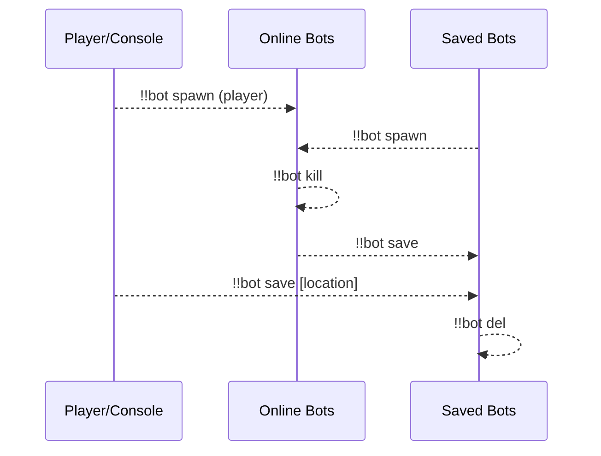
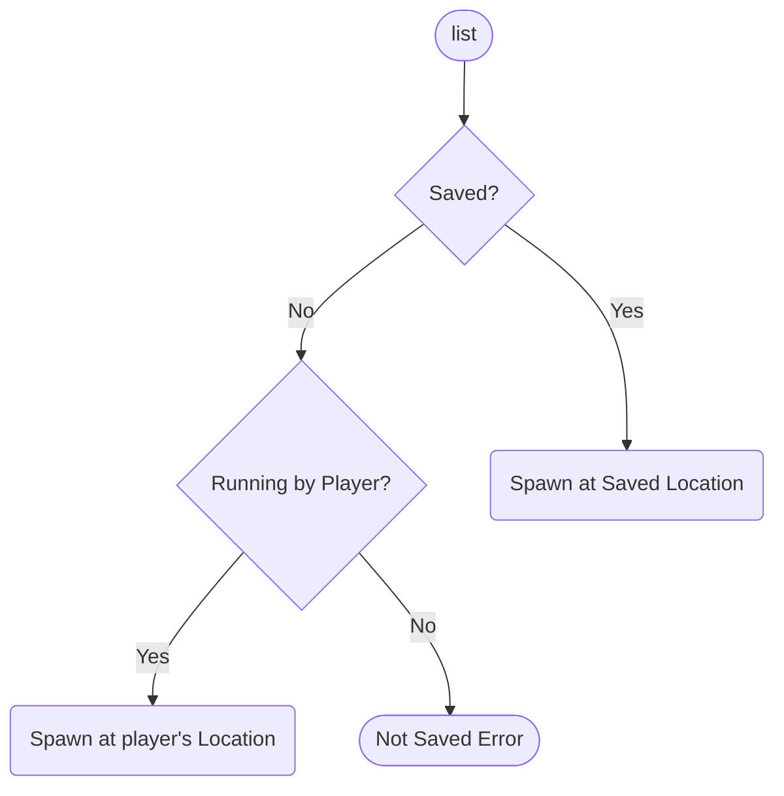
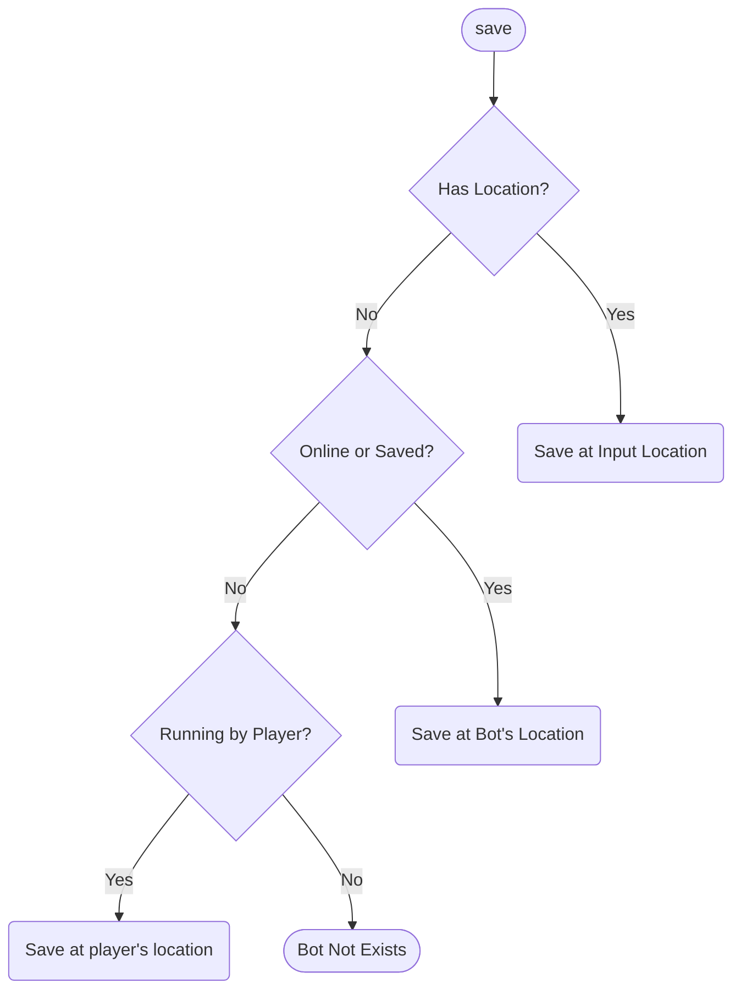
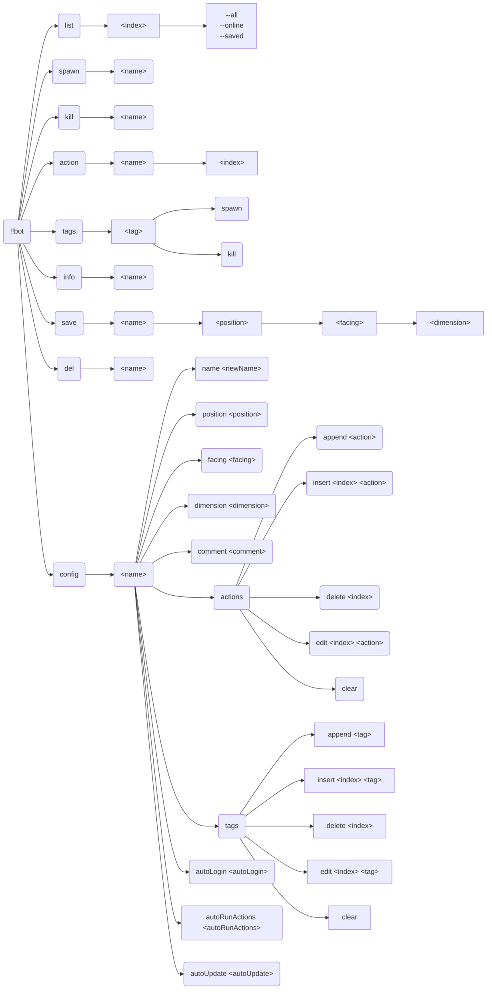

**English** | [中文](readme-zh_cn.md)

\>\>\> [Back to index](/readme.md)

## bot

### Basic Information

- Plugin ID: `bot`
- Plugin Name: Bot
- Version: 1.1.5
  - Metadata version: 1.1.5
  - Release version: 1.1.5
- Total downloads: 3900
- Authors: [Andy Zhang](https://github.com/AnzhiZhang)
- Repository: https://github.com/AnzhiZhang/MCDReforgedPlugins
- Repository plugin page: https://github.com/AnzhiZhang/MCDReforgedPlugins/tree/master/src/bot
- Labels: [`Tool`](/labels/tool/readme.md), [`Management`](/labels/management/readme.md)
- Description: The best carpet bot manager!

### Dependencies

| Plugin ID | Requirement |
| --- | --- |
| [mcdreforged](https://github.com/Fallen-Breath/MCDReforged) | ^2.6.0 |
| [minecraft_data_api](/plugins/minecraft_data_api/readme.md) | ^1.4 |
| [more_command_nodes](/plugins/more_command_nodes/readme.md) | ^1.1.0 |

### Requirements

| Python package | Requirement |
| --- | --- |

### Introduction

# Bot

[简体中文](https://github.com/AnzhiZhang/MCDReforgedPlugins/tree/master/src/bot/readme_cn.md)

> The best carpet bot manager!

## Dependencies

- [MinecraftDataAPI](https://github.com/MCDReforged/MinecraftDataAPI)
- [MoreCommandNodes](https://github.com/AnzhiZhang/MCDReforgedPlugins/tree/master/src/bot/../more_command_nodes)

## Usage

`!!bot` View help

`!!bot list [index] [filter]` Show bot list

`!!bot spawn <name>` Spawn bot

`!!bot kill <name>` Kill bot

`!!bot action <name> [index]` Execute bot action(s)

`!!bot tags` View available tags

`!!bot tags <tag> spawn/kill` Spawn/kill bot(s) with tag

`!!bot info <name>` View bot info

`!!bot save <name> [position] [facing] [dimension]` Save bot

`!!bot del <name>` Delete saved bot

`!!bot config <name> <option> <value>` Config bot

### Workflow



### list

**index**: Page number of the list

**filter**: Available options are: `--all`, `--online` or `--saved`, filter bots

### spawn

Spawn bot



### kill

Kill bot

### action

Execute bot action(s)

When `index` is specified, execute specific action(s) instead of all actions

### tags

View available tags and spawn/kill bot(s) with tag

`!!bot tags` View available tags

`!!bot tags <tag> spawn` Spawn bot(s) with tag

`!!bot tags <tag> kill` Kill bot(s) with tag

### info

View bot info

### save

Save bot



### del

Delete saved bot

### config

Config bot

### Full Command Tree



## Config

### gamemode

Default: `survival`

Game mode of bot

### force_gamemode

Default: `false`

Forcing all bots to use the game mode configured by `gamemode`, if `false`, only saved bots will use the game mode configured by `gamemode`.

### name_prefix

Default: `bot_`

Prefix of bot name

### name_suffix

Default: None

Suffix of bot name

### permissions

Minimum permission to use corresponding command

## FastAPI MCDR

This plugin supports [FastAPI MCDR](https://github.com/AnzhiZhang/MCDReforgedPlugins/tree/master/src/bot/../fastapi_mcdr) plugin, please refer to the source code for detailed API, or run and view the FastAPI document via `http://127.0.0.1:8080/docs`.

Python packages required:

```text
pydantic>=2.0
```

### Download

> [!IMPORTANT]
> Read the README file in plugin repository before using it.

| File | Version | Upload Time (UTC) | Size | Downloads | Operations |
| --- | --- | --- | --- | --- | --- |
| [Bot-v1.1.5.mcdr](https://github.com/AnzhiZhang/MCDReforgedPlugins/releases/tag/bot-v1.1.5) | 1.1.5 | 2024/07/01 14:40:45 | 17.13KB | 405 | [Download](https://github.com/AnzhiZhang/MCDReforgedPlugins/releases/download/bot-v1.1.5/Bot-v1.1.5.mcdr) |
| [Bot-v1.1.4.mcdr](https://github.com/AnzhiZhang/MCDReforgedPlugins/releases/tag/bot-v1.1.4) | 1.1.4 | 2024/03/15 14:08:24 | 17.14KB | 403 | [Download](https://github.com/AnzhiZhang/MCDReforgedPlugins/releases/download/bot-v1.1.4/Bot-v1.1.4.mcdr) |
| [Bot-v1.1.3.mcdr](https://github.com/AnzhiZhang/MCDReforgedPlugins/releases/tag/bot-v1.1.3) | 1.1.3 | 2024/02/27 15:11:25 | 17.14KB | 112 | [Download](https://github.com/AnzhiZhang/MCDReforgedPlugins/releases/download/bot-v1.1.3/Bot-v1.1.3.mcdr) |
| [Bot-v1.1.2.mcdr](https://github.com/AnzhiZhang/MCDReforgedPlugins/releases/tag/bot-v1.1.2) | 1.1.2 | 2024/01/15 10:46:23 | 16.84KB | 218 | [Download](https://github.com/AnzhiZhang/MCDReforgedPlugins/releases/download/bot-v1.1.2/Bot-v1.1.2.mcdr) |
| [Bot-v1.1.1.mcdr](https://github.com/AnzhiZhang/MCDReforgedPlugins/releases/tag/bot-v1.1.1) | 1.1.1 | 2023/12/31 10:51:38 | 16.77KB | 80 | [Download](https://github.com/AnzhiZhang/MCDReforgedPlugins/releases/download/bot-v1.1.1/Bot-v1.1.1.mcdr) |
| [Bot-v1.1.0.mcdr](https://github.com/AnzhiZhang/MCDReforgedPlugins/releases/tag/bot-v1.1.0) | 1.1.0 | 2023/12/21 22:10:07 | 16.75KB | 87 | [Download](https://github.com/AnzhiZhang/MCDReforgedPlugins/releases/download/bot-v1.1.0/Bot-v1.1.0.mcdr) |
| [Bot-v1.0.6.mcdr](https://github.com/AnzhiZhang/MCDReforgedPlugins/releases/tag/bot-v1.0.6) | 1.0.6 | 2023/01/19 16:58:58 | 13.6KB | 1561 | [Download](https://github.com/AnzhiZhang/MCDReforgedPlugins/releases/download/bot-v1.0.6/Bot-v1.0.6.mcdr) |
| [Bot-v1.0.5.mcdr](https://github.com/AnzhiZhang/MCDReforgedPlugins/releases/tag/bot-v1.0.5) | 1.0.5 | 2022/12/29 15:19:31 | 13.55KB | 218 | [Download](https://github.com/AnzhiZhang/MCDReforgedPlugins/releases/download/bot-v1.0.5/Bot-v1.0.5.mcdr) |
| [Bot-v1.0.4.mcdr](https://github.com/AnzhiZhang/MCDReforgedPlugins/releases/tag/bot-v1.0.4) | 1.0.4 | 2022/12/29 14:53:06 | 13.55KB | 80 | [Download](https://github.com/AnzhiZhang/MCDReforgedPlugins/releases/download/bot-v1.0.4/Bot-v1.0.4.mcdr) |
| [Bot-v1.0.3.mcdr](https://github.com/AnzhiZhang/MCDReforgedPlugins/releases/tag/bot-v1.0.3) | 1.0.3 | 2022/12/29 15:14:20 | 13.11KB | 73 | [Download](https://github.com/AnzhiZhang/MCDReforgedPlugins/releases/download/bot-v1.0.3/Bot-v1.0.3.mcdr) |
| [Bot-v1.0.2.mcdr](https://github.com/AnzhiZhang/MCDReforgedPlugins/releases/tag/bot-v1.0.2) | 1.0.2 | 2022/07/22 02:16:19 | 13.06KB | 343 | [Download](https://github.com/AnzhiZhang/MCDReforgedPlugins/releases/download/bot-v1.0.2/Bot-v1.0.2.mcdr) |
| [Bot-v1.0.1.mcdr](https://github.com/AnzhiZhang/MCDReforgedPlugins/releases/tag/bot-v1.0.1) | 1.0.1 | 2022/07/21 05:06:17 | 13.06KB | 88 | [Download](https://github.com/AnzhiZhang/MCDReforgedPlugins/releases/download/bot-v1.0.1/Bot-v1.0.1.mcdr) |
| [Bot-v1.0.0.mcdr](https://github.com/AnzhiZhang/MCDReforgedPlugins/releases/tag/bot-v1.0.0) | 1.0.0 | 2022/07/21 03:53:18 | 13.05KB | 89 | [Download](https://github.com/AnzhiZhang/MCDReforgedPlugins/releases/download/bot-v1.0.0/Bot-v1.0.0.mcdr) |
| [Bot-v0.1.0.mcdr](https://github.com/AnzhiZhang/MCDReforgedPlugins/releases/tag/bot-v0.1.0) | 0.1.0 | 2022/06/30 12:10:23 | 1.97KB | 143 | [Download](https://github.com/AnzhiZhang/MCDReforgedPlugins/releases/download/bot-v0.1.0/Bot-v0.1.0.mcdr) |

